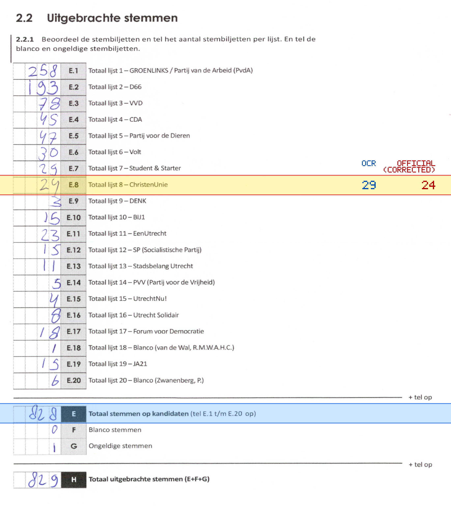
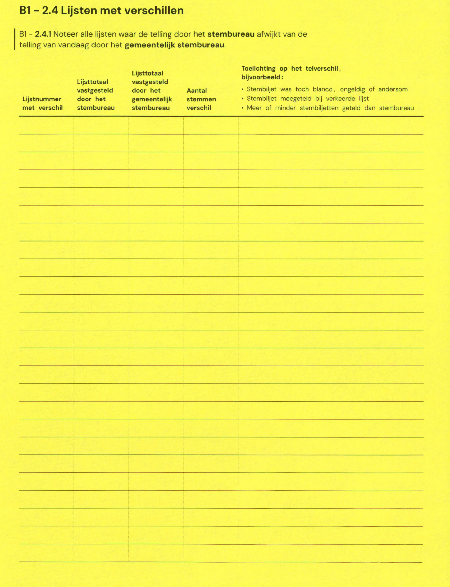

# Station 102 - Hobbemastraat 35 ingang aan de zijkant

- Status: `internally inconsistent`
- Markdown: `2026-GR/0344/results/Utrecht_102_Wilhelminakerk_GR26_eerste_telling.md`
- Correction OCR: `2026-GR/0344/results/corrections/Utrecht_102_Wilhelminakerk_GR26.md`

## Details

- E.1 through E.20 sum to 833, but E is 828
- E.8: md=29, official=24

Legend: yellow/red = official CSV mismatch; blue = internal consistency issue. The right margin shows OCR and official values for official mismatches.



## Corrections

```markdown
| ID | First | Second | Difference | Note |
|---|---:|---:|---:|---|
```


