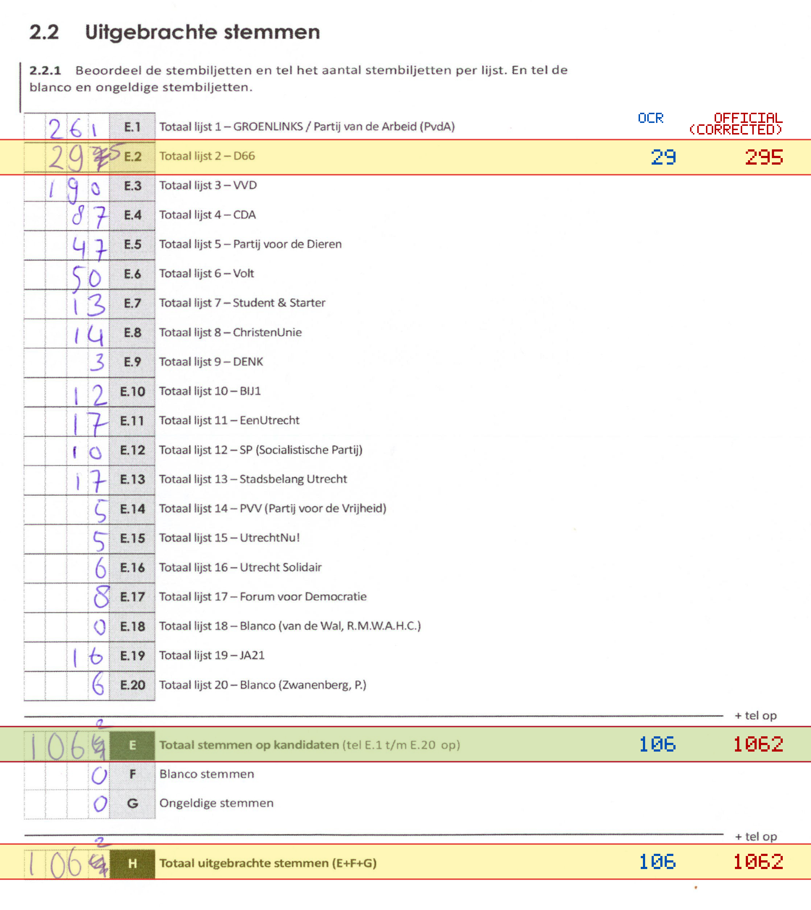
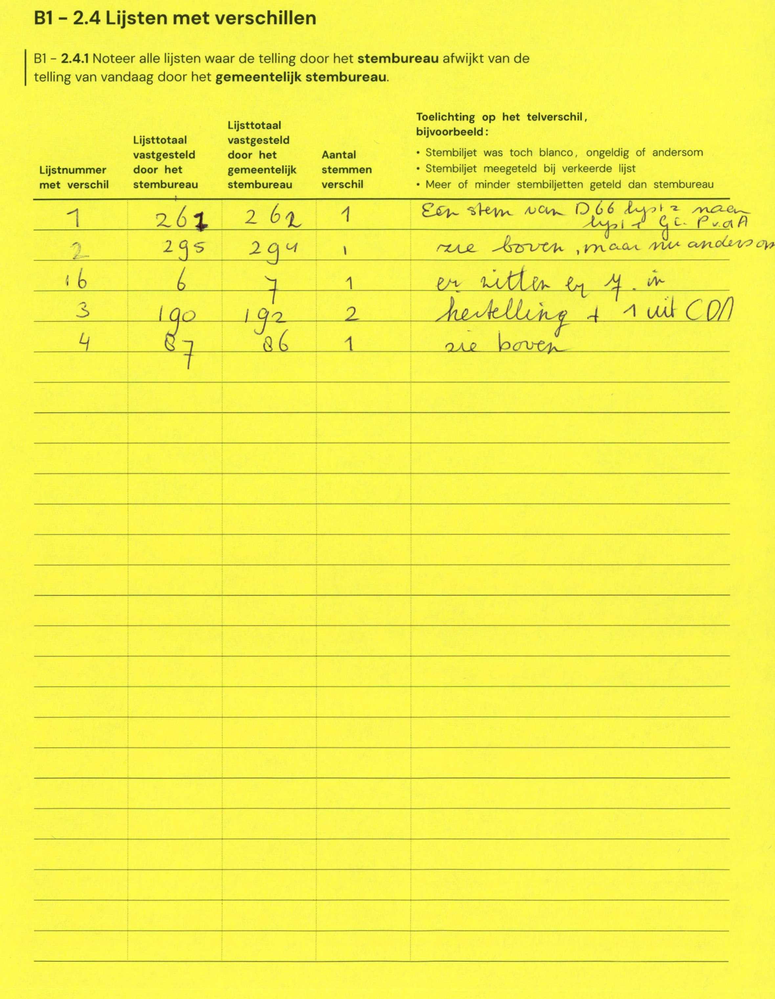

# Station 103 - Jan Muschlaan 24 ingang gymzaal

- Status: `internally inconsistent`
- Markdown: `2026-GR/0344/results/Utrecht_103_Daltonschool_Rijnsweerd_GR26_eerste_telling.md`
- Correction OCR: `2026-GR/0344/results/corrections/Utrecht_103_Daltonschool_Rijnsweerd_GR26.md`

## Details

- E.1 through E.20 sum to 796, but E is 106
- E.2: md=29, official=295
- E: md=106, official=1062
- H: md=106, official=1062

Legend: yellow/red = official CSV mismatch; blue = internal consistency issue. The right margin shows OCR and official values for official mismatches.



## Corrections

```markdown
| ID | First | Second | Difference | Note |
|---|---:|---:|---:|---|
| E.1 | 261 | 262 | 1 | Een stem van D66 lijst naar lijst 1 PvdA |
| E.2 | 295 | 294 | -1 | zie boven, maar nu anderson |
| E.16 | 6 | 7 | 1 | er zitten er 4 in |
| E.3 | 190 | 192 | 2 | hertelling + 1 uit CDA |
| E.4 | 87 | 86 | -1 | zie boven |
```


