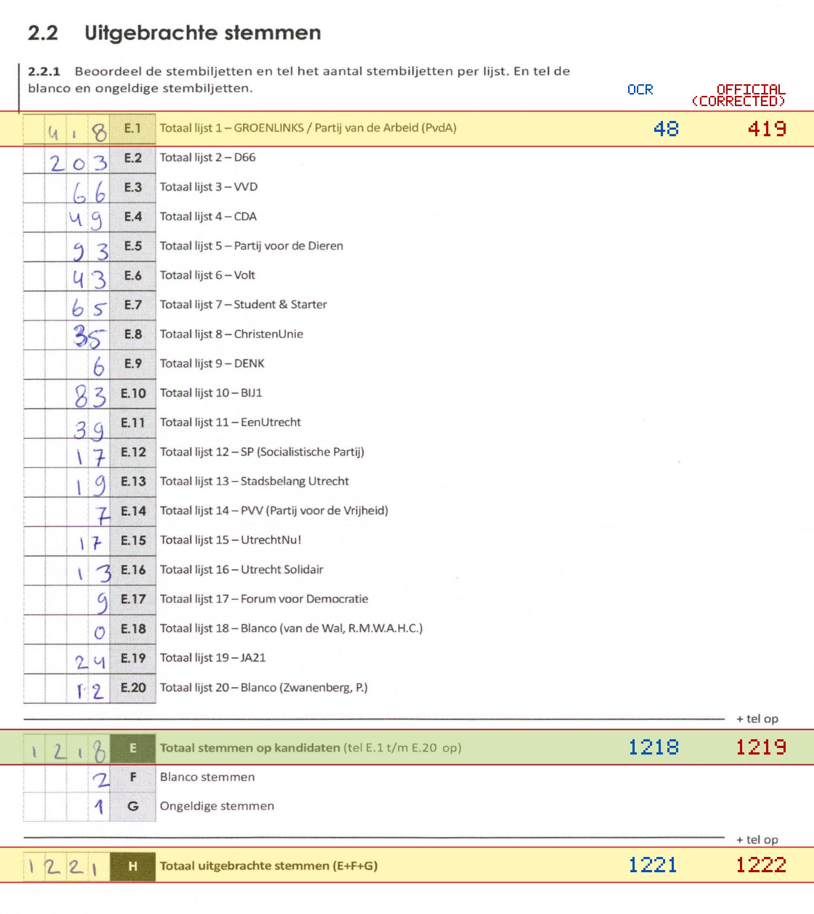
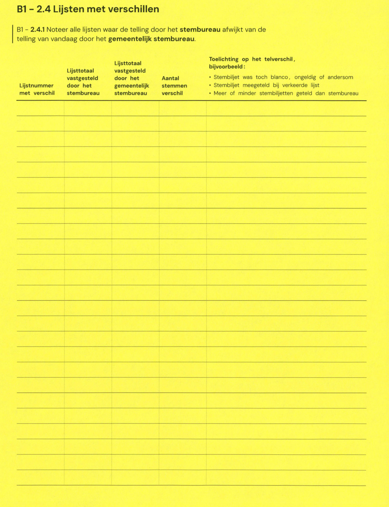

# Station 107 - Rotsoord 20

- Status: `internally inconsistent`
- Markdown: `2026-GR/0344/results/Utrecht_107_Kinderboerderij_Nieuw_Rotsoord_GR26_eerste_telling.md`
- Correction OCR: `2026-GR/0344/results/corrections/Utrecht_107_Kinderboerderij_Nieuw_Rotsoord_GR26.md`

## Details

- E.1 through E.20 sum to 848, but E is 1218
- E.1: md=48, official=419
- E: md=1218, official=1219
- H: md=1221, official=1222

## Candidate Votes

- Status: `incomplete`
- Compared candidate cells: 0/508
- Candidate OCR files: 0
- candidate OCR not available
- known list/correction issues are shown

Legend: yellow/red = official CSV mismatch; blue = internal consistency issue. The right margin shows OCR and official values for official mismatches.



## Corrections

```markdown
| ID | First | Second | Difference | Note |
|---|---:|---:|---:|---|
```


