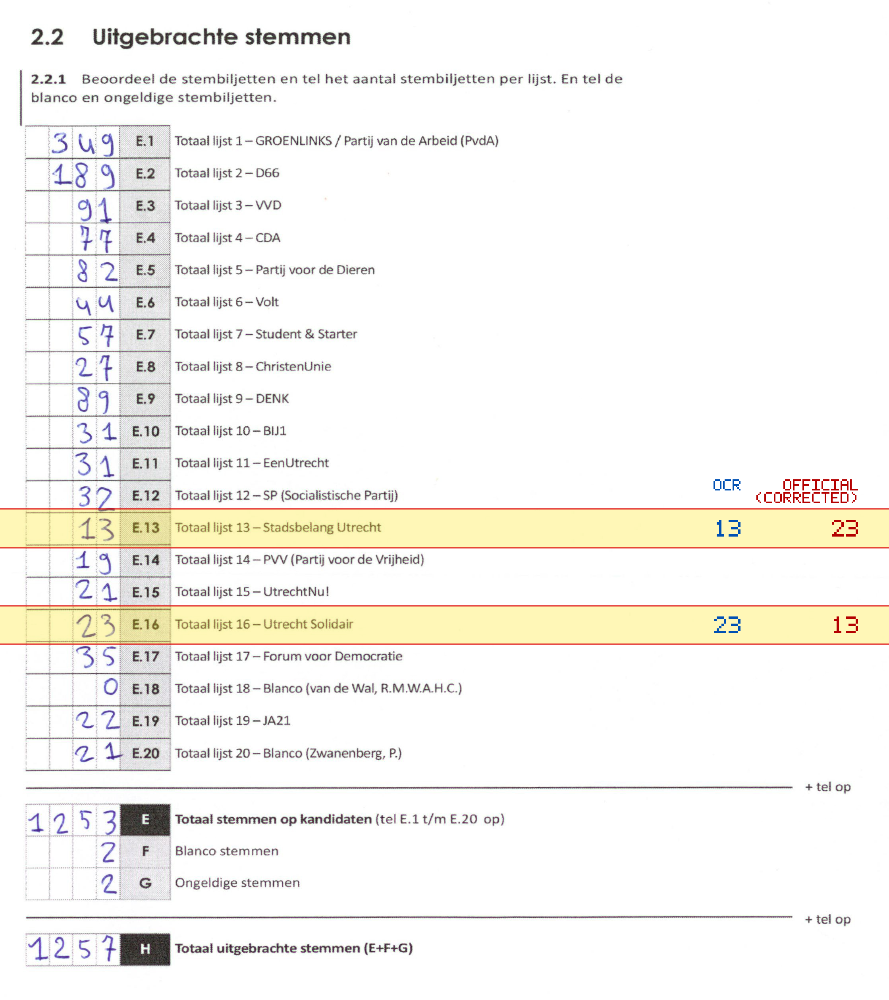
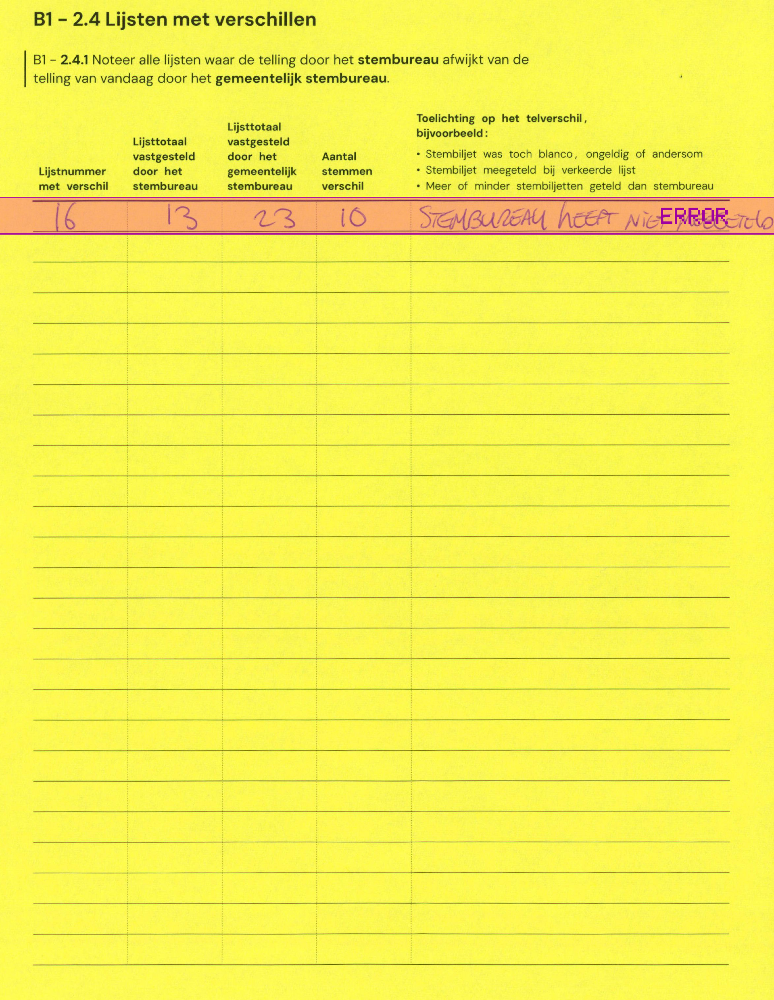

# Station 111 - Verlengde Hoogravenseweg 63

- Status: `correction inconsistent`
- Markdown: `2026-GR/0344/results/Utrecht_111_Kringloopcentrum_De_Arm_GR26_eerste_telling.md`
- Correction OCR: `2026-GR/0344/results/corrections/Utrecht_111_Kringloopcentrum_De_Arm_GR26.md`

## Correction Inconsistency

The correction table does not line up with the first-count Markdown. Inspect the correction crop before treating this as a plain official-result mismatch.

- correction E.16 first=13, Markdown=23, second=23, maybe belongs to E.13

## Details

- correction E.16 first=13, Markdown=23, second=23, maybe belongs to E.13
- E.13: md=13, official=23
- E.16: md=23, official=13

## Candidate Votes

- Status: `incomplete`
- Compared candidate cells: 0/508
- Candidate OCR files: 0
- candidate OCR not available
- known list/correction issues are shown

Legend: yellow/red = official CSV mismatch; blue = internal consistency issue. The right margin shows OCR and official values for official mismatches.



## Corrections

```markdown
| ID | First | Second | Difference | Note |
|---|---:|---:|---:|---|
| E.16 | 13 | 23 | 10 | STEMBUREAU HEEFT NIET MEEGETELD |
```


