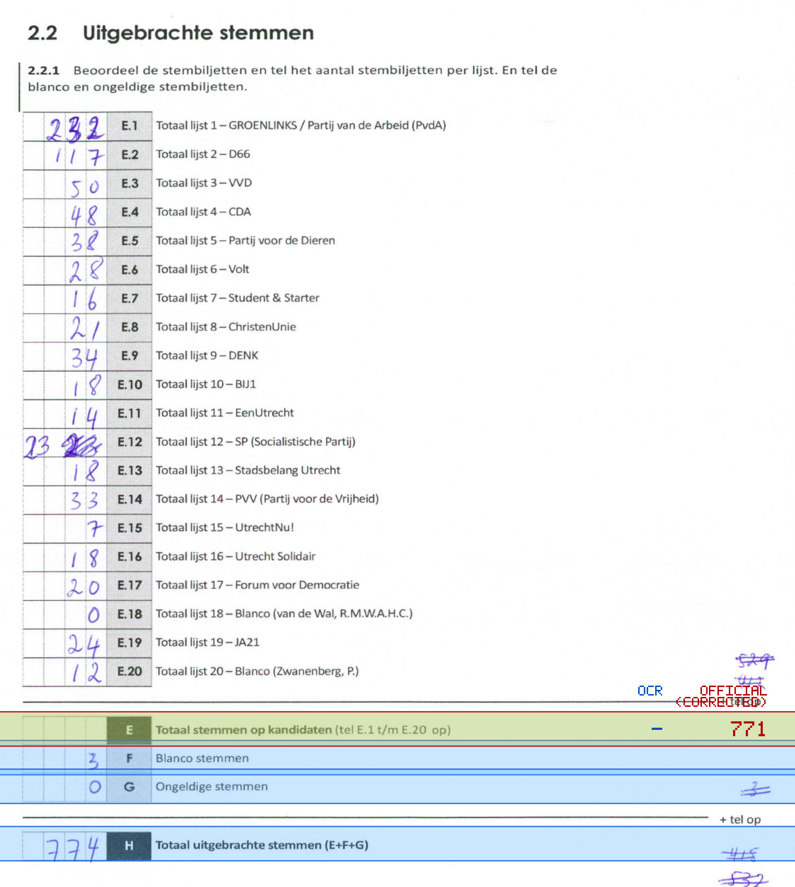
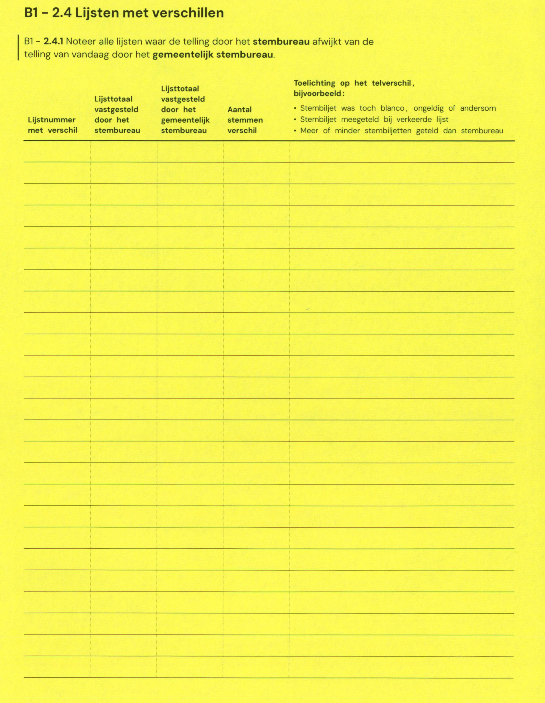

# Station 113 - Oud-Wulvenlaan 4 ingang zijkant via Detmoldstraat

- Status: `internally inconsistent`
- Markdown: `2026-GR/0344/results/Utrecht_113_Wooncomplex_Nieuw_Plettenburgh_GR26_eerste_telling.md`
- Correction OCR: `2026-GR/0344/results/corrections/Utrecht_113_Wooncomplex_Nieuw_Plettenburgh_GR26.md`

## Details

- expected 26 non-empty table lines, found 25
- row 23 expected ID E, found F
- row 24 expected ID F, found G
- row 25 expected ID G, found H
- missing row 26 for H
- E: md=missing, official=771

Legend: yellow/red = official CSV mismatch; blue = internal consistency issue. The right margin shows OCR and official values for official mismatches.



## Corrections

```markdown
| ID | First | Second | Difference | Note |
|---|---:|---:|---:|---|
```


