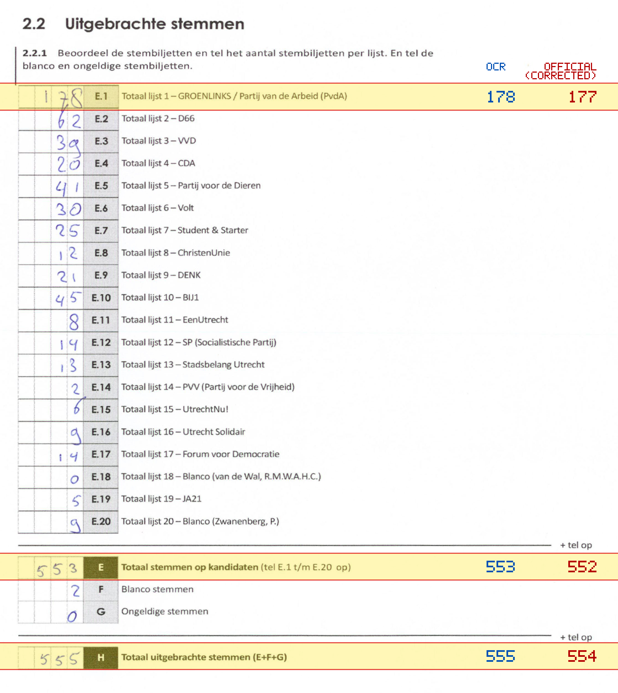
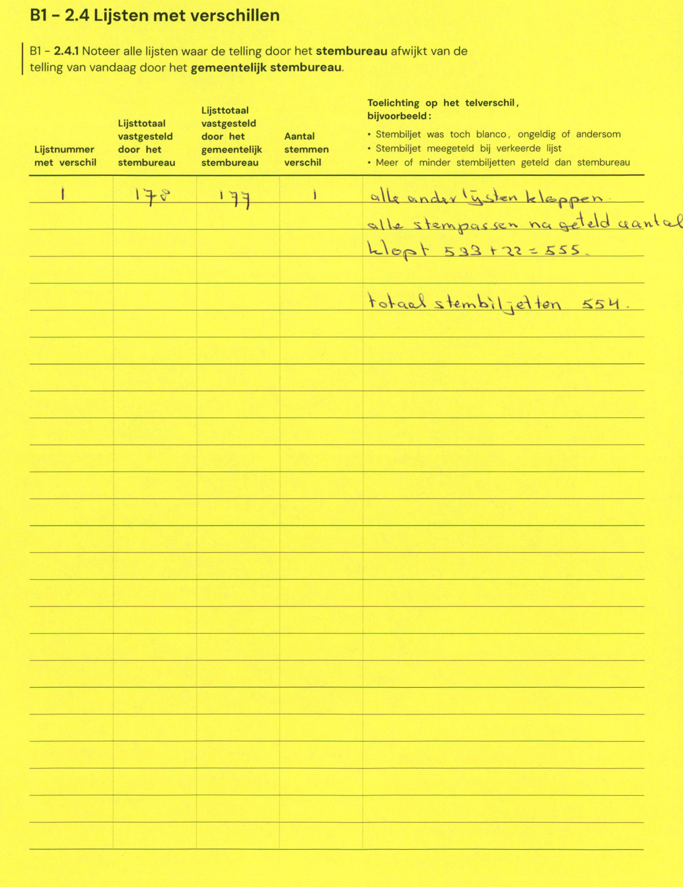

# Station 121 - Beneluxlaan 928

- Status: `correction inconsistent`
- Markdown: `2026-GR/0344/results/Utrecht_121_Domstate_GR26_eerste_telling.md`
- Correction OCR: `2026-GR/0344/results/corrections/Utrecht_121_Domstate_GR26.md`

## Correction Inconsistency

The correction table does not line up with the first-count Markdown. Inspect the correction crop before treating this as a plain official-result mismatch.


## Details

- could not apply corrections: E.1 second=179, official=177

Legend: yellow/red = official CSV mismatch; blue = internal consistency issue. The right margin shows OCR and official values for official mismatches.



## Corrections

```markdown
| ID | First | Second | Difference | Note |
|---|---:|---:|---:|---|
| E.1 | 178 | 179 | 1 | alle andere lijsten kloppen alle stempassen na geteld aantal klopt 533 + 22 = 555 totaal stembiljetten 554. |
```


