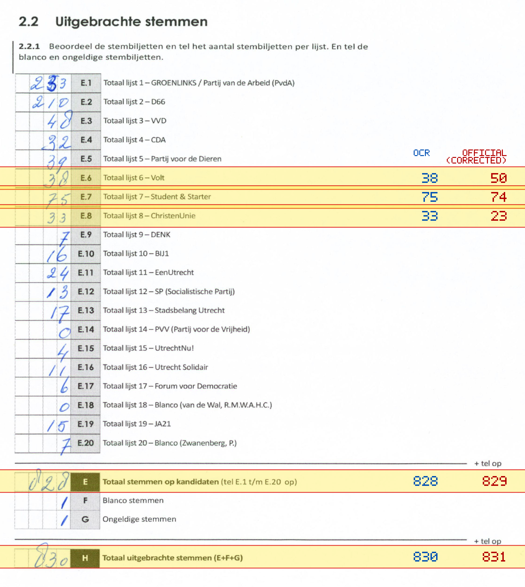
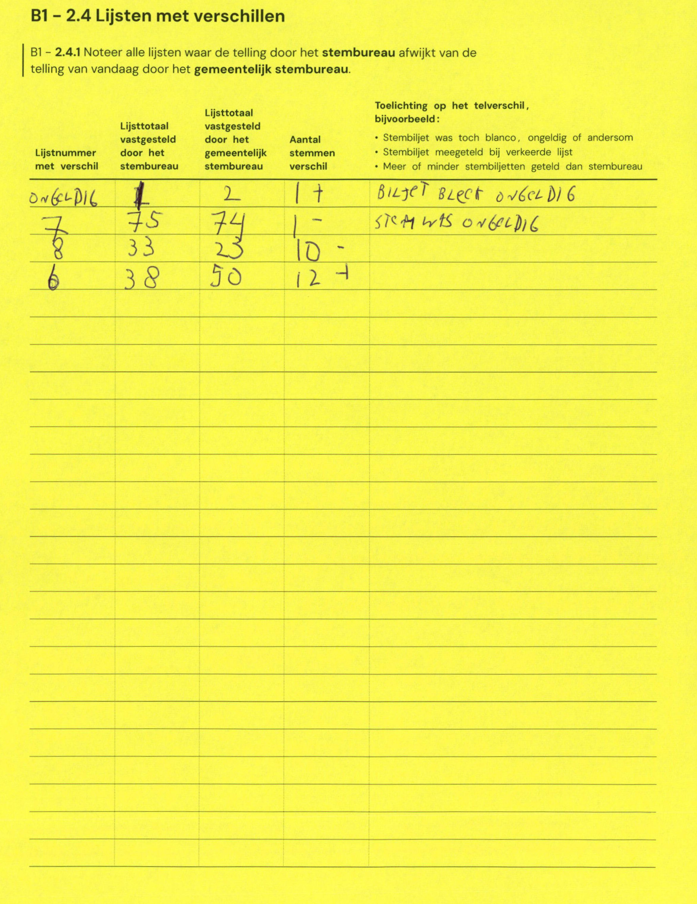

# Station 124 - Heidelberglaan 100

- Status: `mismatch`
- Markdown: `2026-GR/0344/results/Utrecht_124_Universitair_Medisch_Centrum_Utrecht_GR26_eerste_telling.md`
- Correction OCR: `2026-GR/0344/results/corrections/Utrecht_124_Universitair_Medisch_Centrum_Utrecht_GR26.md`

## Details

- E.6: md=38, official=50
- E.7: md=75, official=74
- E.8: md=33, official=23
- E: md=828, official=829
- H: md=830, official=831

## Candidate Votes

- Status: `incomplete`
- Compared candidate cells: 0/508
- Candidate OCR files: 0
- candidate OCR not available
- known list/correction issues are shown

Legend: yellow/red = official CSV mismatch; blue = internal consistency issue. The right margin shows OCR and official values for official mismatches.



## Corrections

```markdown
| ID | First | Second | Difference | Note |
|---|---:|---:|---:|---|
| G | 1 | 2 | 1 |
```


