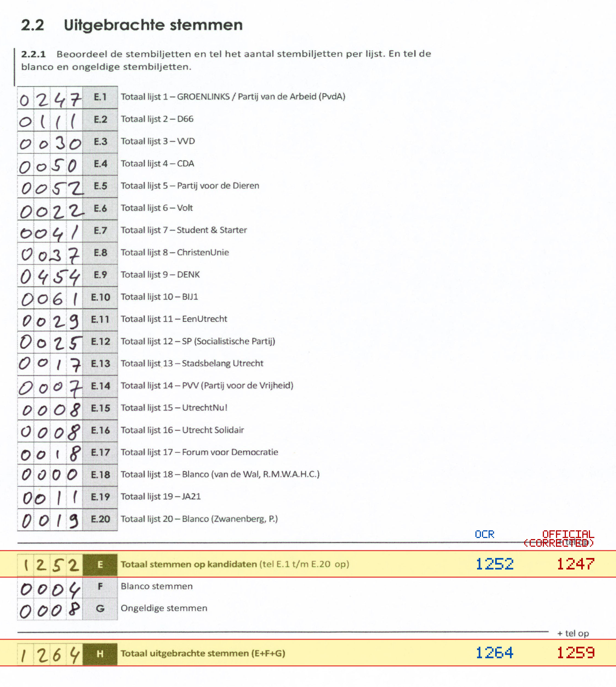
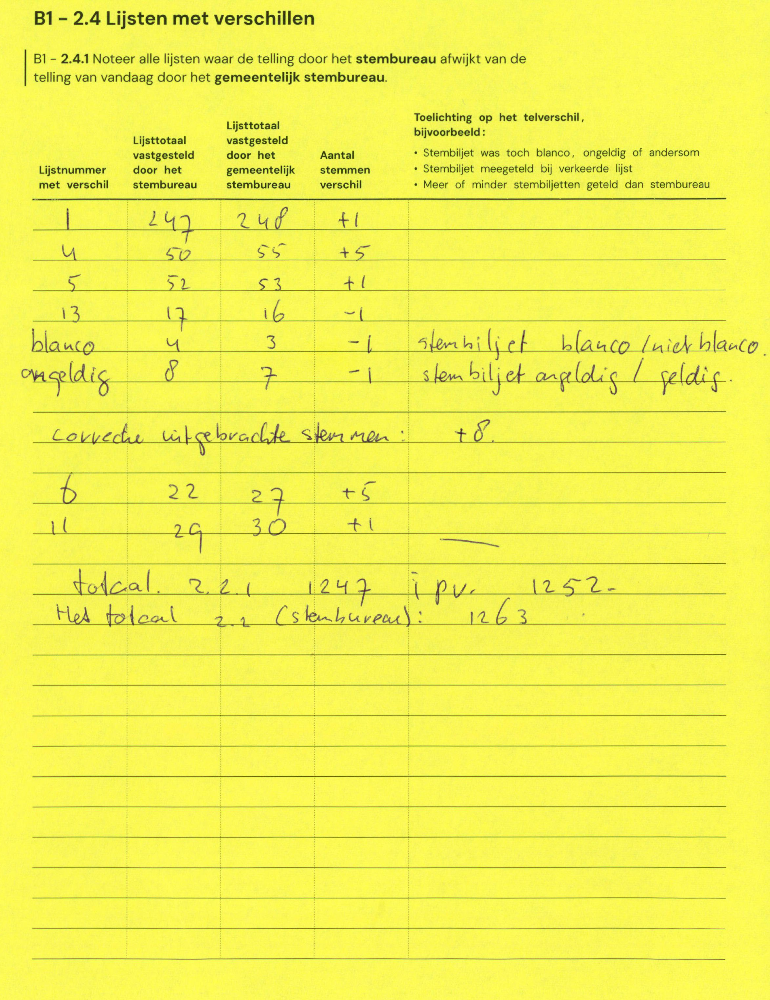

# Station 126 - Trumanlaan 60 ingang via Geallieerdenlaan

- Status: `correction inconsistent`
- Markdown: `2026-GR/0344/results/Utrecht_126_Buurtcentrum_Hart_van_Noord_GR26_eerste_telling.md`
- Correction OCR: `2026-GR/0344/results/corrections/Utrecht_126_Buurtcentrum_Hart_van_Noord_GR26.md`

## Correction Inconsistency

The correction table does not line up with the first-count Markdown. Inspect the correction crop before treating this as a plain official-result mismatch.


## Details

- could not apply corrections: E second=1252, official=1259

Legend: yellow/red = official CSV mismatch; blue = internal consistency issue. The right margin shows OCR and official values for official mismatches.



## Corrections

```markdown
| ID | First | Second | Difference | Note |
|---|---:|---:|---:|---|
| E.1 | 247 | 248 | 1 | |
| E.4 | 50 | 55 | 5 | |
| E.5 | 52 | 53 | 1 | |
| E.13 | 17 | 16 | -1 | |
| F | 4 | 3 | -1 | stembiljet blanco / niet blanco |
| G | 8 | 7 | -1 | stembiljet ongeldig / geldig |
| H | | | 8 | |
| E.6 | 22 | 27 | 5 | |
| E.11 | 29 | 30 | 1 | |
| E | 1247 | 1252 | 5 | |
```


