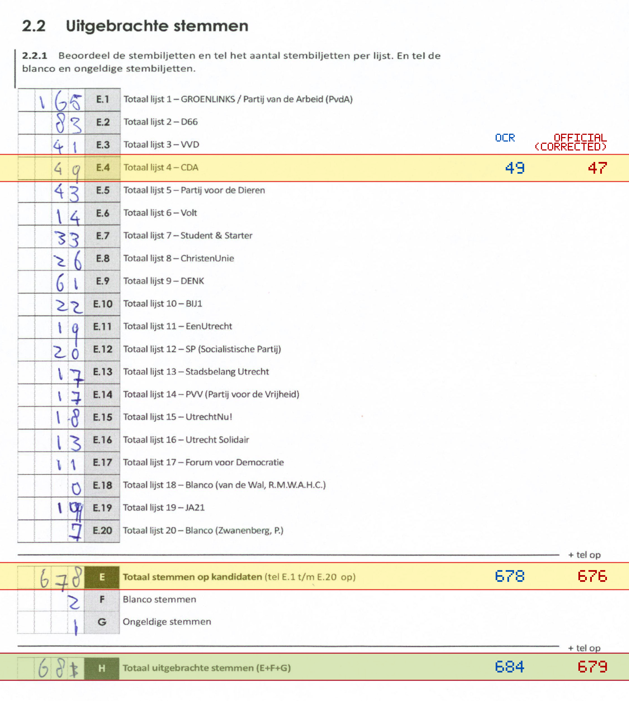
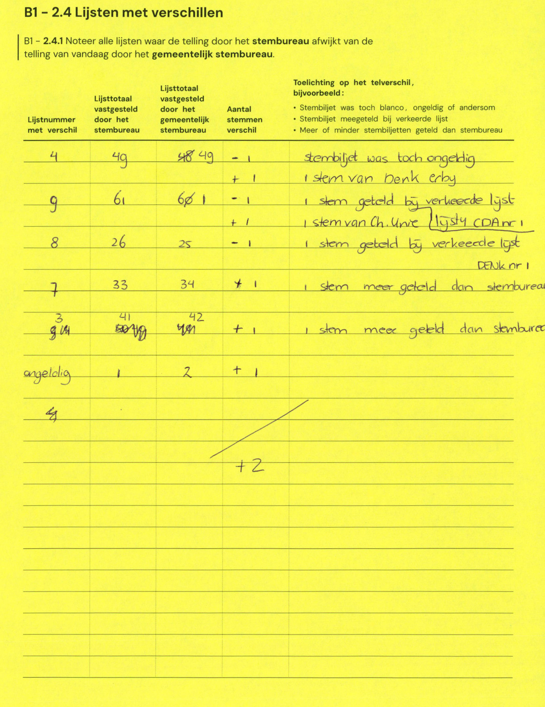

# Station 129 - Van Bijnkershoeklaan 250

- Status: `internally inconsistent`
- Markdown: `2026-GR/0344/results/Utrecht_129_Woonzorgcentrum_De_Bijnkershoek_GR26_eerste_telling.md`
- Correction OCR: `2026-GR/0344/results/corrections/Utrecht_129_Woonzorgcentrum_De_Bijnkershoek_GR26.md`

## Details

- E + F + G is 681, but H is 684
- E.4: md=49, official=47
- E: md=678, official=676
- H: md=684, official=679

## Candidate Votes

- Status: `incomplete`
- Compared candidate cells: 0/508
- Candidate OCR files: 0
- candidate OCR not available
- known list/correction issues are shown

Legend: yellow/red = official CSV mismatch; blue = internal consistency issue. The right margin shows OCR and official values for official mismatches.



## Corrections

```markdown
| ID | First | Second | Difference | Note |
|---|---:|---:|---:|---|
| E.4 | 49 | 48 | -1 | stembiljet was toch ongeldig |
| E.4 | | | 1 | 1 stem van Benk erby |
| E.9 | 61 | 60 | -1 | 1 stem geteld bij verkeerde lijst |
| E.9 | | | 1 | 1 stem van Ch. Unre (lijst CDA nr 1) |
| E.8 | 26 | 25 | -1 | 1 stem geteld bij verkeerde lijst |
| E.7 | 33 | 34 | 1 | 1 stem meer geteld dan stembureau DENK nr 1 |
| E.3 | 41 | 42 | 1 | 1 stem meer geteld dan stembureau |
| G | 1 | 2 | 1 | |
| E.4 | | | 2 | |
```


