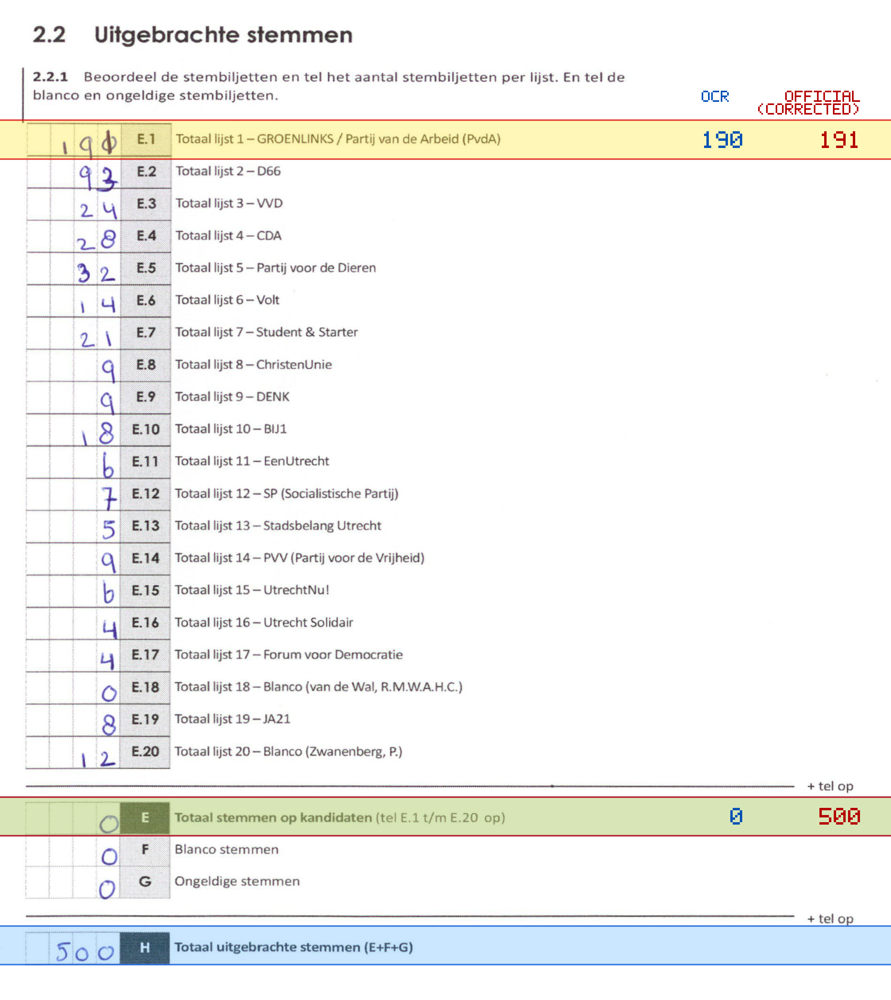
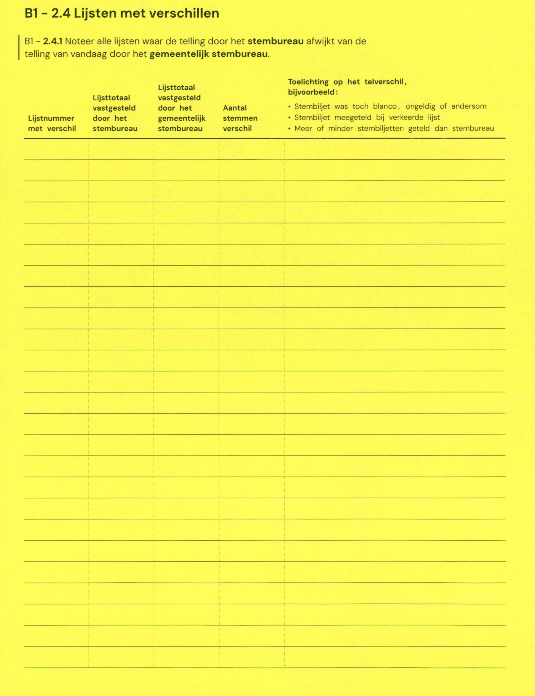

# Station 13 - Cremerstraat 253

- Status: `internally inconsistent`
- Markdown: `2026-GR/0344/results/Utrecht_13_Gymzaal_Cremerstraat_GR26_eerste_telling.md`
- Correction OCR: `2026-GR/0344/results/corrections/Utrecht_13_Gymzaal_Cremerstraat_GR26.md`

## Details

- E.1 through E.20 sum to 499, but E is 0
- E + F + G is 0, but H is 500
- E.1: md=190, official=191
- E: md=0, official=500

Legend: yellow/red = official CSV mismatch; blue = internal consistency issue. The right margin shows OCR and official values for official mismatches.



## Corrections

```markdown
| ID | First | Second | Difference | Note |
|---|---:|---:|---:|---|
```


