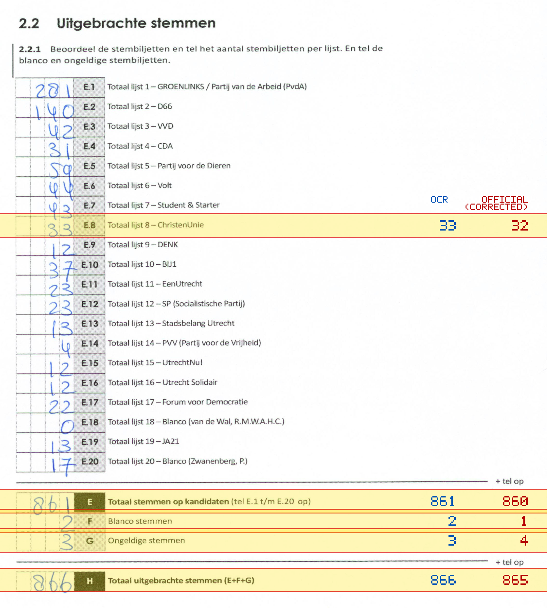
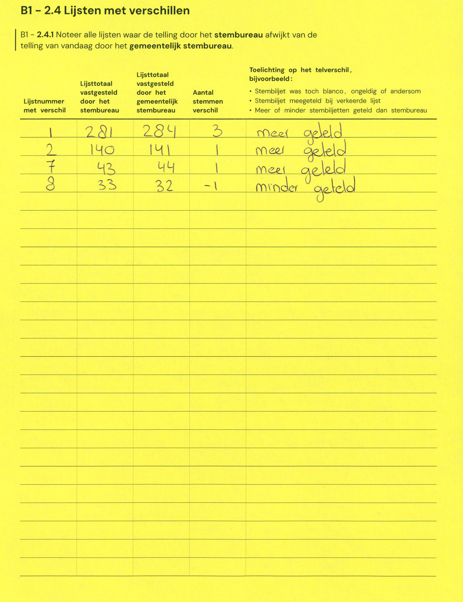

# Station 130 - Briljantlaan 6

- Status: `mismatch`
- Markdown: `2026-GR/0344/results/Utrecht_130_Rehobothkerk_GR26_eerste_telling.md`
- Correction OCR: `2026-GR/0344/results/corrections/Utrecht_130_Rehobothkerk_GR26.md`

## Details

- E.8: md=33, official=32
- E: md=861, official=860
- F: md=2, official=1
- G: md=3, official=4
- H: md=866, official=865

Legend: yellow/red = official CSV mismatch; blue = internal consistency issue. The right margin shows OCR and official values for official mismatches.



## Corrections

```markdown
| ID | First | Second | Difference | Note |
|---|---:|---:|---:|---|
| E.1 | 281 | 284 | 3 | meer geteld |
| E.2 | 140 | 141 | 1 | meer geteld |
| E.7 | 43 | 44 | 1 | meer geteld |
```


