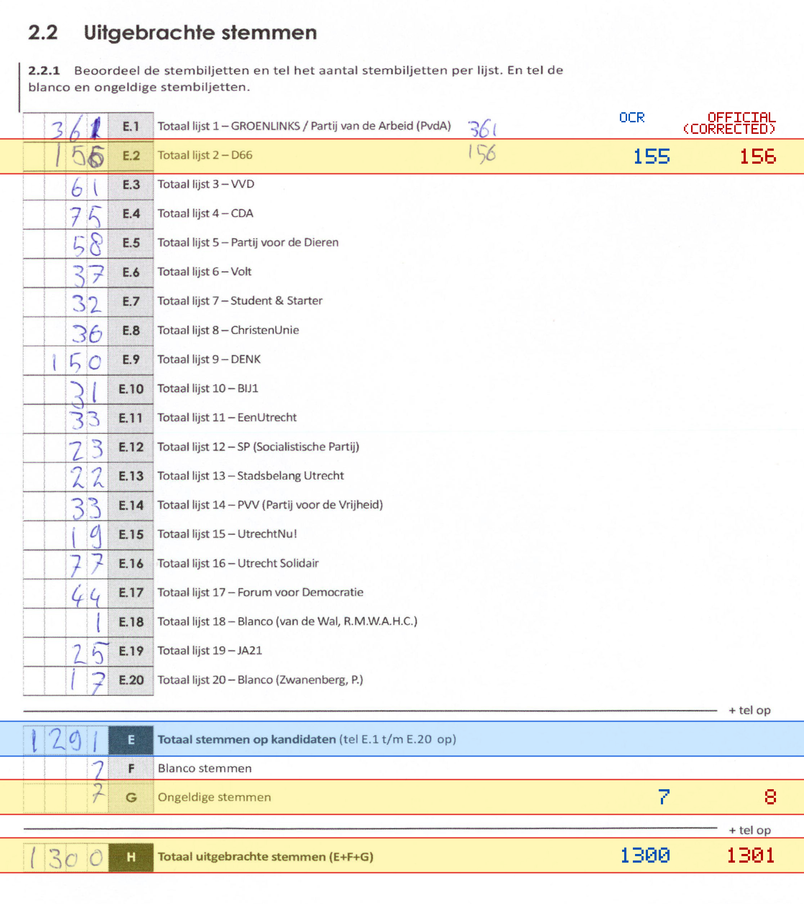
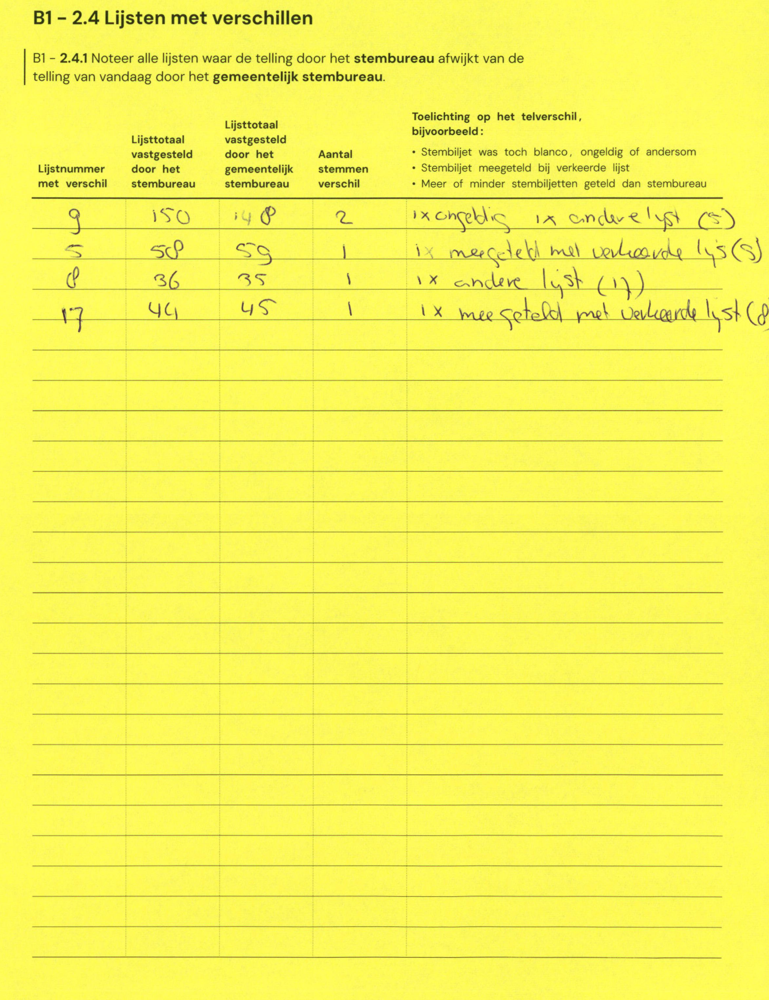

# Station 134 - Maasplein 1 ingang hek Rijnlaan

- Status: `internally inconsistent`
- Markdown: `2026-GR/0344/results/Utrecht_134_Maaspleinschool_GR26_eerste_telling.md`
- Correction OCR: `2026-GR/0344/results/corrections/Utrecht_134_Maaspleinschool_GR26.md`

## Details

- E.1 through E.20 sum to 1290, but E is 1291
- E.2: md=155, official=156
- G: md=7, official=8
- H: md=1300, official=1301

Legend: yellow/red = official CSV mismatch; blue = internal consistency issue. The right margin shows OCR and official values for official mismatches.



## Corrections

```markdown
| ID | First | Second | Difference | Note |
|---|---:|---:|---:|---|
| E.9 | 150 | 148 | -2 | x ongeldig x andere lijst (5) |
| E.5 | 58 | 59 | 1 | x meegeteld met verkeerde lijst (5) |
| E.8 | 36 | 35 | -1 | x andere lijst (17) |
| E.17 | 44 | 45 | 1 | x meegeteld met verkeerde lijst (8) |
```


