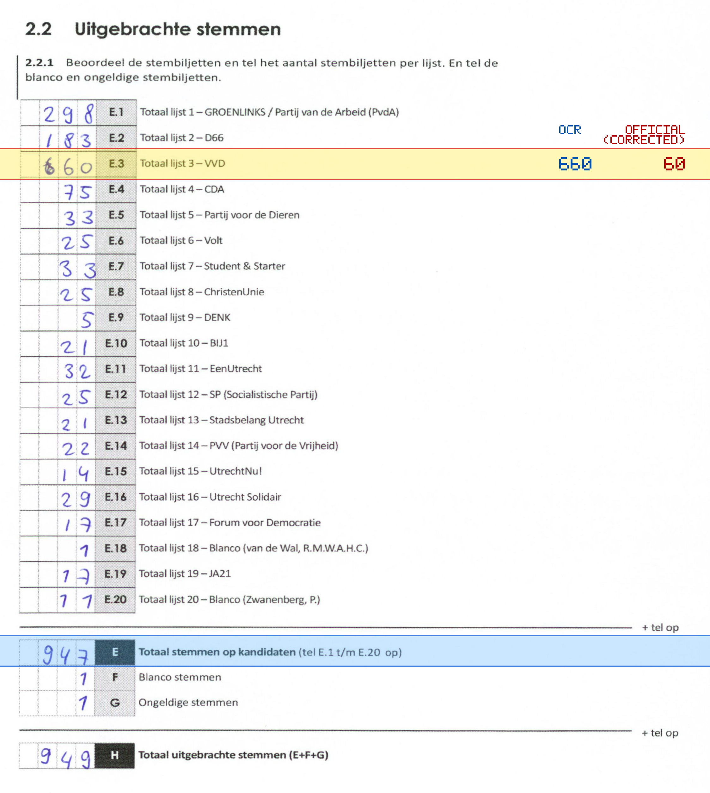
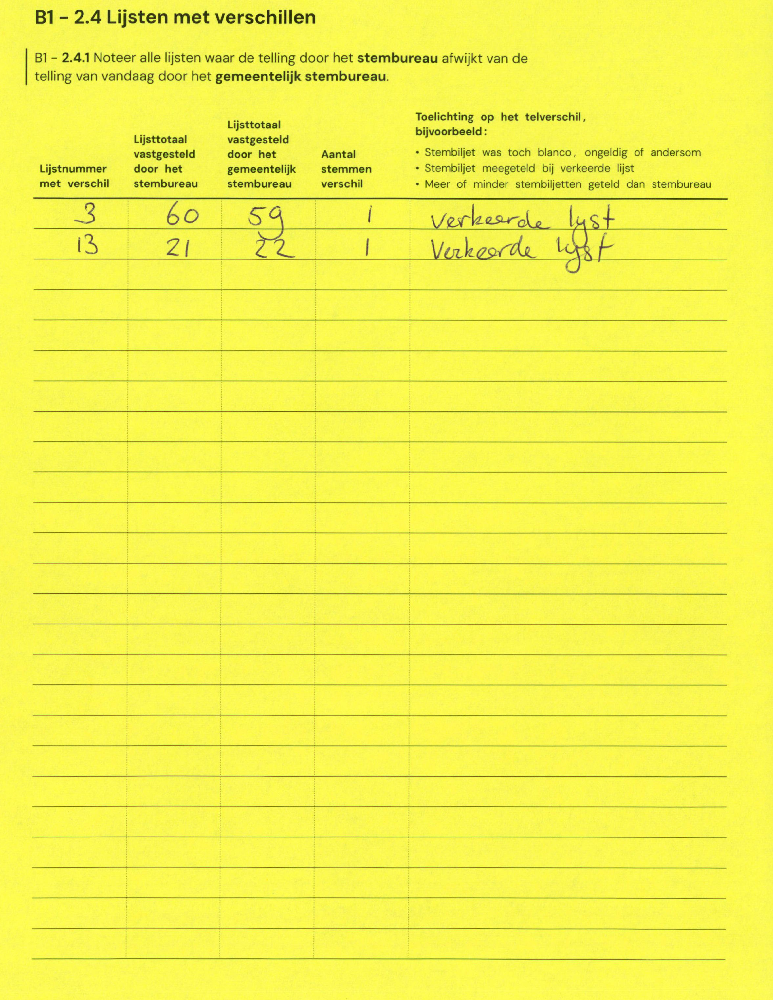

# Station 135 - Oranje-Nassaulaan 2

- Status: `internally inconsistent`
- Markdown: `2026-GR/0344/results/Utrecht_135_Kerkcentr_H_Joh_de_Doper-H_Bernardus_GR26_eerste_telling.md`
- Correction OCR: `2026-GR/0344/results/corrections/Utrecht_135_Kerkcentr_H_Joh_de_Doper-H_Bernardus_GR26.md`

## Details

- E.1 through E.20 sum to 1547, but E is 947
- E.3: md=660, official=60

## Candidate Votes

- Status: `incomplete`
- Compared candidate cells: 0/508
- Candidate OCR files: 0
- candidate OCR not available
- known list/correction issues are shown

Legend: yellow/red = official CSV mismatch; blue = internal consistency issue. The right margin shows OCR and official values for official mismatches.



## Corrections

```markdown
| ID | First | Second | Difference | Note |
|---|---:|---:|---:|---|
| E.3 | 60 | 59 | -1 | verkeerde lijst |
| E.13 | 21 | 22 | 1 | Verkeerde lijst |
```


