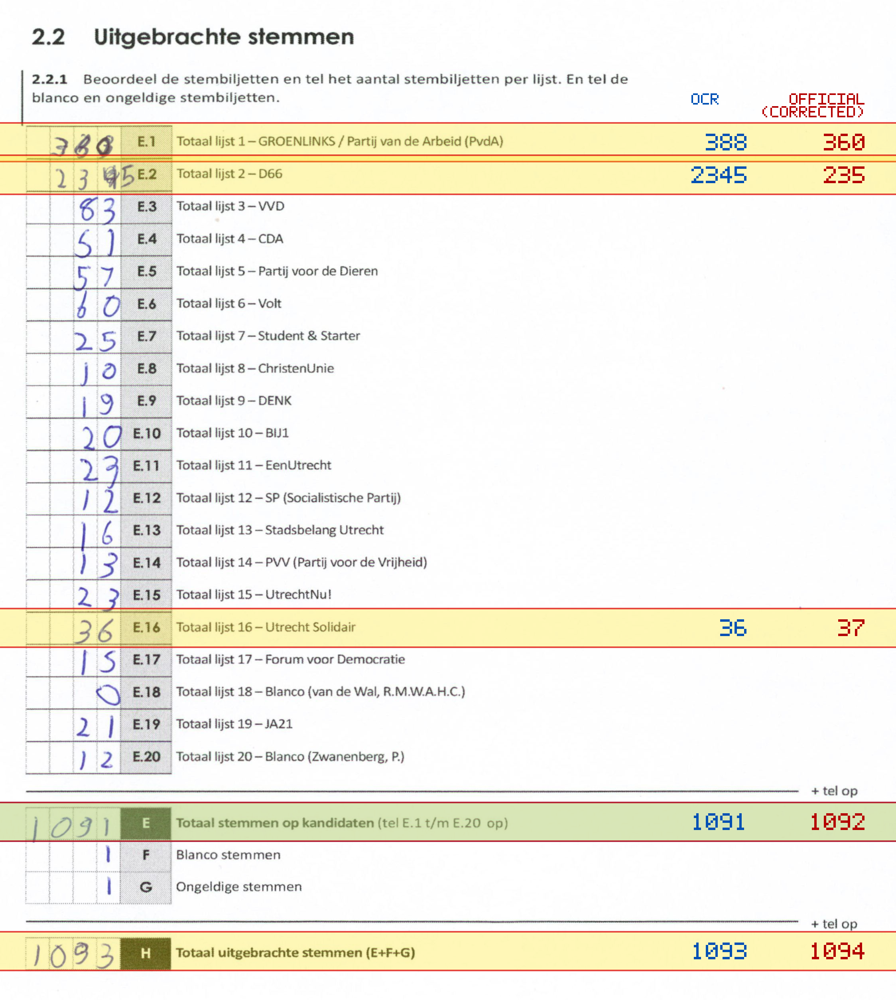
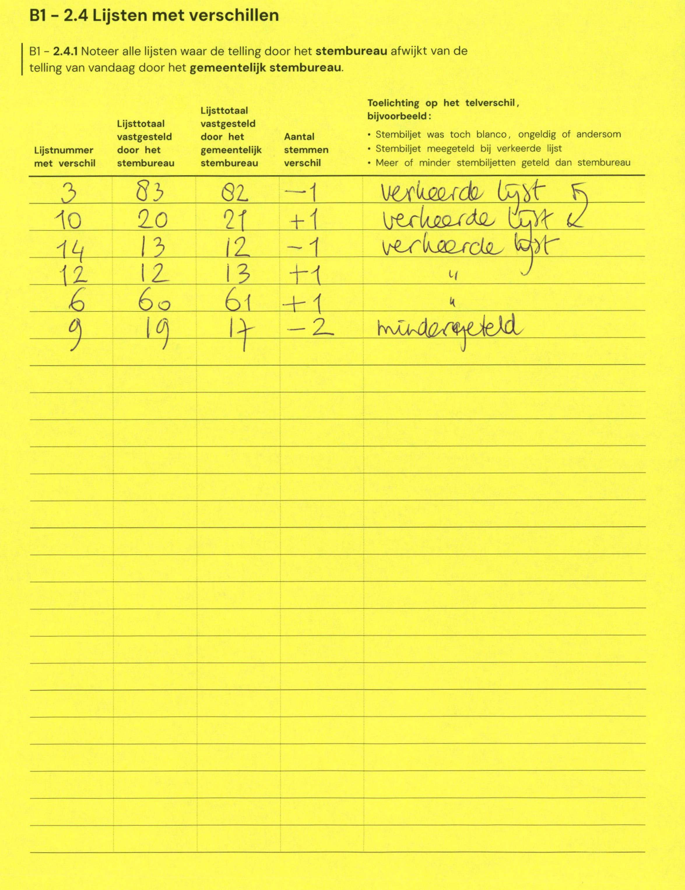

# Station 137 - Amaliadwarsstraat 2 ingang via schoolplein

- Status: `internally inconsistent`
- Markdown: `2026-GR/0344/results/Utrecht_137_Gertrudisschool_GR26_eerste_telling.md`
- Correction OCR: `2026-GR/0344/results/corrections/Utrecht_137_Gertrudisschool_GR26.md`

## Details

- E.1 through E.20 sum to 3229, but E is 1091
- E.1: md=388, official=360
- E.2: md=2345, official=235
- E.16: md=36, official=37
- E: md=1091, official=1092
- H: md=1093, official=1094

Legend: yellow/red = official CSV mismatch; blue = internal consistency issue. The right margin shows OCR and official values for official mismatches.



## Corrections

```markdown
| ID | First | Second | Difference | Note |
|---|---:|---:|---:|---|
| E.3 | 83 | 82 | -1 | verkeerde lijst 5 |
| E.10 | 20 | 21 | 1 | verkeerde lijst 2 |
| E.14 | 13 | 12 | -1 | verkeerde lijst |
| E.12 | 12 | 13 | 1 | " |
| E.6 | 60 | 61 | 1 | " |
| E.9 | 19 | 17 | -2 | mindergeteld |
```


