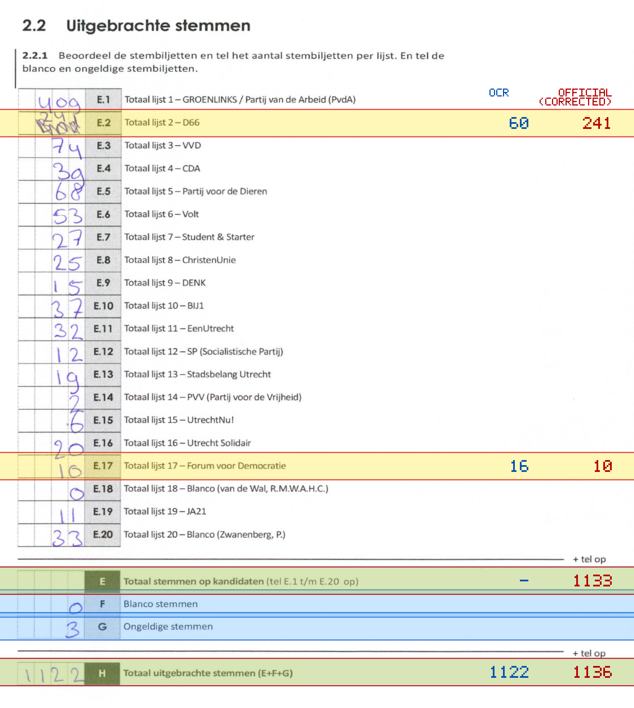
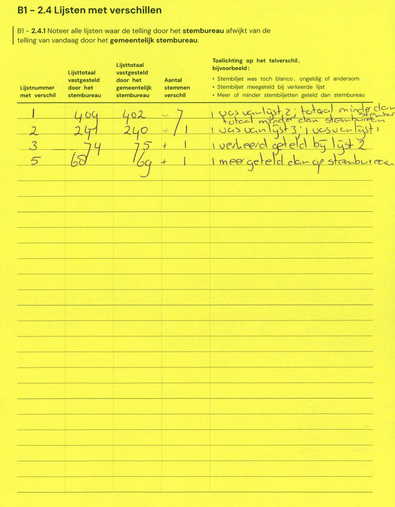

# Station 14 - Leidsekade 118

- Status: `internally inconsistent`
- Markdown: `2026-GR/0344/results/Utrecht_14_Buurthuis_Muntmeesters_GR26_eerste_telling.md`
- Correction OCR: `2026-GR/0344/results/corrections/Utrecht_14_Buurthuis_Muntmeesters_GR26.md`

## Details

- expected 26 non-empty table lines, found 25
- row 23 expected ID E, found F
- row 24 expected ID F, found G
- row 25 expected ID G, found H
- missing row 26 for H
- E.2: md=60, official=241
- E.17: md=16, official=10
- E: md=missing, official=1133
- H: md=1122, official=1136

Legend: yellow/red = official CSV mismatch; blue = internal consistency issue. The right margin shows OCR and official values for official mismatches.



## Corrections

```markdown
| ID | First | Second | Difference | Note |
|---|---:|---:|---:|---|
| E.1 | 409 | 402 | -7 | was van lijst 2, totaal minder dan stembureau |
| E.2 | 241 | 240 | -1 | was van lijst 3, 1 was onlist |
| E.3 | 74 | 75 | 1 | verkeerd geteld bij lijst 2 |
| E.5 | 68 | 69 | 1 | meer geteld dan op stembureau |
```


