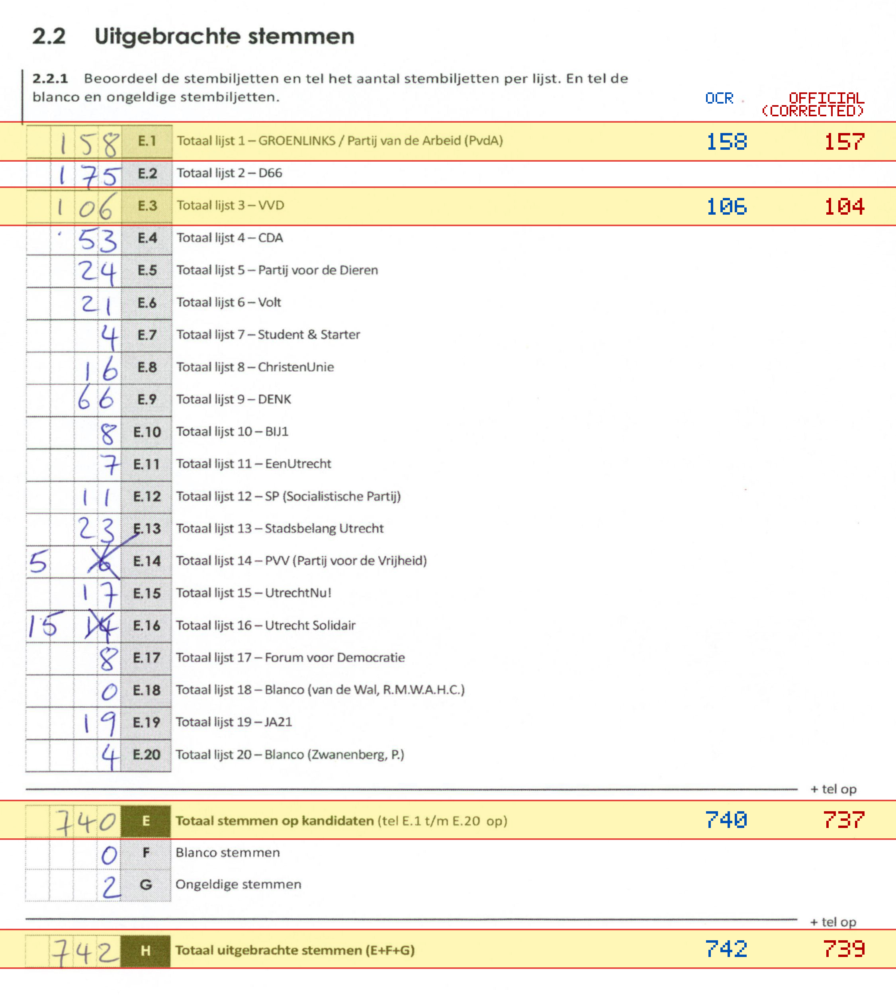
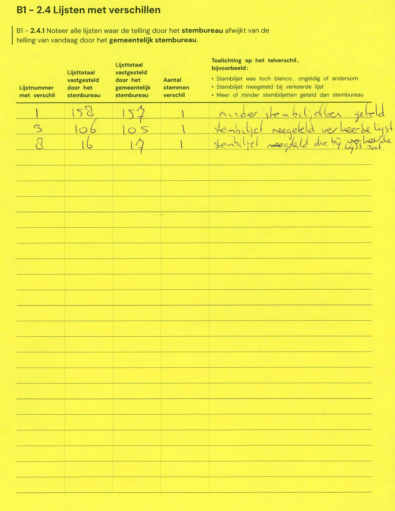

# Station 142 - Hogeweide 6

- Status: `mismatch`
- Markdown: `2026-GR/0344/results/Utrecht_142_Boerderij_De_Hoef_GR26_eerste_telling.md`
- Correction OCR: `2026-GR/0344/results/corrections/Utrecht_142_Boerderij_De_Hoef_GR26.md`

## Details

- E.1: md=158, official=157
- E.3: md=106, official=104
- E: md=740, official=737
- H: md=742, official=739

## Candidate Votes

- Status: `incomplete`
- Compared candidate cells: 0/508
- Candidate OCR files: 0
- candidate OCR not available
- known list/correction issues are shown

Legend: yellow/red = official CSV mismatch; blue = internal consistency issue. The right margin shows OCR and official values for official mismatches.



## Corrections

```markdown
| ID | First | Second | Difference | Note |
|---|---:|---:|---:|---|
| E.1 | 158 | 157 | 1 | minder stembiljetten geteld |
| E.3 | 106 | 105 | 1 | stembiljet meegerekend verkeerde lijst |
| E.8 | 16 | 17 | 1 | stembiljet meegerekend die bij verkeerde lijst zat. |
```


