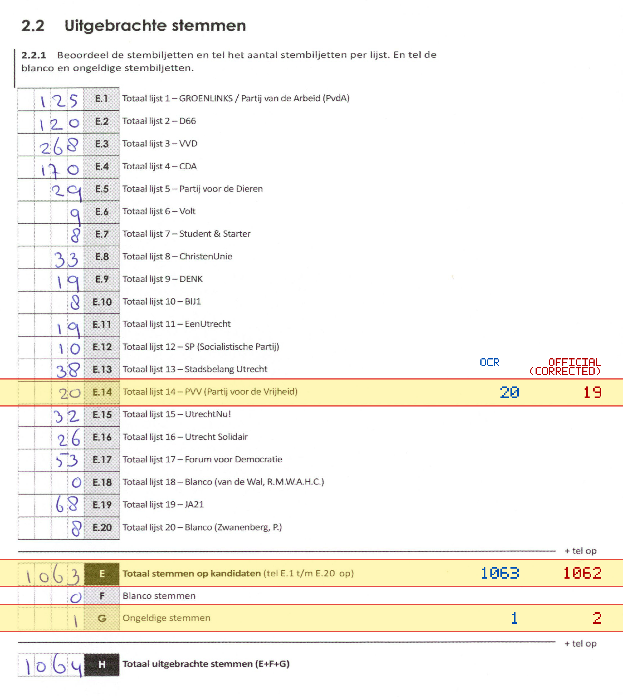
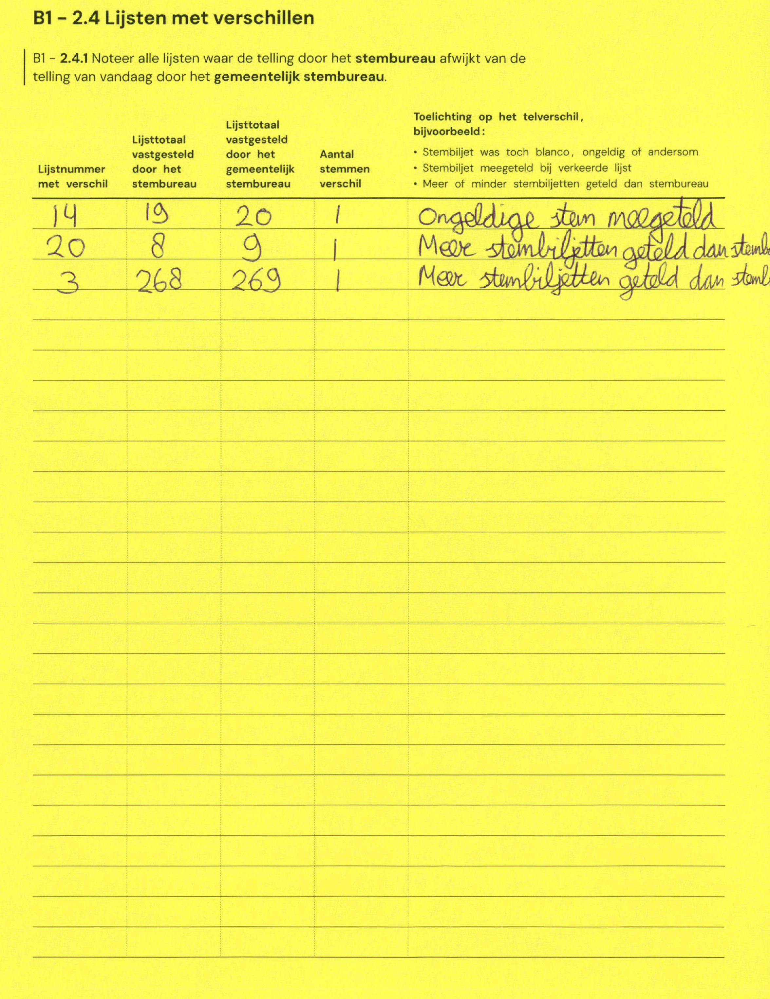

# Station 144 - Dorpsplein 1

- Status: `correction inconsistent`
- Markdown: `2026-GR/0344/results/Utrecht_144_Wijkservicecentrum_Vleuten-De_Meern_GR26_eerste_telling.md`
- Correction OCR: `2026-GR/0344/results/corrections/Utrecht_144_Wijkservicecentrum_Vleuten-De_Meern_GR26.md`

## Correction Inconsistency

The correction table does not line up with the first-count Markdown. Inspect the correction crop before treating this as a plain official-result mismatch.


## Details

- could not apply corrections: E.14 second=20, official=19

Legend: yellow/red = official CSV mismatch; blue = internal consistency issue. The right margin shows OCR and official values for official mismatches.



## Corrections

```markdown
| ID | First | Second | Difference | Note |
|---|---:|---:|---:|---|
| E.14 | 19 | 20 | 1 | Ongeldige stem meegeteld |
| E.20 | 8 | 9 | 1 | Meer stembiljetten geteld dan stemb |
| E.3 | 268 | 269 | 1 | Meer stembiljetten geteld dan stemb |
```


