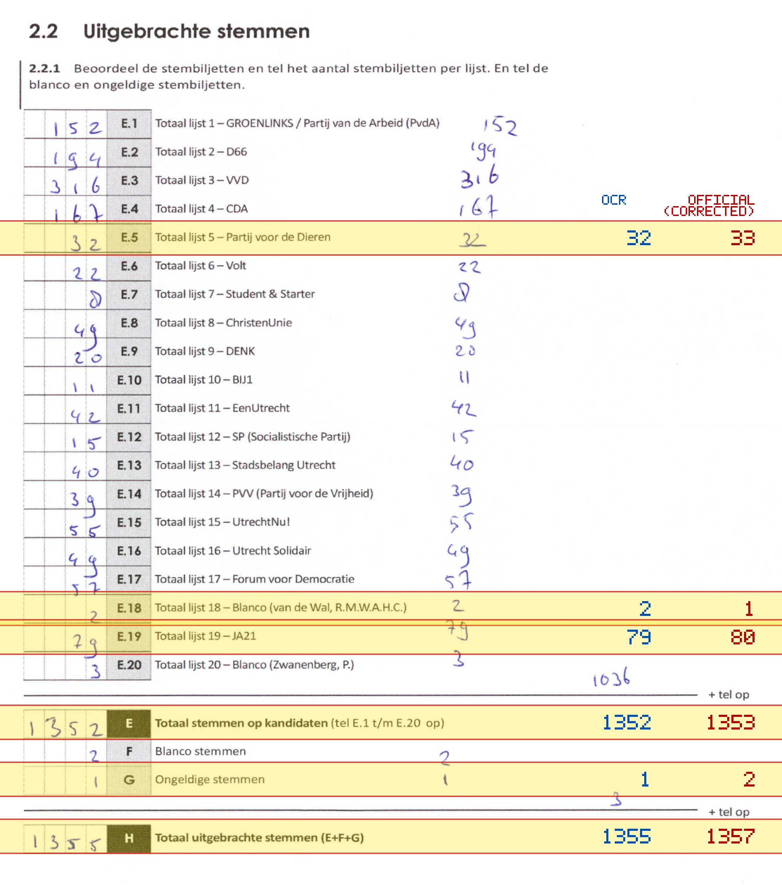
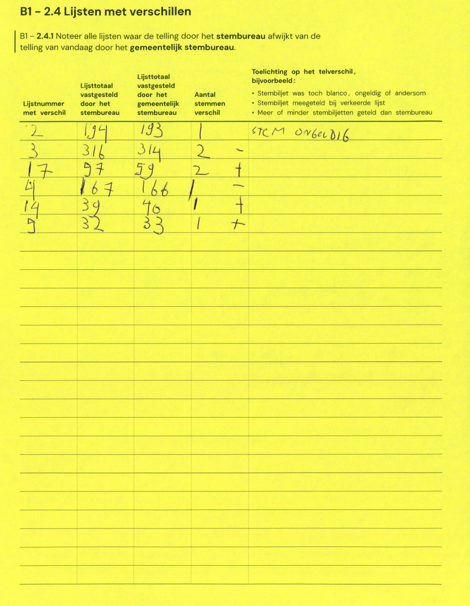

# Station 146 - Kortland 23

- Status: `correction inconsistent`
- Markdown: `2026-GR/0344/results/Utrecht_146_Kees_Valkensteinschool_GR26_eerste_telling.md`
- Correction OCR: `2026-GR/0344/results/corrections/Utrecht_146_Kees_Valkensteinschool_GR26.md`

## Correction Inconsistency

The correction table does not line up with the first-count Markdown. Inspect the correction crop before treating this as a plain official-result mismatch.


## Details

- could not apply corrections: E.9 second=33, official=20

Legend: yellow/red = official CSV mismatch; blue = internal consistency issue. The right margin shows OCR and official values for official mismatches.



## Corrections

```markdown
| ID | First | Second | Difference | Note |
|---|---:|---:|---:|---|
| E.2 | 194 | 193 | -1 | STEM ONGELDIG |
| E.3 | 316 | 314 | -2 |  |
| E.17 | 57 | 59 | 2 |  |
| E.4 | 167 | 166 | -1 |  |
| E.14 | 39 | 40 | 1 |  |
| E.9 | 32 | 33 | 1 |  |
```


