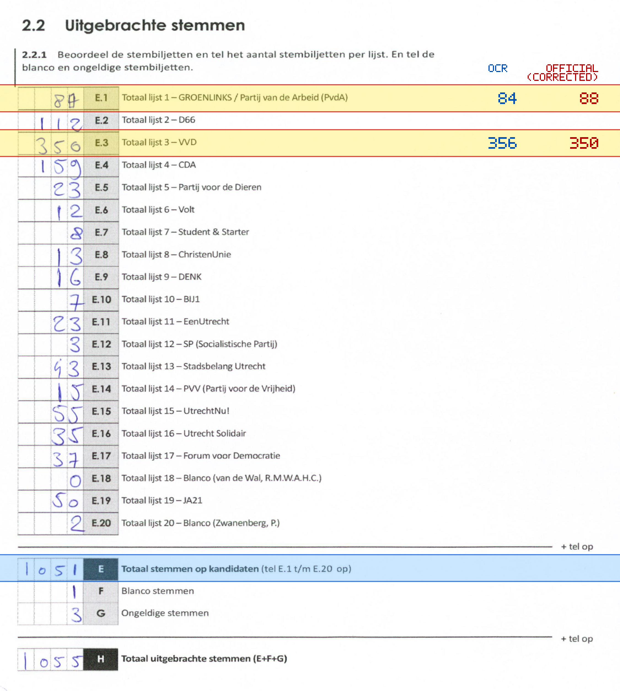
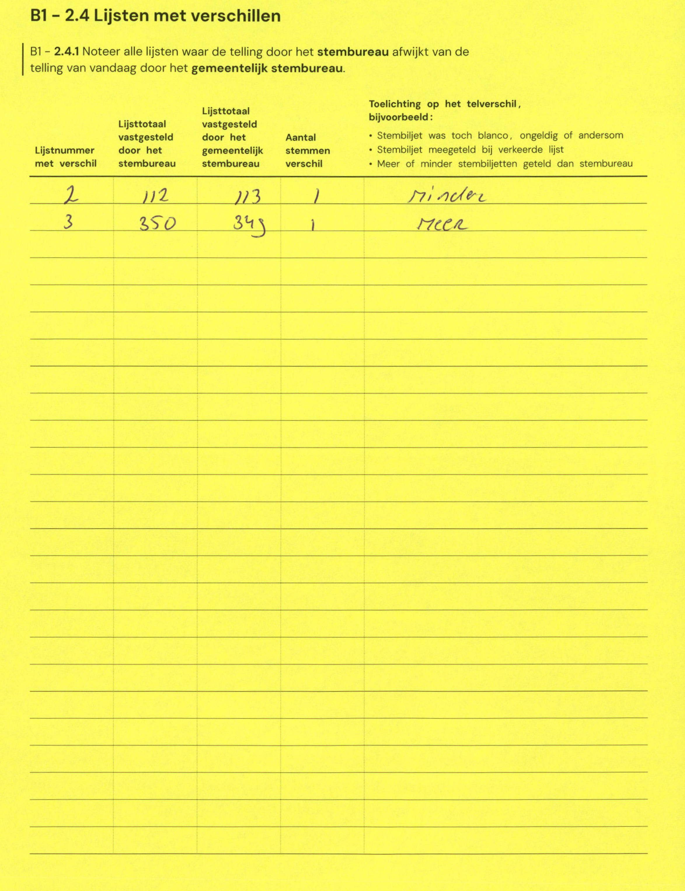

# Station 151 - Zandweg 148

- Status: `internally inconsistent`
- Markdown: `2026-GR/0344/results/Utrecht_151_Vereenigingsgebouw_De_Zandweg_GR26_eerste_telling.md`
- Correction OCR: `2026-GR/0344/results/corrections/Utrecht_151_Vereenigingsgebouw_De_Zandweg_GR26.md`

## Details

- E.1 through E.20 sum to 1053, but E is 1051
- E.1: md=84, official=88
- E.3: md=356, official=350

## Candidate Votes

- Status: `incomplete`
- Compared candidate cells: 0/508
- Candidate OCR files: 0
- candidate OCR not available
- known list/correction issues are shown

Legend: yellow/red = official CSV mismatch; blue = internal consistency issue. The right margin shows OCR and official values for official mismatches.



## Corrections

```markdown
| ID | First | Second | Difference | Note |
|---|---:|---:|---:|---|
| E.2 | 112 | 113 | 1 | minder |
| E.3 | 350 | 349 | -1 | meer |
```


