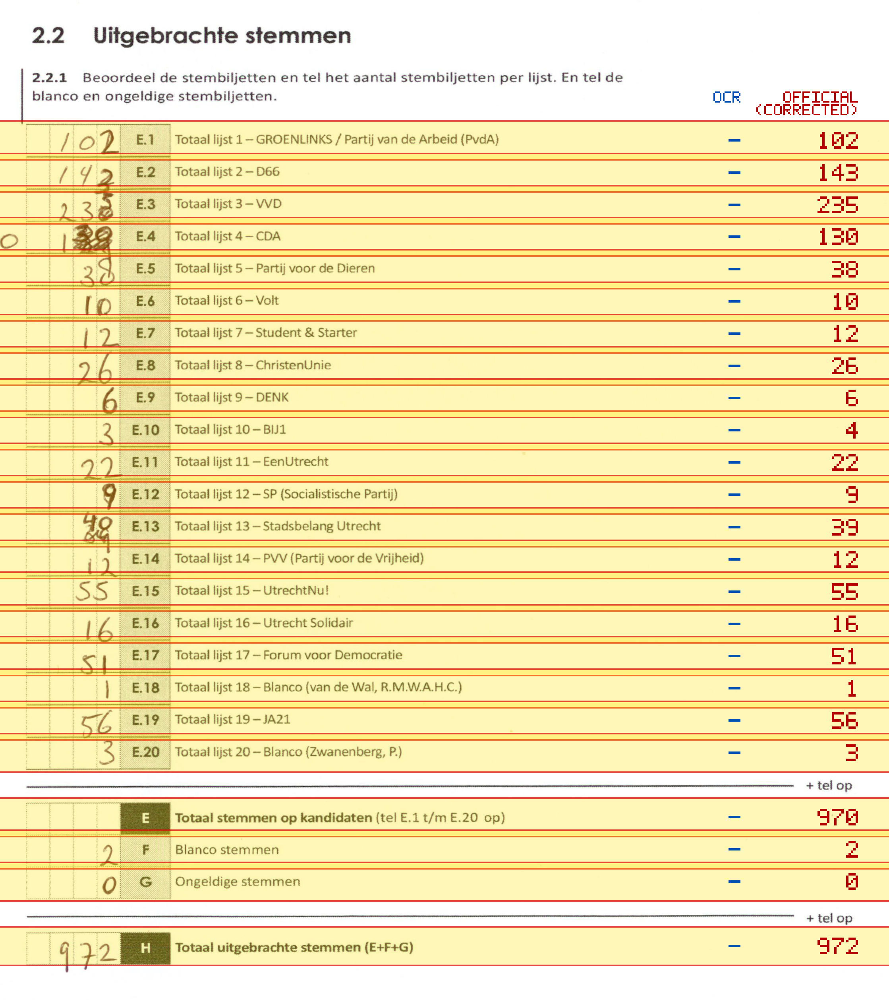
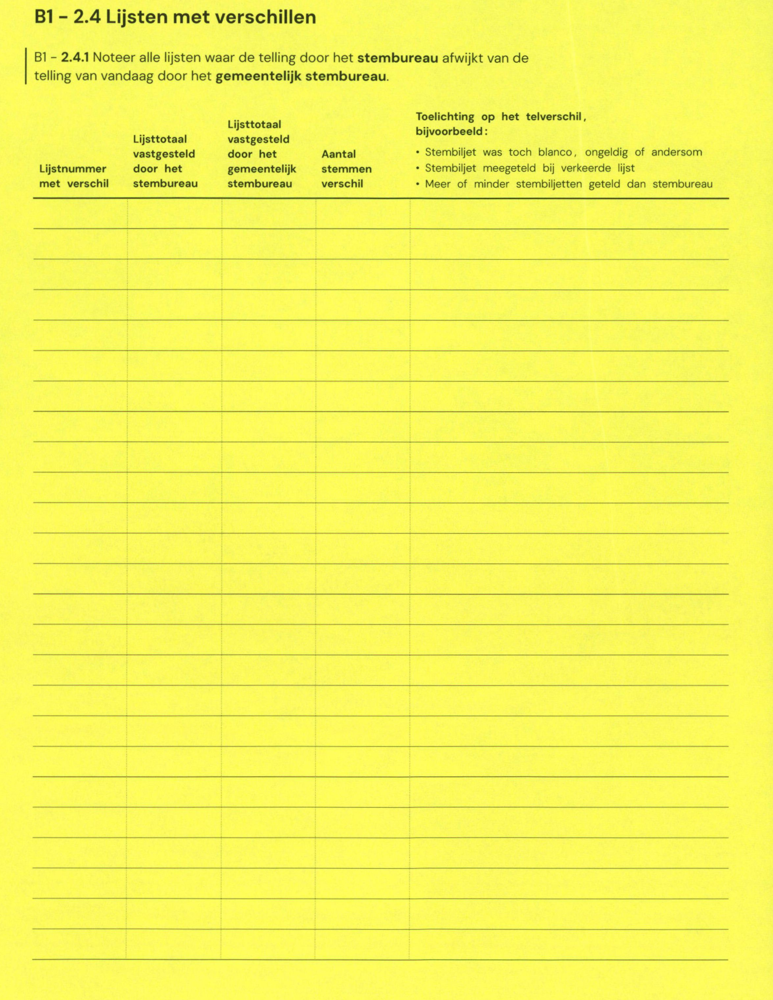

# Station 153 - Mereveldlaan 3

- Status: `mismatch`
- Markdown: `2026-GR/0344/results/Utrecht_153_Gymzaal_Mereveldlaan_GR26_eerste_telling.md`
- Correction OCR: `2026-GR/0344/results/corrections/Utrecht_153_Gymzaal_Mereveldlaan_GR26.md`

## Details

- E.1: md=missing, official=102
- E.2: md=missing, official=143
- E.3: md=missing, official=235
- E.4: md=missing, official=130
- E.5: md=missing, official=38
- E.6: md=missing, official=10
- E.7: md=missing, official=12
- E.8: md=missing, official=26
- E.9: md=missing, official=6
- E.10: md=missing, official=4
- E.11: md=missing, official=22
- E.12: md=missing, official=9
- E.13: md=missing, official=39
- E.14: md=missing, official=12
- E.15: md=missing, official=55
- E.16: md=missing, official=16
- E.17: md=missing, official=51
- E.18: md=missing, official=1
- E.19: md=missing, official=56
- E.20: md=missing, official=3
- E: md=missing, official=970
- F: md=missing, official=2
- G: md=missing, official=0
- H: md=missing, official=972

## Candidate Votes

- Status: `incomplete`
- Compared candidate cells: 0/508
- Candidate OCR files: 0
- candidate OCR not available
- known list/correction issues are shown

Legend: yellow/red = official CSV mismatch; blue = internal consistency issue. The right margin shows OCR and official values for official mismatches.



## Corrections

```markdown
| ID | First | Second | Difference | Note |
|---|---:|---:|---:|---|
```


