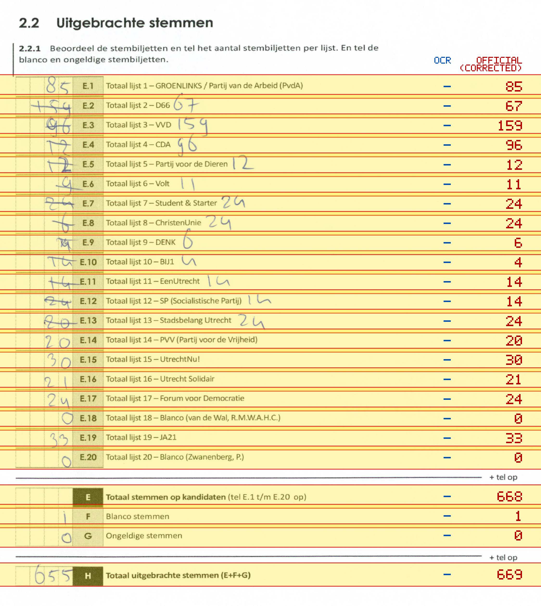
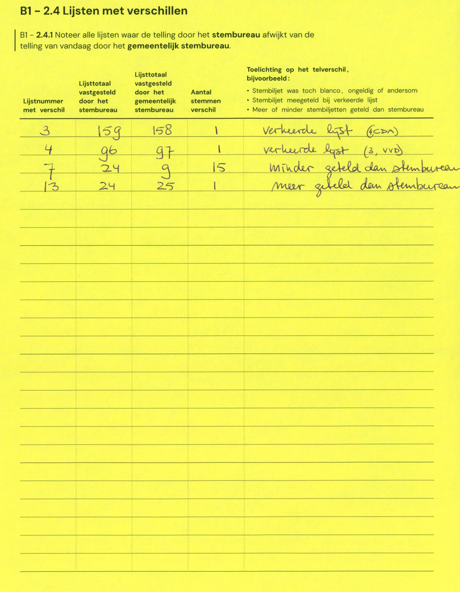

# Station 154 - Touwslagerslaan 3

- Status: `mismatch`
- Markdown: `2026-GR/0344/results/Utrecht_154_Dienstencentrum_De_Roef_GR26_eerste_telling.md`
- Correction OCR: `2026-GR/0344/results/corrections/Utrecht_154_Dienstencentrum_De_Roef_GR26.md`

## Details

- E.1: md=missing, official=85
- E.2: md=missing, official=67
- E.3: md=missing, official=159
- E.4: md=missing, official=96
- E.5: md=missing, official=12
- E.6: md=missing, official=11
- E.7: md=missing, official=24
- E.8: md=missing, official=24
- E.9: md=missing, official=6
- E.10: md=missing, official=4
- E.11: md=missing, official=14
- E.12: md=missing, official=14
- E.13: md=missing, official=24
- E.14: md=missing, official=20
- E.15: md=missing, official=30
- E.16: md=missing, official=21
- E.17: md=missing, official=24
- E.18: md=missing, official=0
- E.19: md=missing, official=33
- E.20: md=missing, official=0
- E: md=missing, official=668
- F: md=missing, official=1
- G: md=missing, official=0
- H: md=missing, official=669

Legend: yellow/red = official CSV mismatch; blue = internal consistency issue. The right margin shows OCR and official values for official mismatches.



## Corrections

```markdown
| ID | First | Second | Difference | Note |
|---|---:|---:|---:|---|
| E.3 | 159 | 158 | -1 | verkeerde lijst (CDA) |
| E.4 | 96 | 97 | 1 | verkeerde lijst (3, VVD) |
| E.7 | 24 | 9 | -15 | minder geteld dan stembureau |
| E.13 | 24 | 25 | 1 | meer geteld dan stembureau |
```


