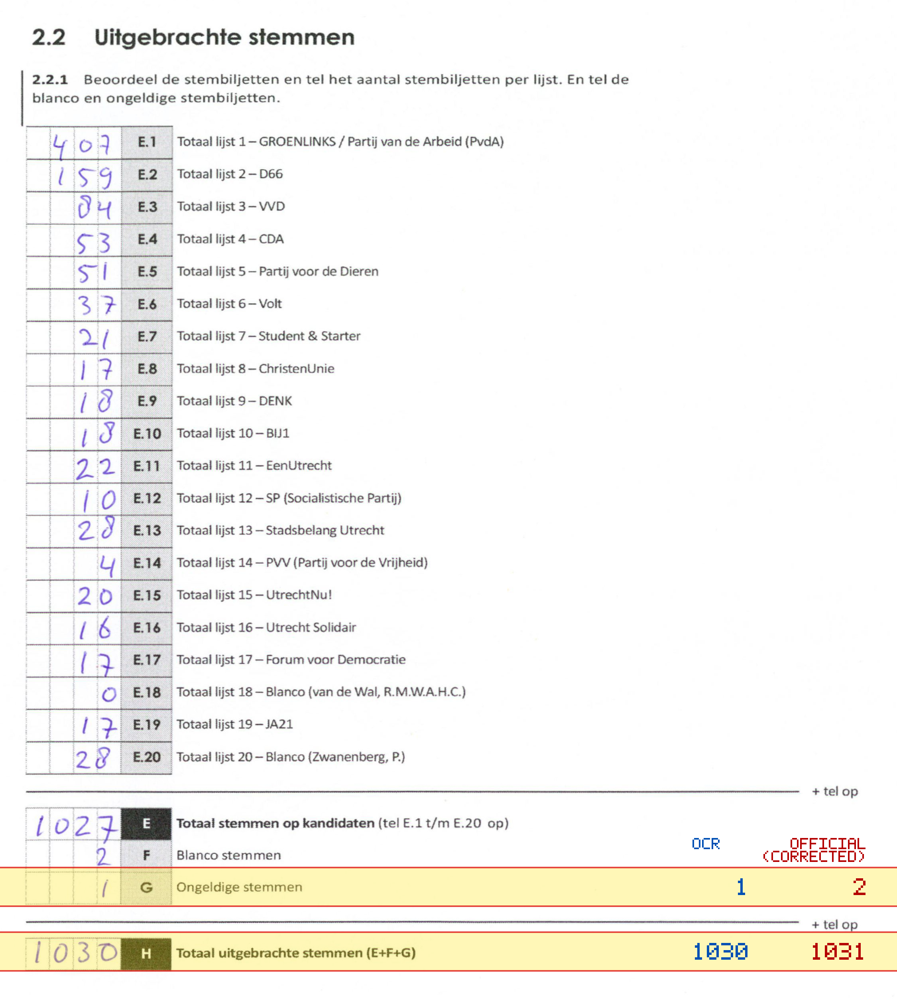
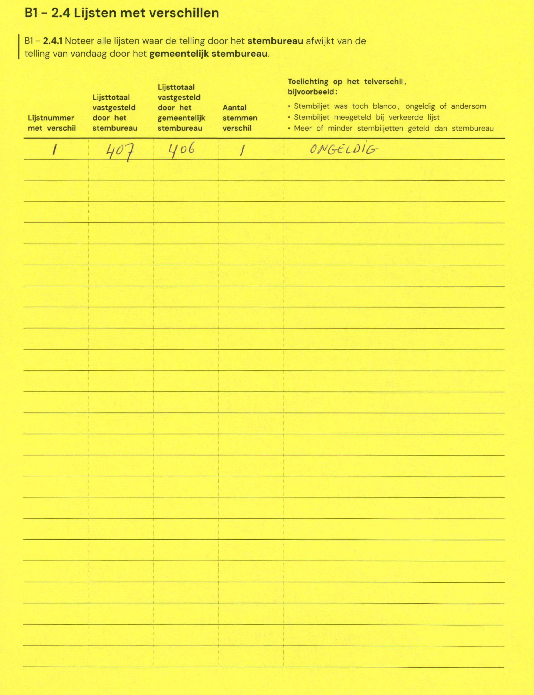

# Station 16 - Staringstraat 1 ingang H.J. Schimmelplein

- Status: `mismatch`
- Markdown: `2026-GR/0344/results/Utrecht_16_KBS_De_Catharijnepoort_GR26_eerste_telling.md`
- Correction OCR: `2026-GR/0344/results/corrections/Utrecht_16_KBS_De_Catharijnepoort_GR26.md`

## Details

- G: md=1, official=2
- H: md=1030, official=1031

## Candidate Votes

- Status: `incomplete`
- Compared candidate cells: 0/508
- Candidate OCR files: 0
- candidate OCR not available
- known list/correction issues are shown

Legend: yellow/red = official CSV mismatch; blue = internal consistency issue. The right margin shows OCR and official values for official mismatches.



## Corrections

```markdown
| ID | First | Second | Difference | Note |
|---|---:|---:|---:|---|
| E.1 | 407 | 406 | -1 | ONGELDIG |
```


