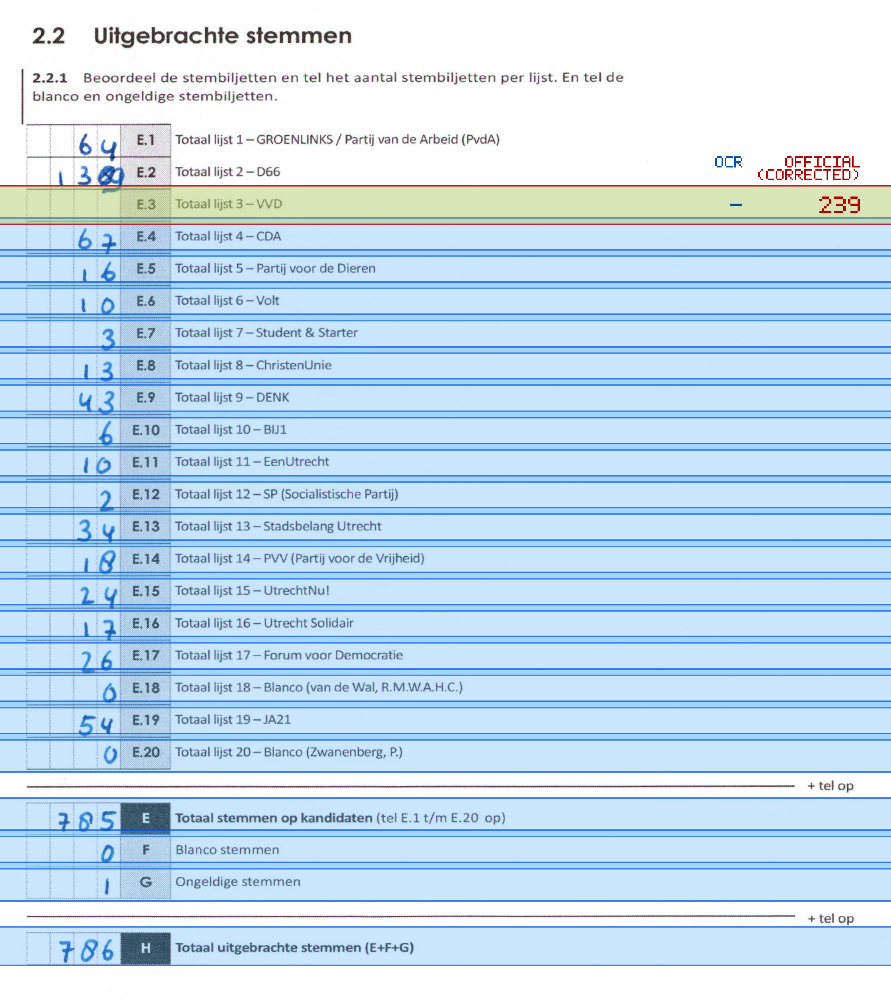
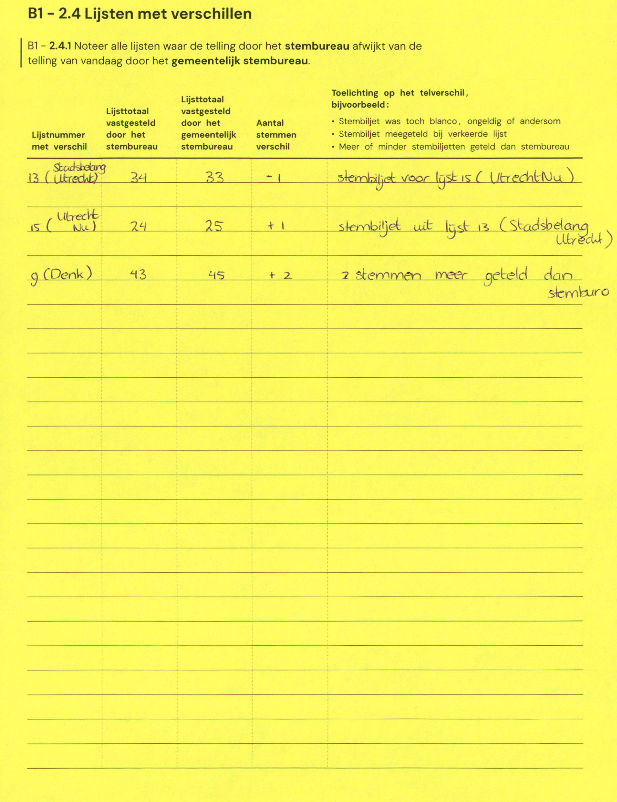

# Station 161 - Kweektuinlaan 11

- Status: `internally inconsistent`
- Markdown: `2026-GR/0344/results/Utrecht_161_Gymzaal_Kweektuinlaan_GR26_eerste_telling.md`
- Correction OCR: `2026-GR/0344/results/corrections/Utrecht_161_Gymzaal_Kweektuinlaan_GR26.md`

## Details

- expected 26 non-empty table lines, found 25
- row 5 expected ID E.3, found E.4
- row 6 expected ID E.4, found E.5
- row 7 expected ID E.5, found E.6
- row 8 expected ID E.6, found E.7
- row 9 expected ID E.7, found E.8
- row 10 expected ID E.8, found E.9
- row 11 expected ID E.9, found E.10
- row 12 expected ID E.10, found E.11
- row 13 expected ID E.11, found E.12
- row 14 expected ID E.12, found E.13
- row 15 expected ID E.13, found E.14
- row 16 expected ID E.14, found E.15
- row 17 expected ID E.15, found E.16
- row 18 expected ID E.16, found E.17
- row 19 expected ID E.17, found E.18
- row 20 expected ID E.18, found E.19
- row 21 expected ID E.19, found E.20
- row 22 expected ID E.20, found E
- row 23 expected ID E, found F
- row 24 expected ID F, found G
- row 25 expected ID G, found H
- missing row 26 for H
- E.3: md=missing, official=239

Legend: yellow/red = official CSV mismatch; blue = internal consistency issue. The right margin shows OCR and official values for official mismatches.



## Corrections

```markdown
| ID | First | Second | Difference | Note |
|---|---:|---:|---:|---|
| E.13 | 34 | 33 | -1 | stembiljet voor lijst 15 (Utrecht Nu) |
| E.15 | 24 | 25 | 1 | stembiljet uit lijst 13 (Stadsbelang Utrecht) |
| E.9 | 43 | 45 | 2 | 2 stemmen meer geteld dan stemburo |
```


