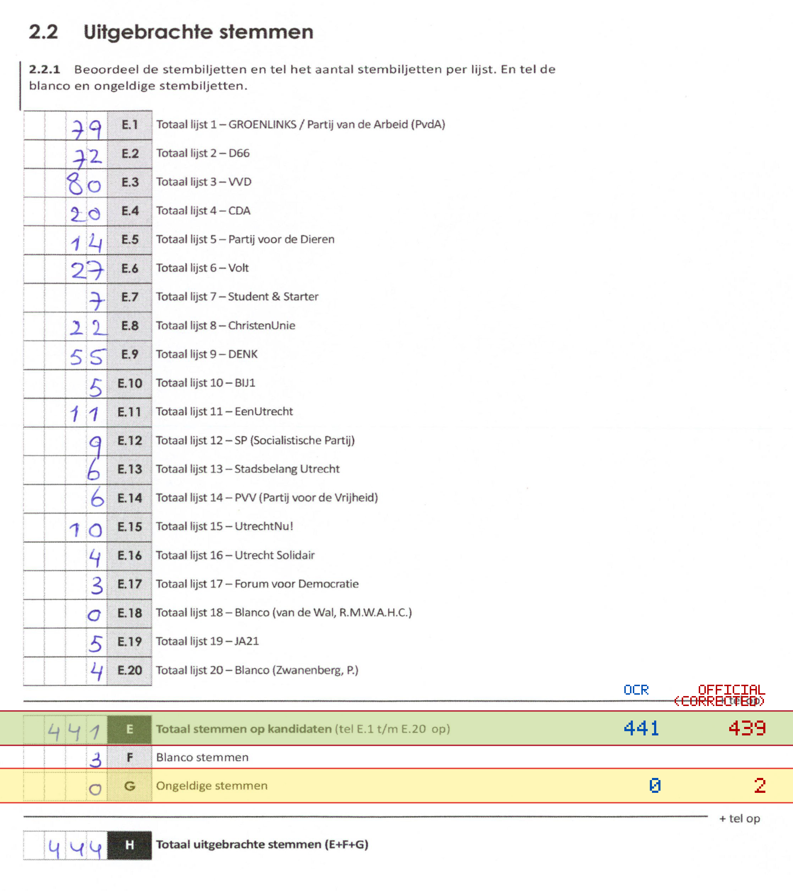
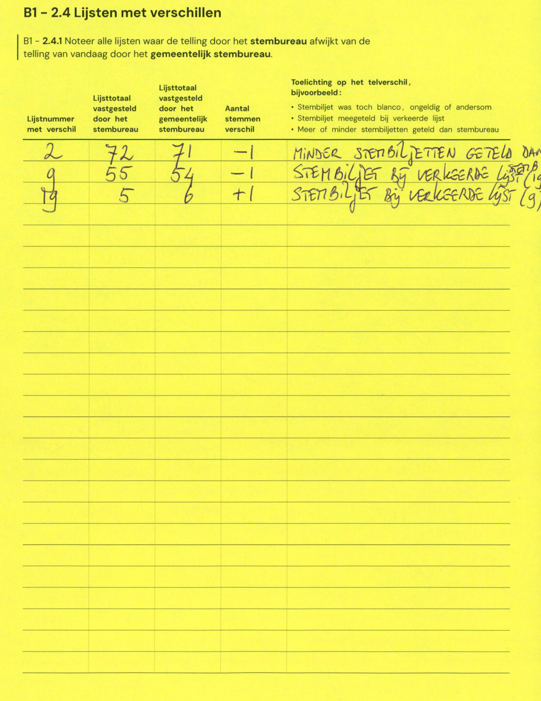

# Station 162 - Jazzsingel 900

- Status: `internally inconsistent`
- Markdown: `2026-GR/0344/results/Utrecht_162_KBS_De_JazzSingel_GR26_eerste_telling.md`
- Correction OCR: `2026-GR/0344/results/corrections/Utrecht_162_KBS_De_JazzSingel_GR26.md`

## Details

- E.1 through E.20 sum to 439, but E is 441
- E: md=441, official=439
- G: md=0, official=2

## Candidate Votes

- Status: `incomplete`
- Compared candidate cells: 0/508
- Candidate OCR files: 0
- candidate OCR not available
- known list/correction issues are shown

Legend: yellow/red = official CSV mismatch; blue = internal consistency issue. The right margin shows OCR and official values for official mismatches.



## Corrections

```markdown
| ID | First | Second | Difference | Note |
|---|---:|---:|---:|---|
| E.2 | 72 | 71 | -1 | MINDERS STEMBILJETTEN GETELD DAN |
| E.9 | 55 | 54 | -1 | STEMBILJET BY VERKEERDE LIJST (19) |
| E.19 | 5 | 6 | 1 | STEMBILJET BY VERKEERDE LIJST (9) |
```


