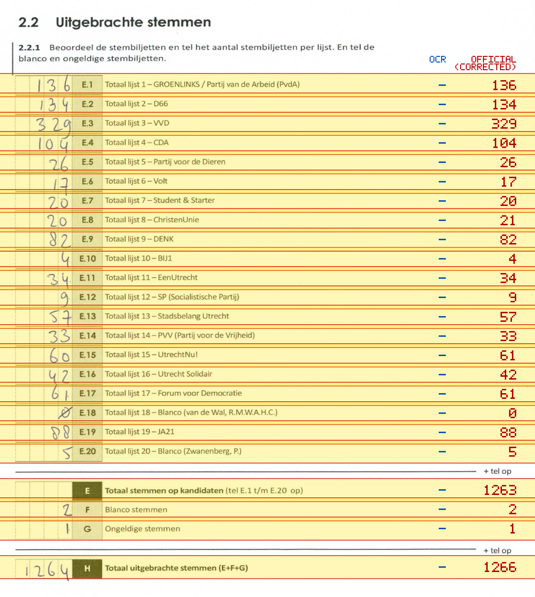
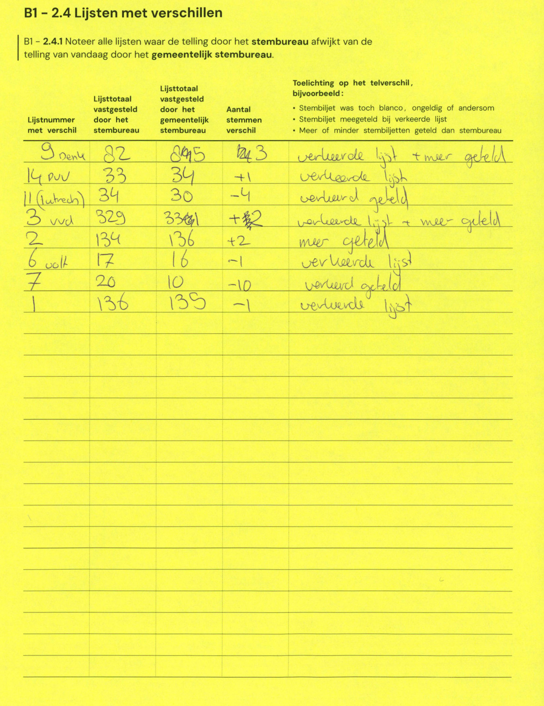

# Station 163 - Keerderberg 21

- Status: `mismatch`
- Markdown: `2026-GR/0344/results/Utrecht_163_Sportzaal_Broos_Gerssen_GR26_eerste_telling.md`
- Correction OCR: `2026-GR/0344/results/corrections/Utrecht_163_Sportzaal_Broos_Gerssen_GR26.md`

## Details

- E.1: md=missing, official=136
- E.2: md=missing, official=134
- E.3: md=missing, official=329
- E.4: md=missing, official=104
- E.5: md=missing, official=26
- E.6: md=missing, official=17
- E.7: md=missing, official=20
- E.8: md=missing, official=21
- E.9: md=missing, official=82
- E.10: md=missing, official=4
- E.11: md=missing, official=34
- E.12: md=missing, official=9
- E.13: md=missing, official=57
- E.14: md=missing, official=33
- E.15: md=missing, official=61
- E.16: md=missing, official=42
- E.17: md=missing, official=61
- E.18: md=missing, official=0
- E.19: md=missing, official=88
- E.20: md=missing, official=5
- E: md=missing, official=1263
- F: md=missing, official=2
- G: md=missing, official=1
- H: md=missing, official=1266

Legend: yellow/red = official CSV mismatch; blue = internal consistency issue. The right margin shows OCR and official values for official mismatches.



## Corrections

```markdown
| ID | First | Second | Difference | Note |
|---|---:|---:|---:|---|
| E.9 | 82 | 85 | 3 | verkeerde lijst + meer geteld |
| E.14 | 33 | 34 | 1 | verkeerde lijst |
| E.11 | 34 | 30 | -4 | verkeerd geteld |
| E.3 | 329 | 331 | 2 | verkeerde lijst + meer geteld |
| E.2 | 134 | 136 | 2 | meer geteld |
| E.6 | 17 | 16 | -1 | verkeerde lijst |
| E.7 | 20 | 10 | -10 | verkeerd geteld |
| E.1 | 136 | 135 | -1 | verkeerde lijst |
```


