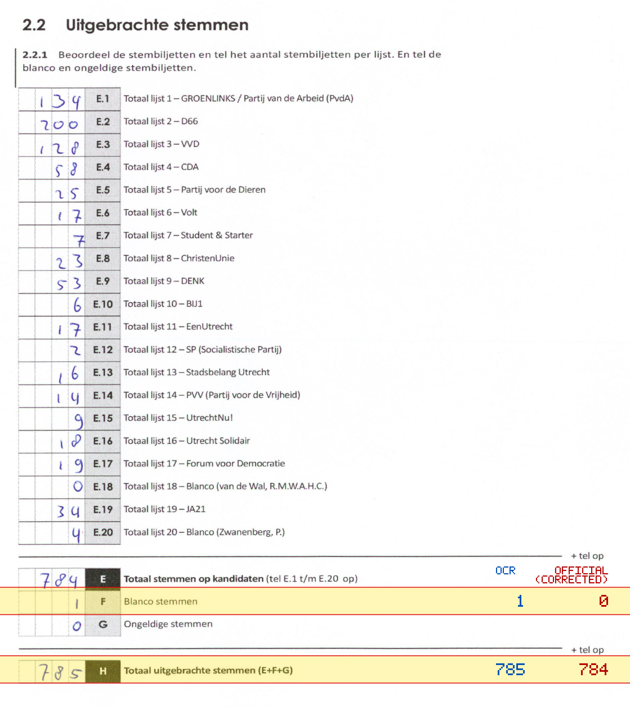
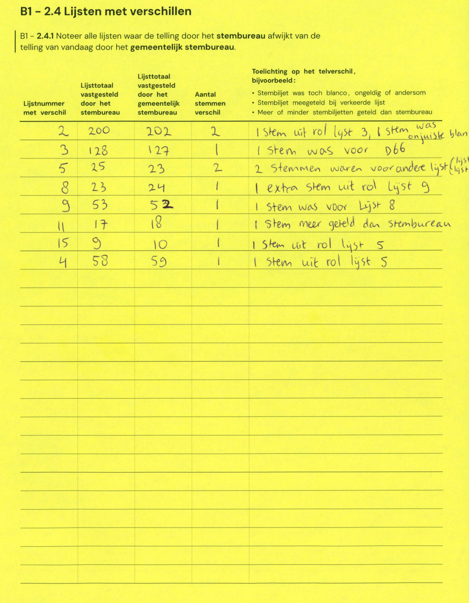

# Station 167 - Pauwoogvlinder 20

- Status: `mismatch`
- Markdown: `2026-GR/0344/results/Utrecht_167_Buurtcentrum__t_Zand_GR26_eerste_telling.md`
- Correction OCR: `2026-GR/0344/results/corrections/Utrecht_167_Buurtcentrum__t_Zand_GR26.md`

## Details

- F: md=1, official=0
- H: md=785, official=784

Legend: yellow/red = official CSV mismatch; blue = internal consistency issue. The right margin shows OCR and official values for official mismatches.



## Corrections

```markdown
| ID | First | Second | Difference | Note |
|---|---:|---:|---:|---|
| E.2 | 200 | 202 | 2 | 1 stem uit rol lijst 3, 1 stem was onjuiste blanco |
| E.3 | 128 | 127 | -1 | 1 stem was voor D66 |
| E.5 | 25 | 23 | -2 | 2 stemmen waren voor andere lijst |
| E.8 | 23 | 24 | 1 | 1 extra stem uit rol Lijst 9 |
| E.9 | 53 | 52 | -1 | 1 stem was voor Lijst 8 |
| E.11 | 17 | 18 | 1 | 1 stem meer geteld dan stembureau |
| E.15 | 9 | 10 | 1 | 1 stem uit rol lijst 5 |
| E.4 | 58 | 59 | 1 | 1 stem uit rol lijst 5 |
```


