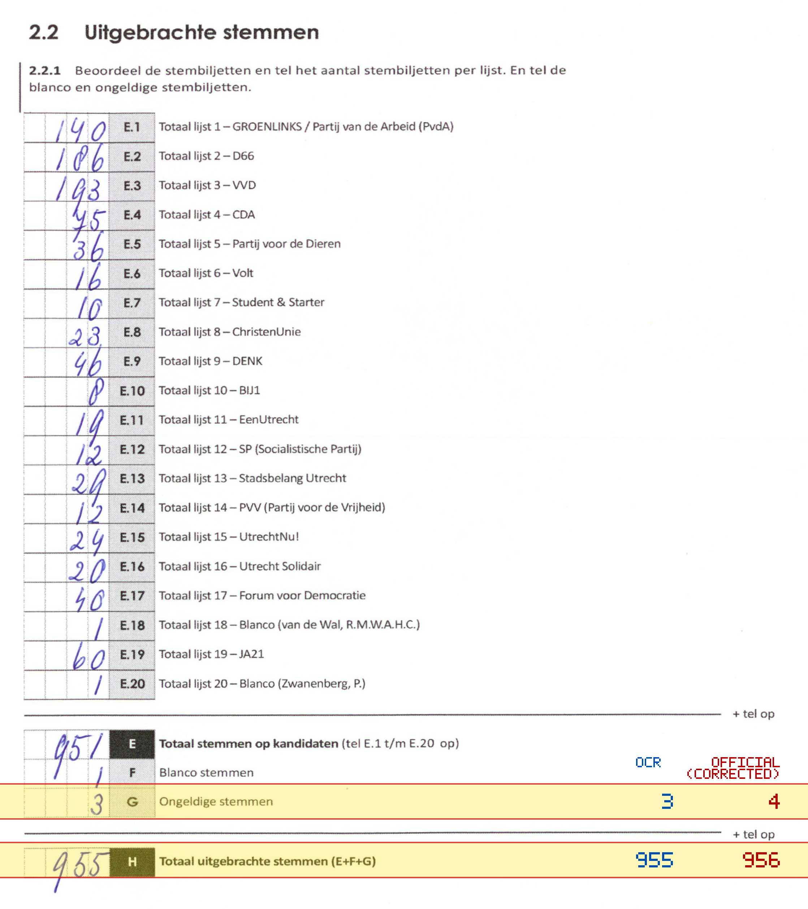
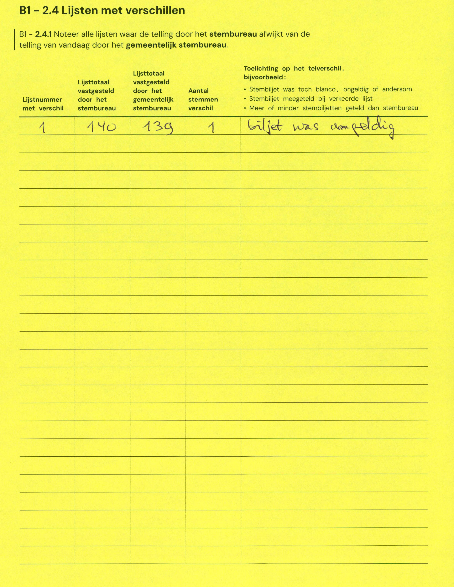

# Station 168 - Kandinskystraat 40

- Status: `mismatch`
- Markdown: `2026-GR/0344/results/Utrecht_168_Woonzorgcentrum_De_Drie_Ringen_GR26_eerste_telling.md`
- Correction OCR: `2026-GR/0344/results/corrections/Utrecht_168_Woonzorgcentrum_De_Drie_Ringen_GR26.md`

## Details

- G: md=3, official=4
- H: md=955, official=956

## Candidate Votes

- Status: `incomplete`
- Compared candidate cells: 0/508
- Candidate OCR files: 0
- candidate OCR not available
- known list/correction issues are shown

Legend: yellow/red = official CSV mismatch; blue = internal consistency issue. The right margin shows OCR and official values for official mismatches.



## Corrections

```markdown
| ID | First | Second | Difference | Note |
|---|---:|---:|---:|---|
| E.1 | 140 | 139 | -1 | biljet was ongeldig |
```


