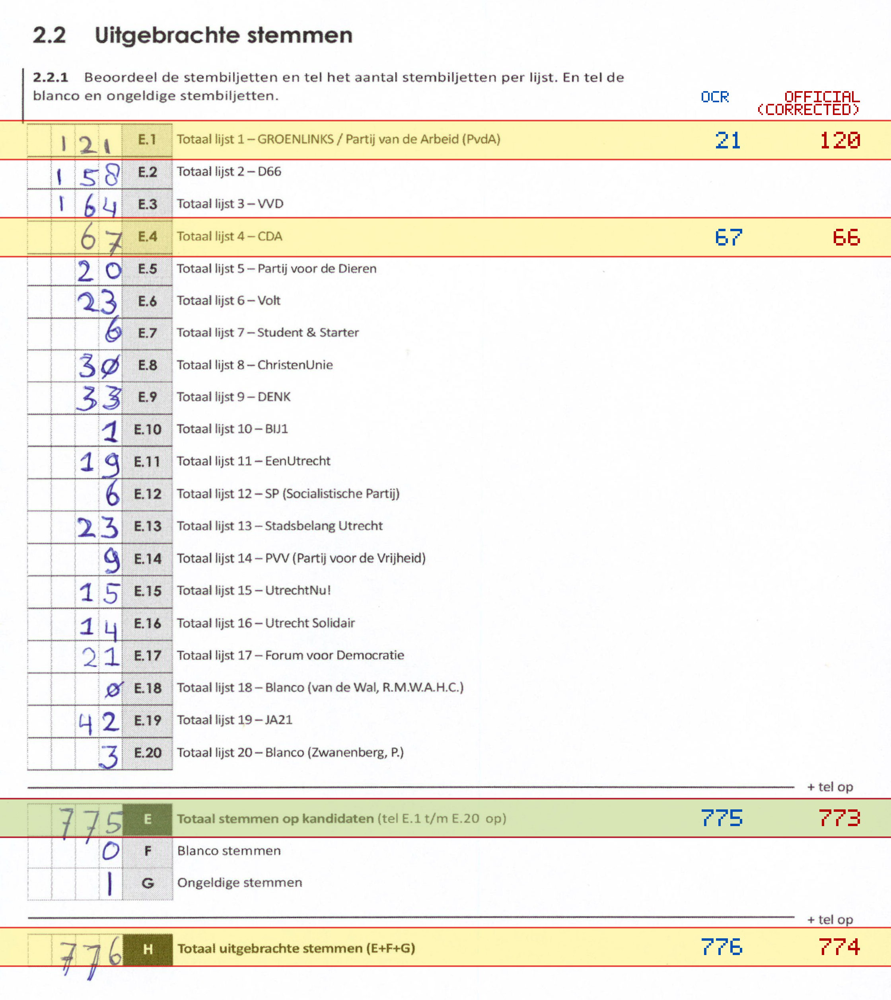
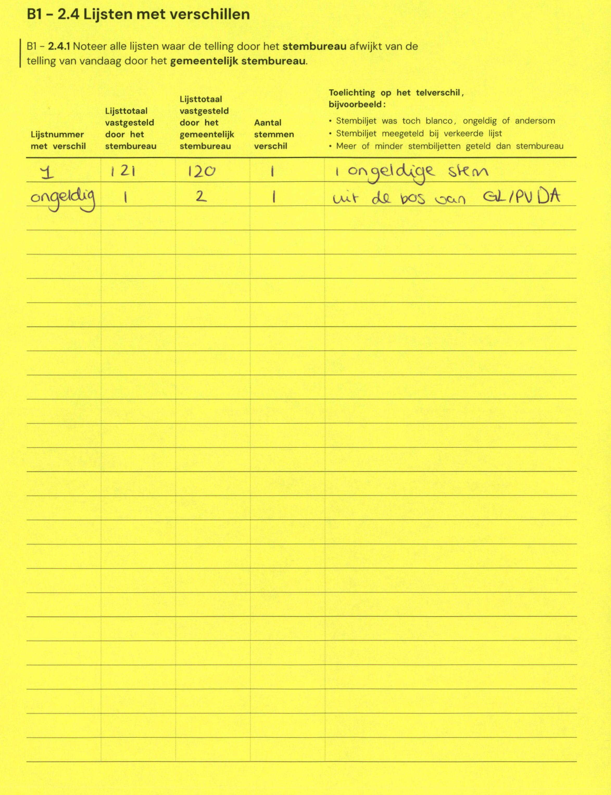

# Station 179 - Parkzichtlaan 203

- Status: `internally inconsistent`
- Markdown: `2026-GR/0344/results/Utrecht_179_Sportcentrum_De_Paperclip_GR26_eerste_telling.md`
- Correction OCR: `2026-GR/0344/results/corrections/Utrecht_179_Sportcentrum_De_Paperclip_GR26.md`

## Details

- E.1 through E.20 sum to 675, but E is 775
- E.1: md=21, official=120
- E.4: md=67, official=66
- E: md=775, official=773
- H: md=776, official=774

## Candidate Votes

- Status: `incomplete`
- Compared candidate cells: 0/508
- Candidate OCR files: 0
- candidate OCR not available
- known list/correction issues are shown

Legend: yellow/red = official CSV mismatch; blue = internal consistency issue. The right margin shows OCR and official values for official mismatches.



## Corrections

```markdown
| ID | First | Second | Difference | Note |
|---|---:|---:|---:|---|
| E.4 | 121 | 120 | 1 | ongeldige stem |
| G | 1 | 2 | 1 | uit de bos van GL/PvdA |
```


