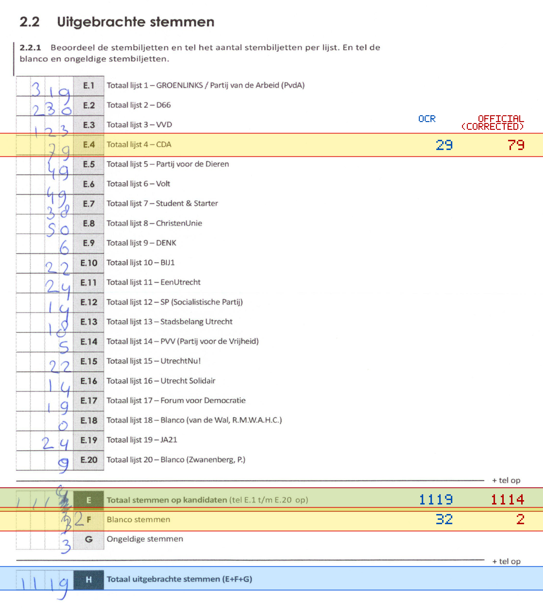
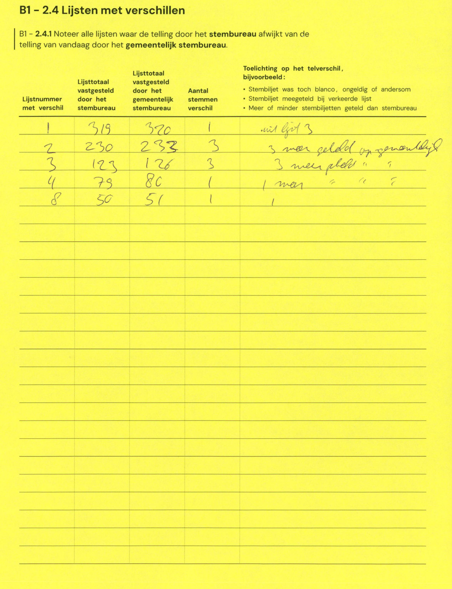

# Station 190 - Kouwerplantsoen 1A

- Status: `internally inconsistent`
- Markdown: `2026-GR/0344/results/Utrecht_190_Jeruzalemkerk_GR26_eerste_telling.md`
- Correction OCR: `2026-GR/0344/results/corrections/Utrecht_190_Jeruzalemkerk_GR26.md`

## Details

- E.1 through E.20 sum to 1064, but E is 1119
- E + F + G is 1154, but H is 1119
- E.4: md=29, official=79
- E: md=1119, official=1114
- F: md=32, official=2

## Candidate Votes

- Status: `incomplete`
- Compared candidate cells: 0/508
- Candidate OCR files: 0
- candidate OCR not available
- known list/correction issues are shown

Legend: yellow/red = official CSV mismatch; blue = internal consistency issue. The right margin shows OCR and official values for official mismatches.



## Corrections

```markdown
| ID | First | Second | Difference | Note |
|---|---:|---:|---:|---|
| E.1 | 319 | 320 | 1 | wil ligt 3 |
| E.2 | 230 | 233 | 3 | 3 meer geteld op gemeentelijk |
| E.3 | 123 | 126 | 3 | 3 meer geteld " " " |
| E.4 | 79 | 80 | 1 | 1 meer " " " |
| E.8 | 50 | 51 | 1 | |
```


