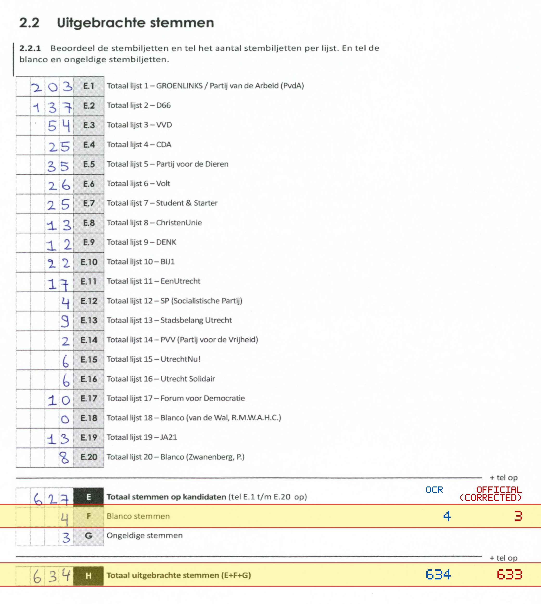
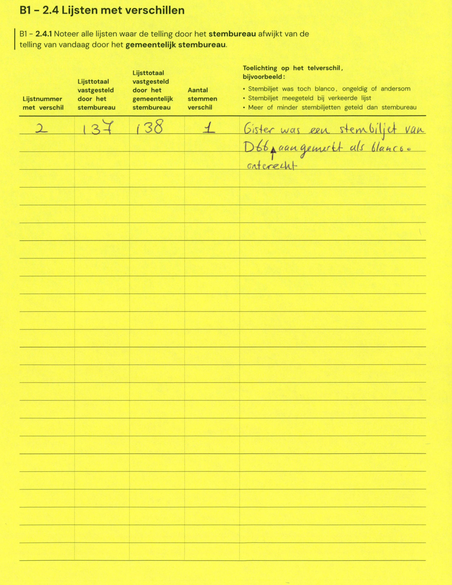

# Station 192 - Stadsplateau 1

- Status: `mismatch`
- Markdown: `2026-GR/0344/results/Utrecht_192_Stadskantoor_GR26_eerste_telling.md`
- Correction OCR: `2026-GR/0344/results/corrections/Utrecht_192_Stadskantoor_GR26.md`

## Details

- F: md=4, official=3
- H: md=634, official=633

## Candidate Votes

- Status: `incomplete`
- Compared candidate cells: 0/508
- Candidate OCR files: 0
- candidate OCR not available
- known list/correction issues are shown

Legend: yellow/red = official CSV mismatch; blue = internal consistency issue. The right margin shows OCR and official values for official mismatches.



## Corrections

```markdown
| ID | First | Second | Difference | Note |
|---|---:|---:|---:|---|
| E.2 | 137 | 138 | 1 | Gister was een stembiljet van D66 aangemerkt als blanco = corrected |
```


