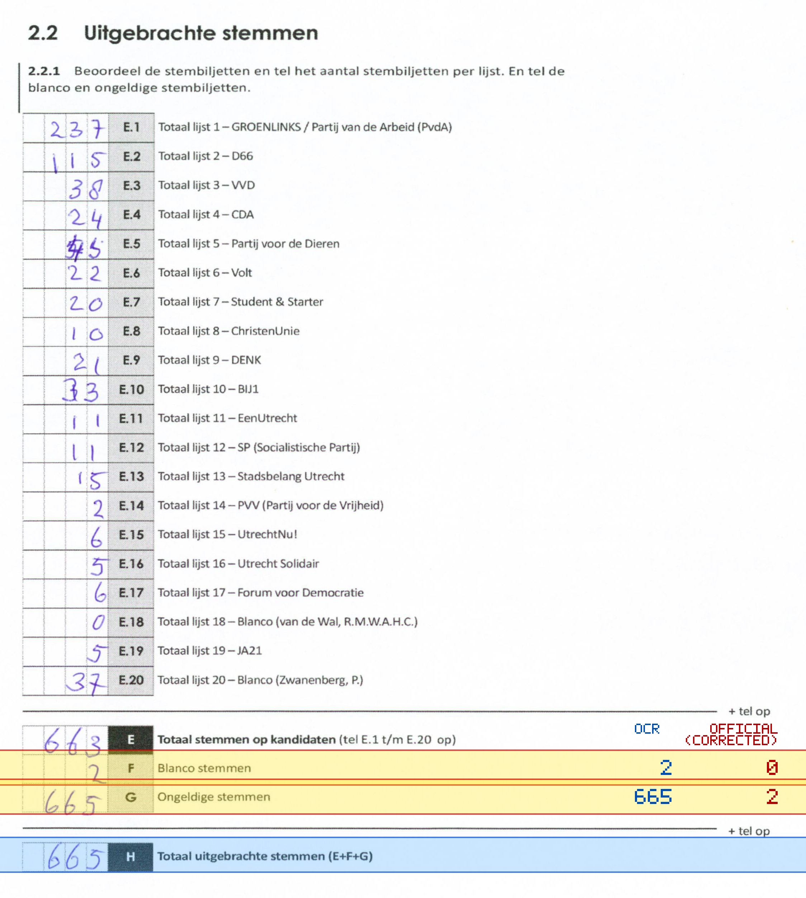
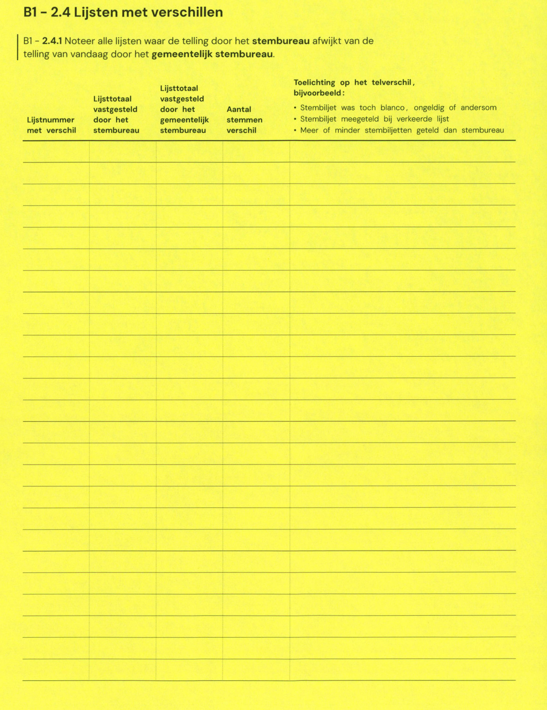

# Station 193 - Kanaalstraat 198

- Status: `internally inconsistent`
- Markdown: `2026-GR/0344/results/Utrecht_193_Stadsklooster_Utrecht_GR26_eerste_telling.md`
- Correction OCR: `2026-GR/0344/results/corrections/Utrecht_193_Stadsklooster_Utrecht_GR26.md`

## Details

- E + F + G is 1330, but H is 665
- F: md=2, official=0
- G: md=665, official=2

## Candidate Votes

- Status: `incomplete`
- Compared candidate cells: 0/508
- Candidate OCR files: 0
- candidate OCR not available
- known list/correction issues are shown

Legend: yellow/red = official CSV mismatch; blue = internal consistency issue. The right margin shows OCR and official values for official mismatches.



## Corrections

```markdown
| ID | First | Second | Difference | Note |
|---|---:|---:|---:|---|
```


