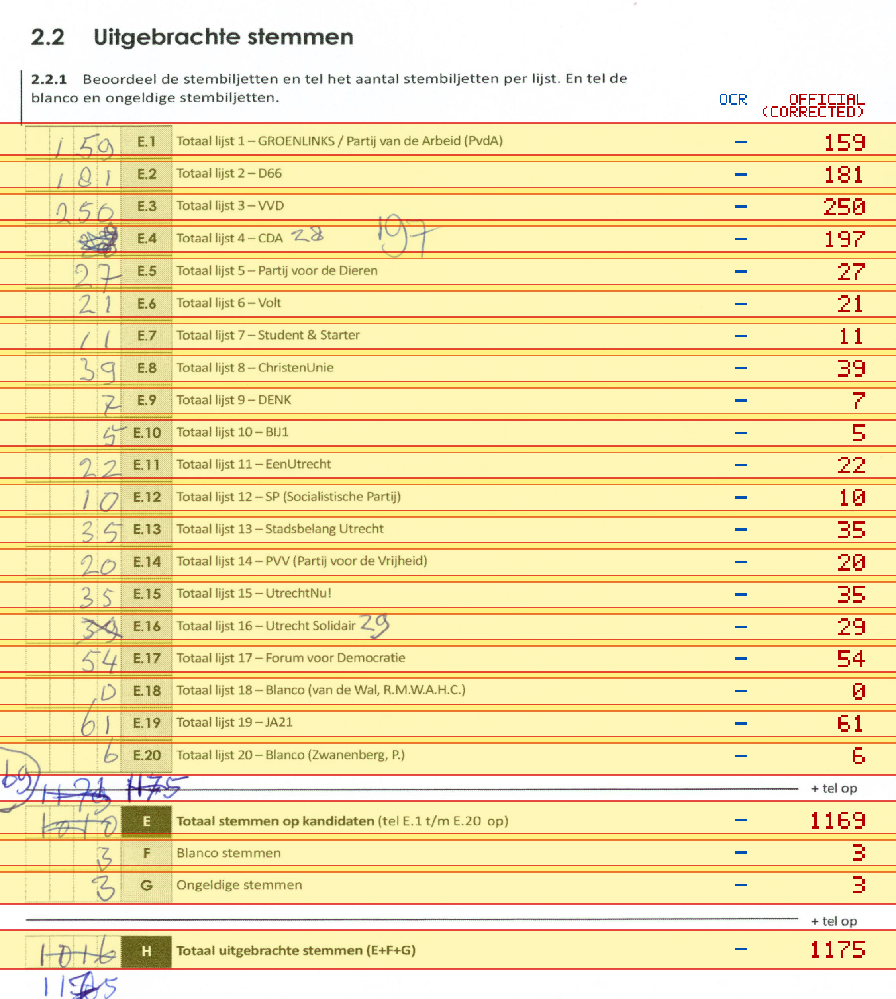
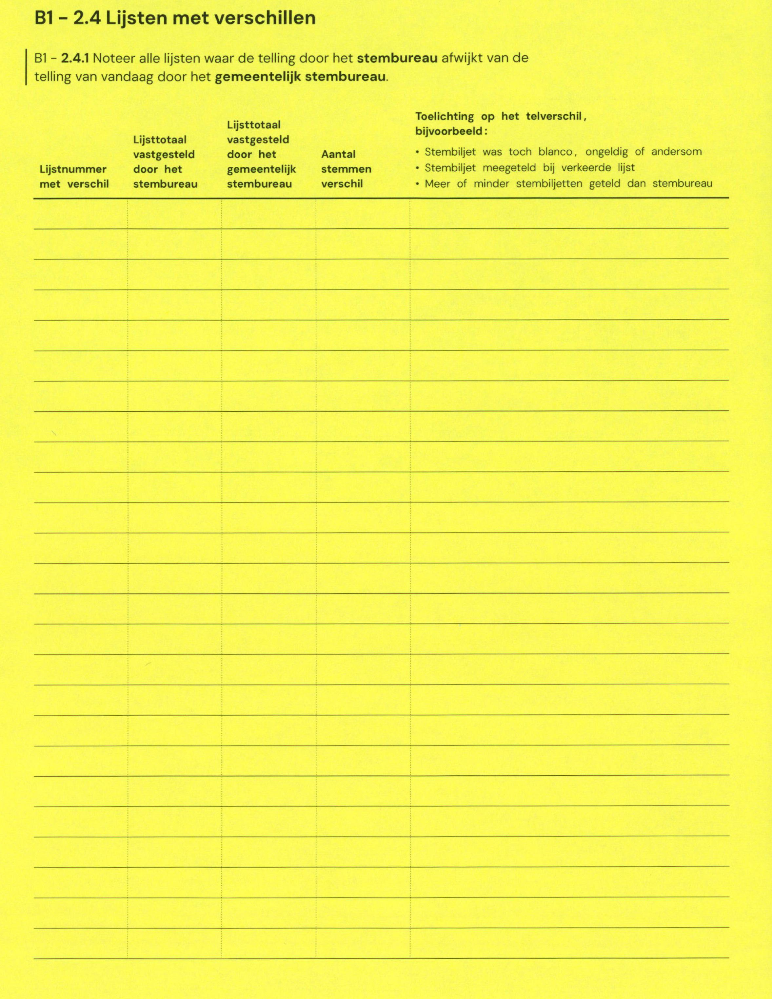

# Station 194 - Schoolstraat 11

- Status: `mismatch`
- Markdown: `2026-GR/0344/results/Utrecht_194_Buurtcentrum_De_Schakel_GR26_eerste_telling.md`
- Correction OCR: `2026-GR/0344/results/corrections/Utrecht_194_Buurtcentrum_De_Schakel_GR26.md`

## Details

- E.1: md=missing, official=159
- E.2: md=missing, official=181
- E.3: md=missing, official=250
- E.4: md=missing, official=197
- E.5: md=missing, official=27
- E.6: md=missing, official=21
- E.7: md=missing, official=11
- E.8: md=missing, official=39
- E.9: md=missing, official=7
- E.10: md=missing, official=5
- E.11: md=missing, official=22
- E.12: md=missing, official=10
- E.13: md=missing, official=35
- E.14: md=missing, official=20
- E.15: md=missing, official=35
- E.16: md=missing, official=29
- E.17: md=missing, official=54
- E.18: md=missing, official=0
- E.19: md=missing, official=61
- E.20: md=missing, official=6
- E: md=missing, official=1169
- F: md=missing, official=3
- G: md=missing, official=3
- H: md=missing, official=1175

Legend: yellow/red = official CSV mismatch; blue = internal consistency issue. The right margin shows OCR and official values for official mismatches.



## Corrections

```markdown
| ID | First | Second | Difference | Note |
|---|---:|---:|---:|---|
```


