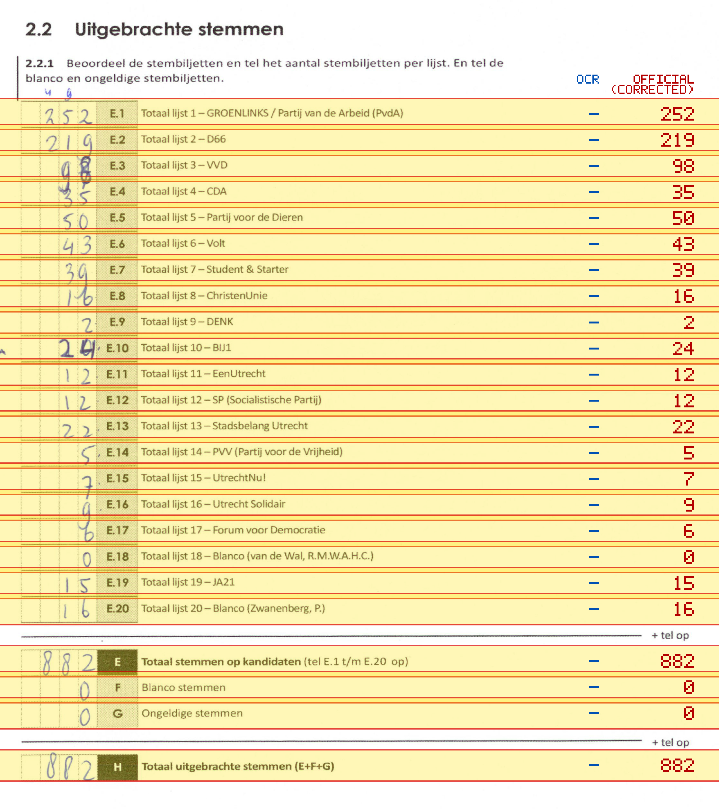
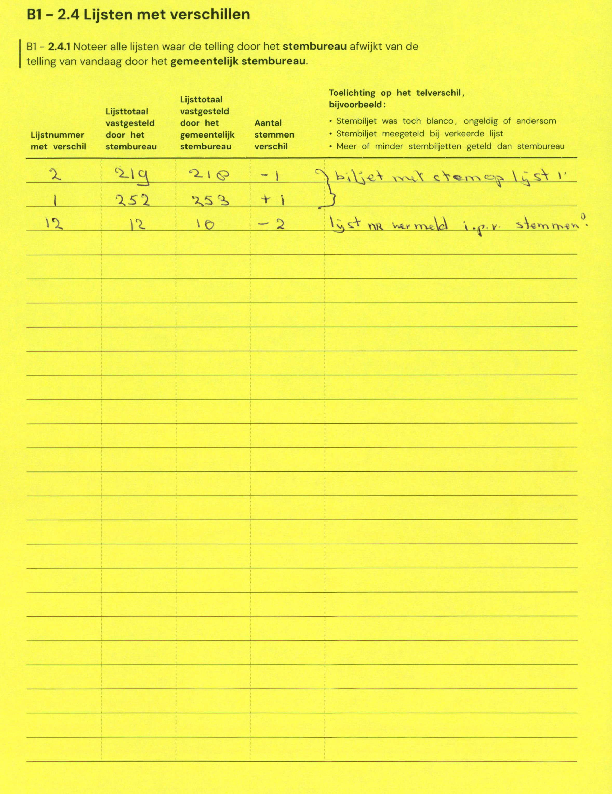

# Station 195 - Koekoeksplein 1 ingang achterzijde via Lijsterstraat

- Status: `mismatch`
- Markdown: `2026-GR/0344/results/Utrecht_195_OBS_De_Koekoek_GR26_eerste_telling.md`
- Correction OCR: `2026-GR/0344/results/corrections/Utrecht_195_OBS_De_Koekoek_GR26.md`

## Details

- E.1: md=missing, official=252
- E.2: md=missing, official=219
- E.3: md=missing, official=98
- E.4: md=missing, official=35
- E.5: md=missing, official=50
- E.6: md=missing, official=43
- E.7: md=missing, official=39
- E.8: md=missing, official=16
- E.9: md=missing, official=2
- E.10: md=missing, official=24
- E.11: md=missing, official=12
- E.12: md=missing, official=12
- E.13: md=missing, official=22
- E.14: md=missing, official=5
- E.15: md=missing, official=7
- E.16: md=missing, official=9
- E.17: md=missing, official=6
- E.18: md=missing, official=0
- E.19: md=missing, official=15
- E.20: md=missing, official=16
- E: md=missing, official=882
- F: md=missing, official=0
- G: md=missing, official=0
- H: md=missing, official=882

## Candidate Votes

- Status: `incomplete`
- Compared candidate cells: 0/508
- Candidate OCR files: 0
- candidate OCR not available
- known list/correction issues are shown

Legend: yellow/red = official CSV mismatch; blue = internal consistency issue. The right margin shows OCR and official values for official mismatches.



## Corrections

```markdown
| ID | First | Second | Difference | Note |
|---|---:|---:|---:|---|
| E.2 | 219 | 218 | -1 | biljet met stem op lijst 1 |
| E.1 | 252 | 253 | 1 | biljet met stem op lijst 1 |
| E.12 | 12 | 10 | -2 | lijst nu hermeld i.p.v. stemmen |
```


