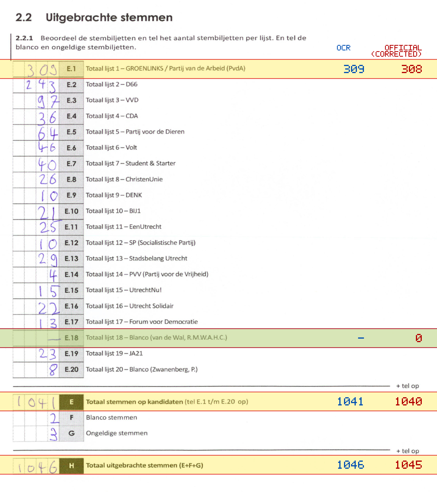
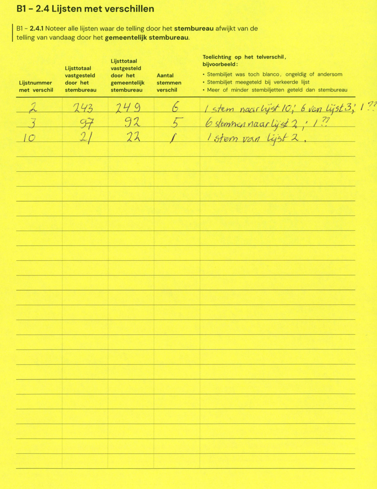

# Station 199 - Oudwijkerdwarsstraat 148

- Status: `internally inconsistent`
- Markdown: `2026-GR/0344/results/Utrecht_199_Podium_Oost_GR26_eerste_telling.md`
- Correction OCR: `2026-GR/0344/results/corrections/Utrecht_199_Podium_Oost_GR26.md`

## Details

- row 20 value for E.18 could not be parsed: cannot parse integer from empty string
- E.1: md=309, official=308
- E.18: md=missing, official=0
- E: md=1041, official=1040
- H: md=1046, official=1045

Legend: yellow/red = official CSV mismatch; blue = internal consistency issue. The right margin shows OCR and official values for official mismatches.



## Corrections

```markdown
| ID | First | Second | Difference | Note |
|---|---:|---:|---:|---|
| E.2 | 243 | 249 | 6 | 1 stem naar lijst 10; 5 van lijst 3; 1 ?? |
| E.3 | 97 | 92 | -5 | 6 stemmen naar lijst 2; 1 ?? |
| E.10 | 21 | 22 | 1 | 1 stem van lijst 2 |
```


