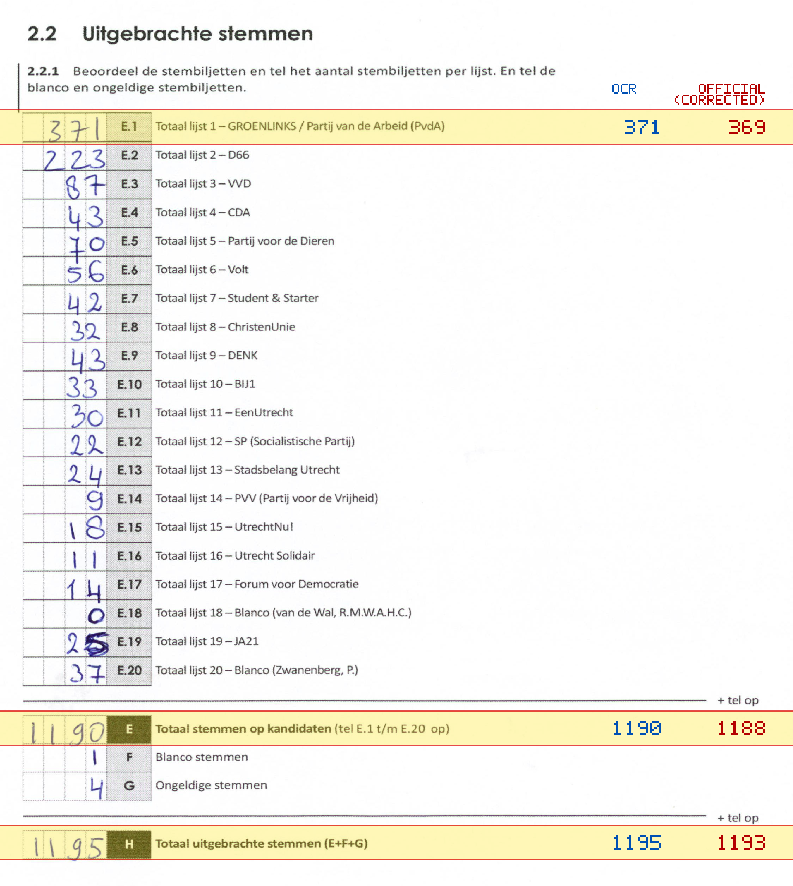
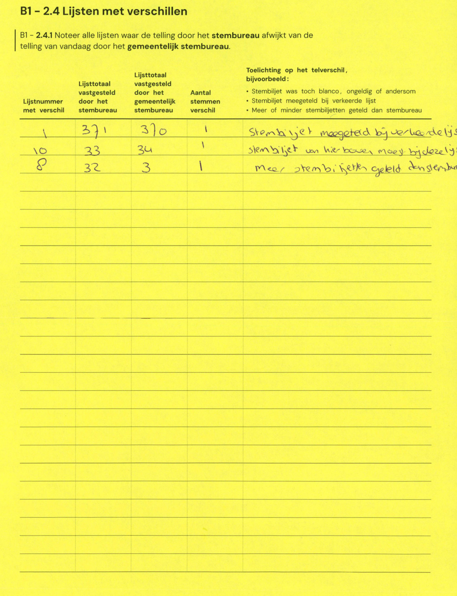

# Station 20 - Vleutenseweg 515 ingang via Broerestraat

- Status: `mismatch`
- Markdown: `2026-GR/0344/results/Utrecht_20_Schoolgebouw__voorheen_HUB030_AGORA_en_KBS_De_Catharijnepoort__GR26_eerste_telling.md`
- Correction OCR: `2026-GR/0344/results/corrections/Utrecht_20_Schoolgebouw__voorheen_HUB030_AGORA_en_KBS_De_Catharijnepoort__GR26.md`

## Details

- E.1: md=371, official=369
- E: md=1190, official=1188
- H: md=1195, official=1193

## Candidate Votes

- Status: `incomplete`
- Compared candidate cells: 0/508
- Candidate OCR files: 0
- candidate OCR not available
- known list/correction issues are shown

Legend: yellow/red = official CSV mismatch; blue = internal consistency issue. The right margin shows OCR and official values for official mismatches.



## Corrections

```markdown
| ID | First | Second | Difference | Note |
|---|---:|---:|---:|---|
| E.1 | 371 | 370 | 1 | Stembiljet meegeteld bij verkeerde lijst |
| E.10 | 33 | 34 | 1 | stembiljet van hierboven moet bij deze lijst |
| E.8 | 32 | 3 | 1 | meer stembiljetten geteld stembureau |
```


