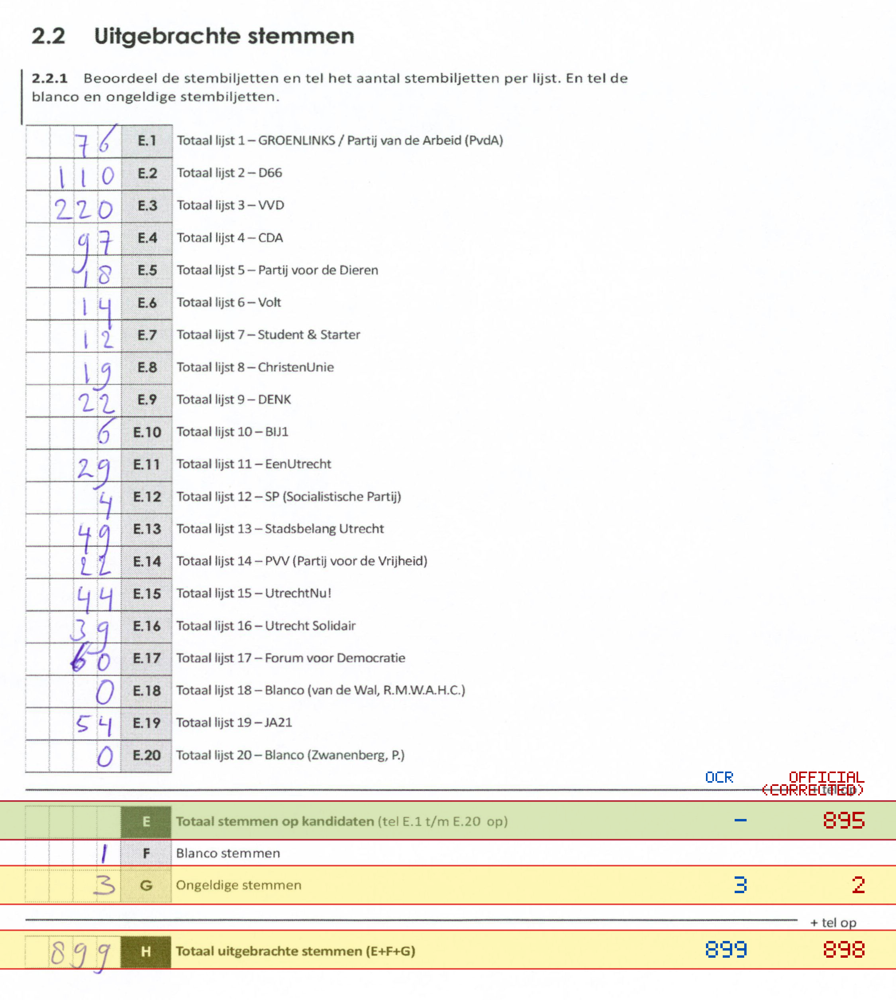
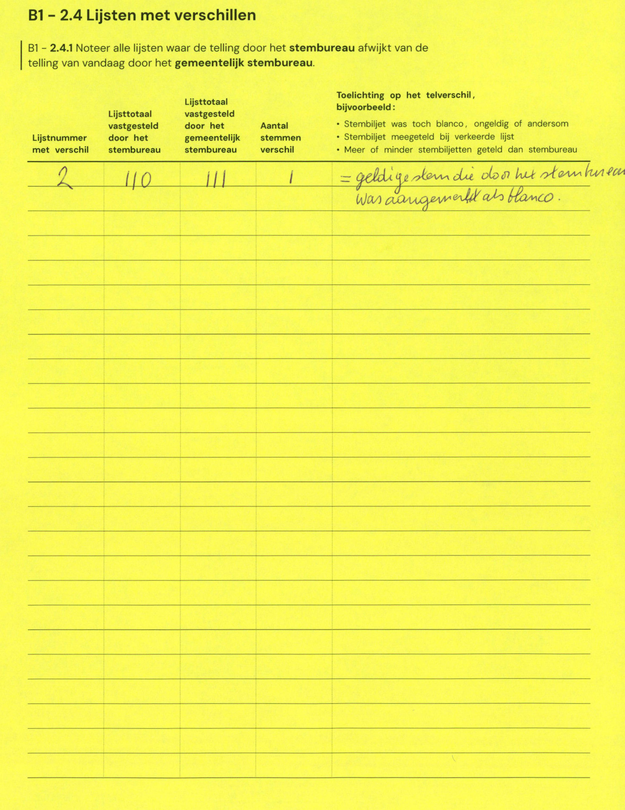

# Station 202 - Bovenpolder 80

- Status: `internally inconsistent`
- Markdown: `2026-GR/0344/results/Utrecht_202_Buurtcentrum_De_Pijler_GR26_eerste_telling.md`
- Correction OCR: `2026-GR/0344/results/corrections/Utrecht_202_Buurtcentrum_De_Pijler_GR26.md`

## Details

- row 23 value for E could not be parsed: cannot parse integer from empty string
- E: md=missing, official=895
- G: md=3, official=2
- H: md=899, official=898

Legend: yellow/red = official CSV mismatch; blue = internal consistency issue. The right margin shows OCR and official values for official mismatches.



## Corrections

```markdown
| ID | First | Second | Difference | Note |
|---|---:|---:|---:|---|
| E.2 | 110 | 111 | 1 | = geldige stem die door het stembureau was aangemerkt als blanco. |
```


