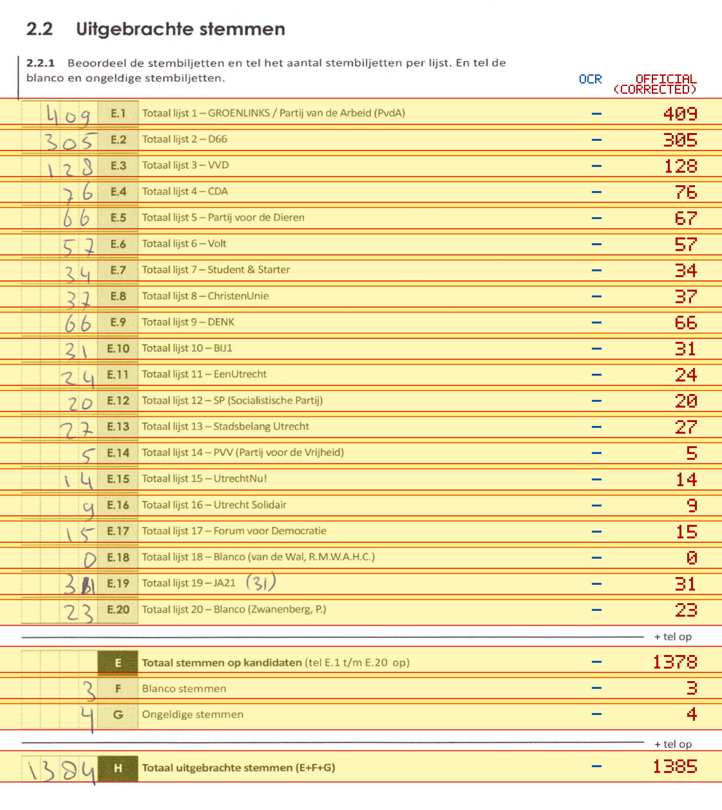
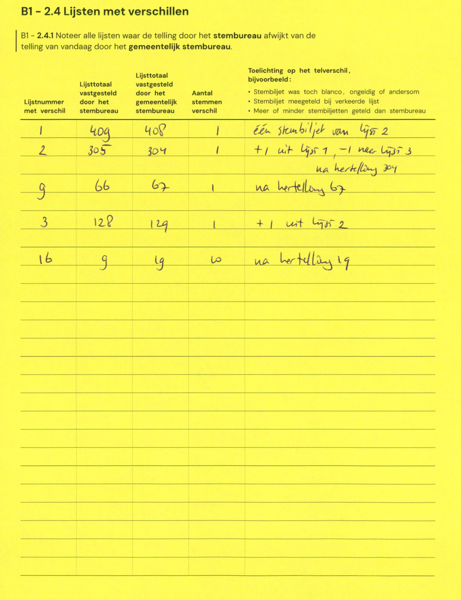

# Station 22 - Johan Wagenaarkade 45A

- Status: `mismatch`
- Markdown: `2026-GR/0344/results/Utrecht_22_Gymzaal_Johan_Wagenaarkade_GR26_eerste_telling.md`
- Correction OCR: `2026-GR/0344/results/corrections/Utrecht_22_Gymzaal_Johan_Wagenaarkade_GR26.md`

## Details

- E.1: md=missing, official=409
- E.2: md=missing, official=305
- E.3: md=missing, official=128
- E.4: md=missing, official=76
- E.5: md=missing, official=67
- E.6: md=missing, official=57
- E.7: md=missing, official=34
- E.8: md=missing, official=37
- E.9: md=missing, official=66
- E.10: md=missing, official=31
- E.11: md=missing, official=24
- E.12: md=missing, official=20
- E.13: md=missing, official=27
- E.14: md=missing, official=5
- E.15: md=missing, official=14
- E.16: md=missing, official=9
- E.17: md=missing, official=15
- E.18: md=missing, official=0
- E.19: md=missing, official=31
- E.20: md=missing, official=23
- E: md=missing, official=1378
- F: md=missing, official=3
- G: md=missing, official=4
- H: md=missing, official=1385

## Candidate Votes

- Status: `incomplete`
- Compared candidate cells: 0/508
- Candidate OCR files: 0
- candidate OCR not available
- known list/correction issues are shown

Legend: yellow/red = official CSV mismatch; blue = internal consistency issue. The right margin shows OCR and official values for official mismatches.



## Corrections

```markdown
| ID | First | Second | Difference | Note |
|---|---:|---:|---:|---|
| E.1 | 409 | 408 | -1 | één stembiljet van lijst 2 |
| E.2 | 305 | 304 | -1 | +1 uit lijst 7, -1 naar lijst 3 na hertelling 304 |
| E.9 | 66 | 67 | 1 | na hertelling 67 |
| E.3 | 128 | 129 | 1 | +1 uit lijst 2 |
| E.16 | 9 | 19 | 10 | na hertelling 19 |
```


