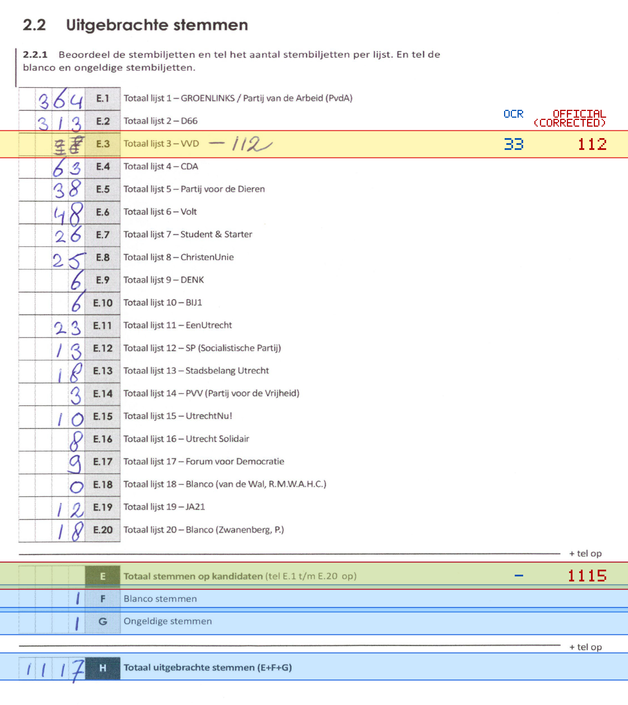
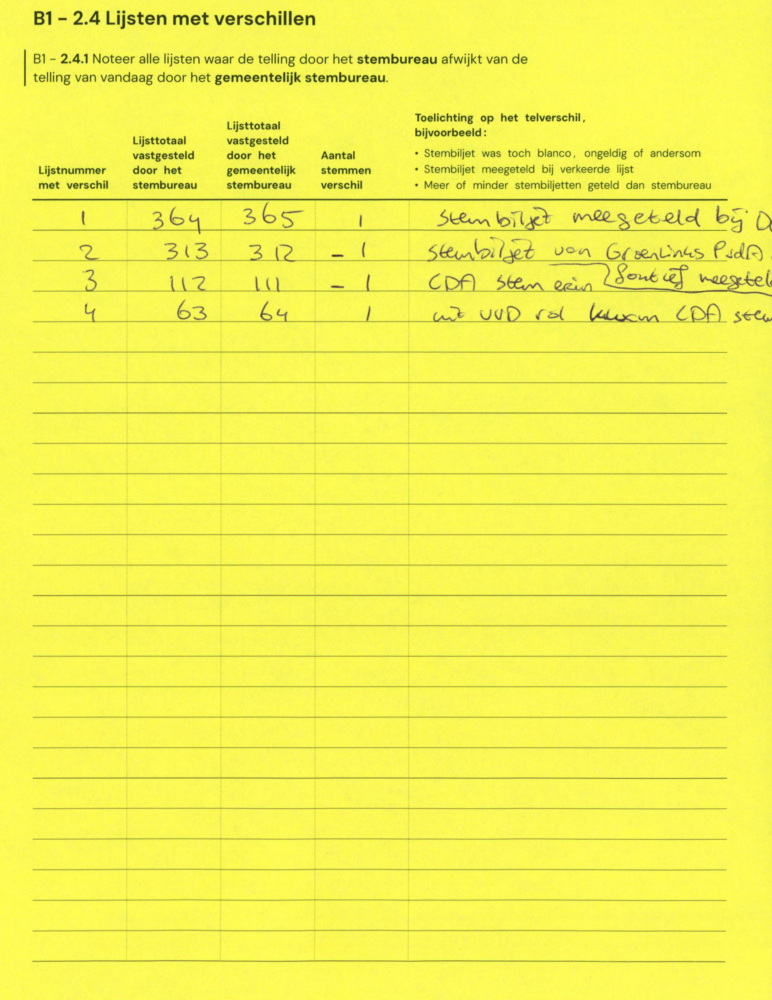

# Station 24 - Franz Schubertstraat 20 ingang via Händelstraat

- Status: `internally inconsistent`
- Markdown: `2026-GR/0344/results/Utrecht_24_Gymzaal_Franz_Schubertstraat_GR26_eerste_telling.md`
- Correction OCR: `2026-GR/0344/results/corrections/Utrecht_24_Gymzaal_Franz_Schubertstraat_GR26.md`

## Details

- expected 26 non-empty table lines, found 25
- row 23 expected ID E, found F
- row 24 expected ID F, found G
- row 25 expected ID G, found H
- missing row 26 for H
- E.3: md=33, official=112
- E: md=missing, official=1115

Legend: yellow/red = official CSV mismatch; blue = internal consistency issue. The right margin shows OCR and official values for official mismatches.



## Corrections

```markdown
| ID | First | Second | Difference | Note |
|---|---:|---:|---:|---|
| E.1 | 364 | 365 | 1 | stembiljet meegeteld bij D |
| E.2 | 313 | 312 | -1 | stembiljet van GroenLinks PvdA |
| E.3 | 112 | 111 | -1 | CDA stem een (sommet meegeteld) |
| E.4 | 63 | 64 | 1 | uit VVD naar CDA stem |
```


