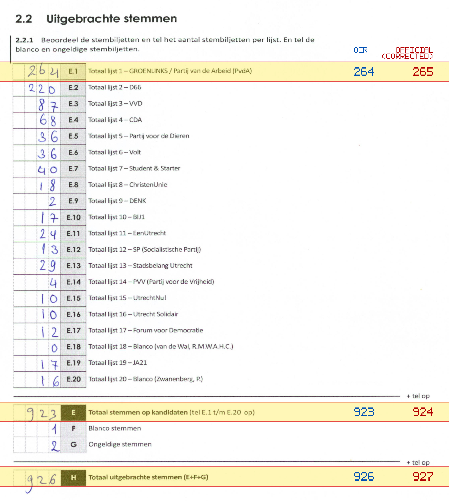
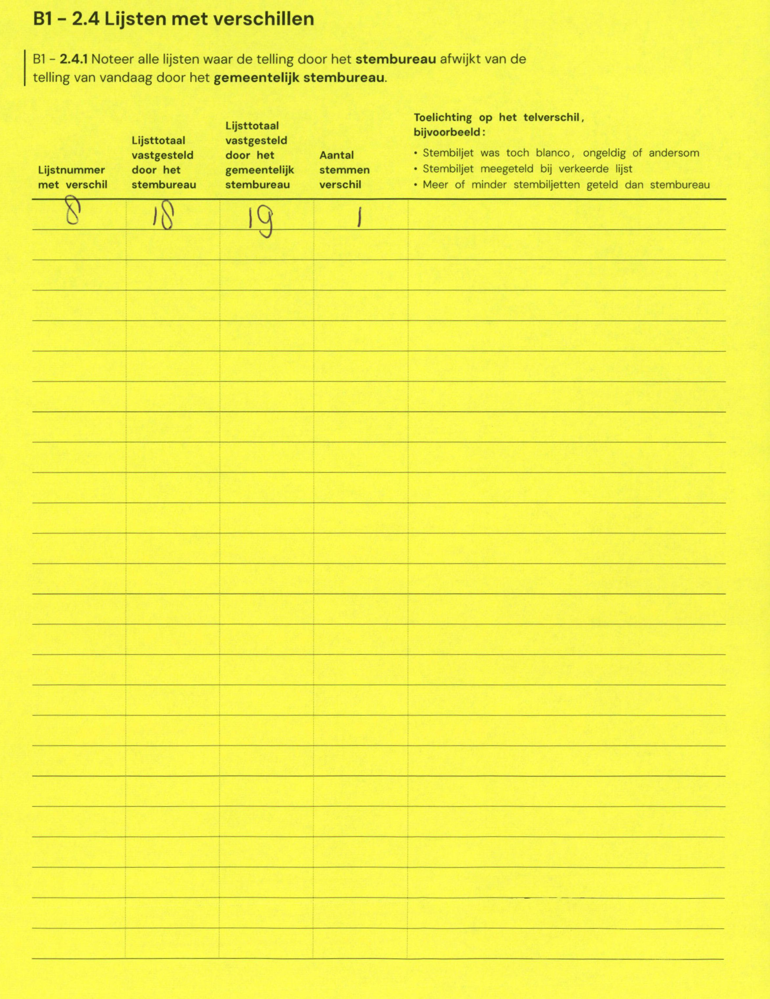

# Station 25 - Leidseweg 140

- Status: `mismatch`
- Markdown: `2026-GR/0344/results/Utrecht_25_Park_Welgelegen_GR26_eerste_telling.md`
- Correction OCR: `2026-GR/0344/results/corrections/Utrecht_25_Park_Welgelegen_GR26.md`

## Details

- E.1: md=264, official=265
- E: md=923, official=924
- H: md=926, official=927

## Candidate Votes

- Status: `incomplete`
- Compared candidate cells: 0/508
- Candidate OCR files: 0
- candidate OCR not available
- known list/correction issues are shown

Legend: yellow/red = official CSV mismatch; blue = internal consistency issue. The right margin shows OCR and official values for official mismatches.



## Corrections

```markdown
| ID | First | Second | Difference | Note |
|---|---:|---:|---:|---|
| E.8 | 18 | 19 | 1 | |
```


