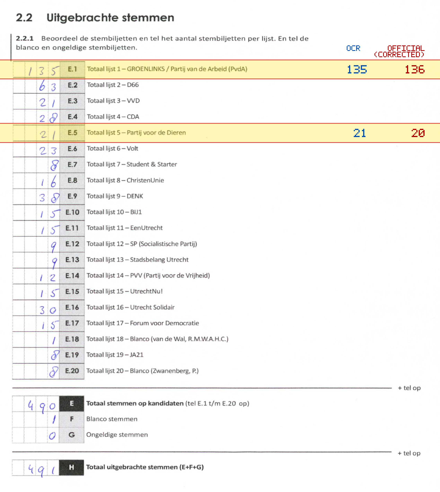
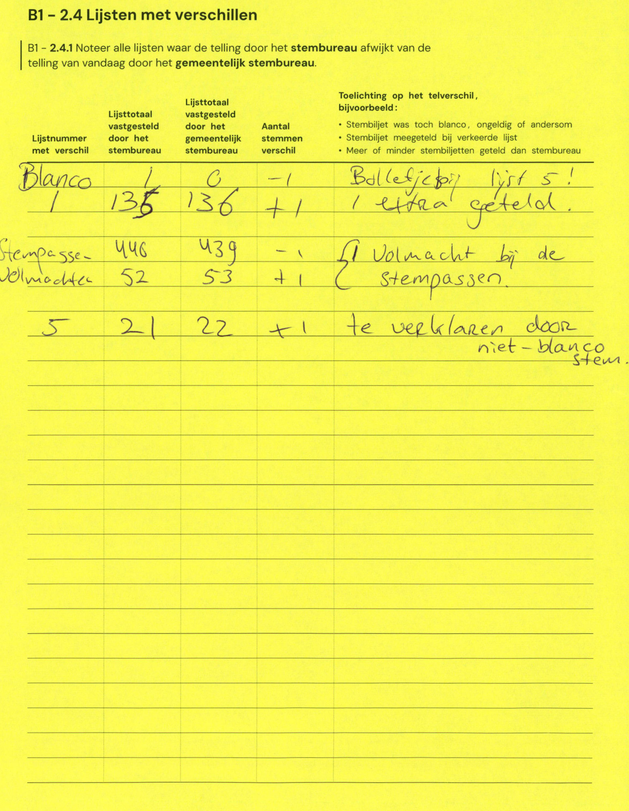

# Station 29 - Prinses Margrietstraat 22

- Status: `mismatch`
- Markdown: `2026-GR/0344/results/Utrecht_29_Bij_Bosshardt__Leger_des_Heils__GR26_eerste_telling.md`
- Correction OCR: `2026-GR/0344/results/corrections/Utrecht_29_Bij_Bosshardt__Leger_des_Heils__GR26.md`

## Details

- E.1: md=135, official=136
- E.5: md=21, official=20

## Candidate Votes

- Status: `incomplete`
- Compared candidate cells: 0/508
- Candidate OCR files: 0
- candidate OCR not available
- known list/correction issues are shown

Legend: yellow/red = official CSV mismatch; blue = internal consistency issue. The right margin shows OCR and official values for official mismatches.



## Corrections

```markdown
| ID | First | Second | Difference | Note |
|---|---:|---:|---:|---|
| F | 1 | 0 | -1 | Bolletjes bij lijst 5! |
| E.5 | 135 | 136 | +1 | 1 extra geteld. |
| H | 446 | 439 | -7 | Volmacht bij de stempassen. |
| H | 52 | 53 | +1 | Volmacht bij de stempassen. |
| E.5 | 21 | 22 | +1 | te verklaren door niet-blanco stem. |
```


