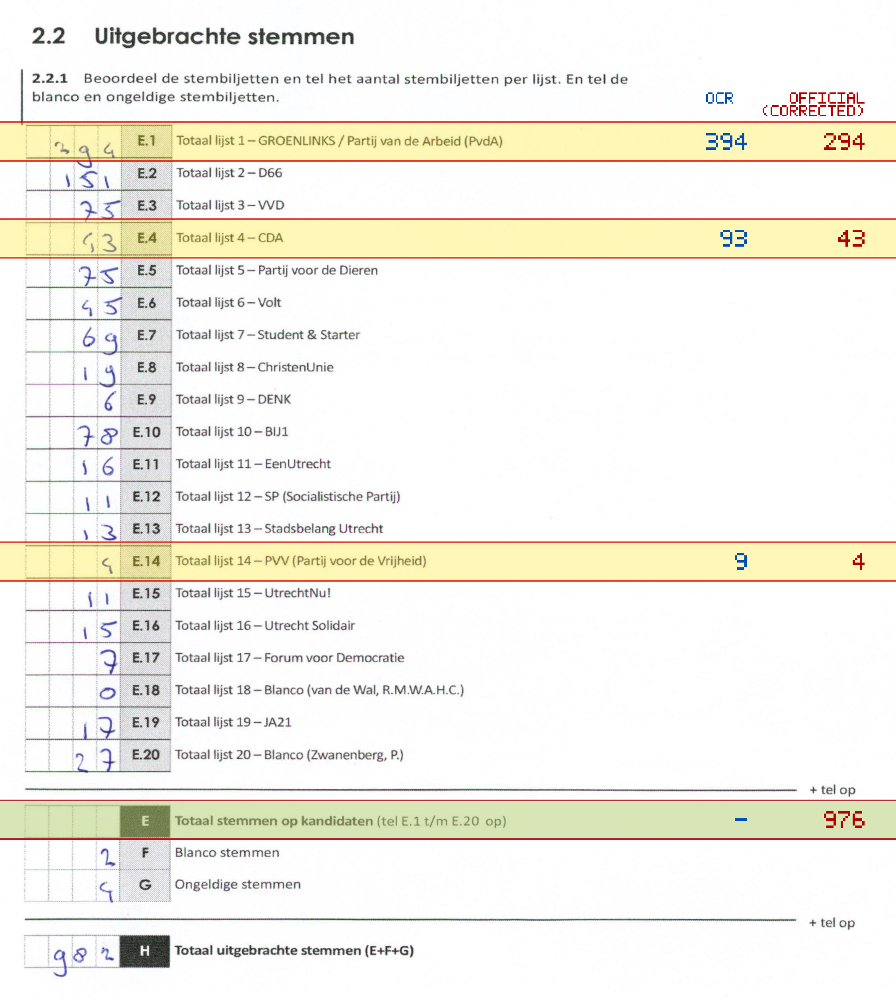
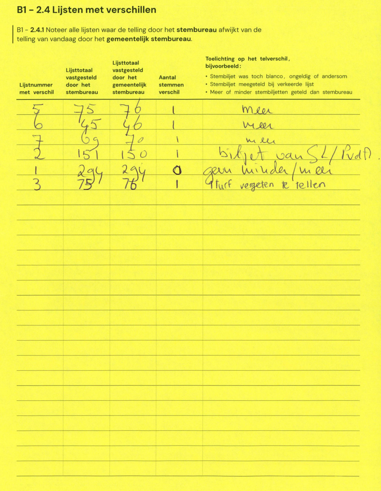

# Station 3 - Vredenburgkade 11

- Status: `internally inconsistent`
- Markdown: `2026-GR/0344/results/Utrecht_3_TivoliVredenburg_GR26_eerste_telling.md`
- Correction OCR: `2026-GR/0344/results/corrections/Utrecht_3_TivoliVredenburg_GR26.md`

## Details

- row 23 value for E could not be parsed: cannot parse integer from empty string
- E.1: md=394, official=294
- E.4: md=93, official=43
- E.14: md=9, official=4
- E: md=missing, official=976

## Candidate Votes

- Status: `incomplete`
- Compared candidate cells: 0/508
- Candidate OCR files: 0
- candidate OCR not available
- known list/correction issues are shown

Legend: yellow/red = official CSV mismatch; blue = internal consistency issue. The right margin shows OCR and official values for official mismatches.



## Corrections

```markdown
| ID | First | Second | Difference | Note |
|---|---:|---:|---:|---|
| E.5 | 75 | 76 | 1 | meer |
| E.6 | 45 | 46 | 1 | meer |
| E.7 | 69 | 70 | 1 | meer |
| E.2 | 151 | 150 | -1 | biljet van SL/PvdD |
| E.1 | 294 | 294 | 0 | geen minder/meer |
| E.3 | 75 | 76 | 1 | 1 brief vergeten te tellen |
```


