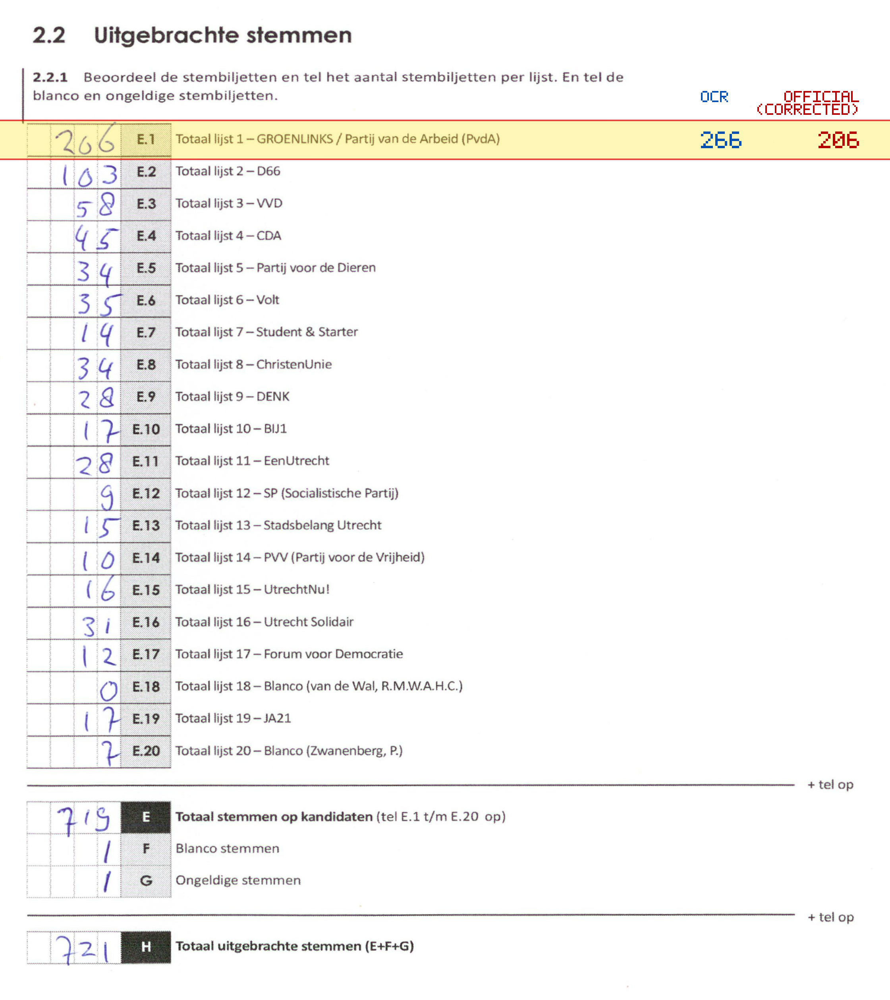
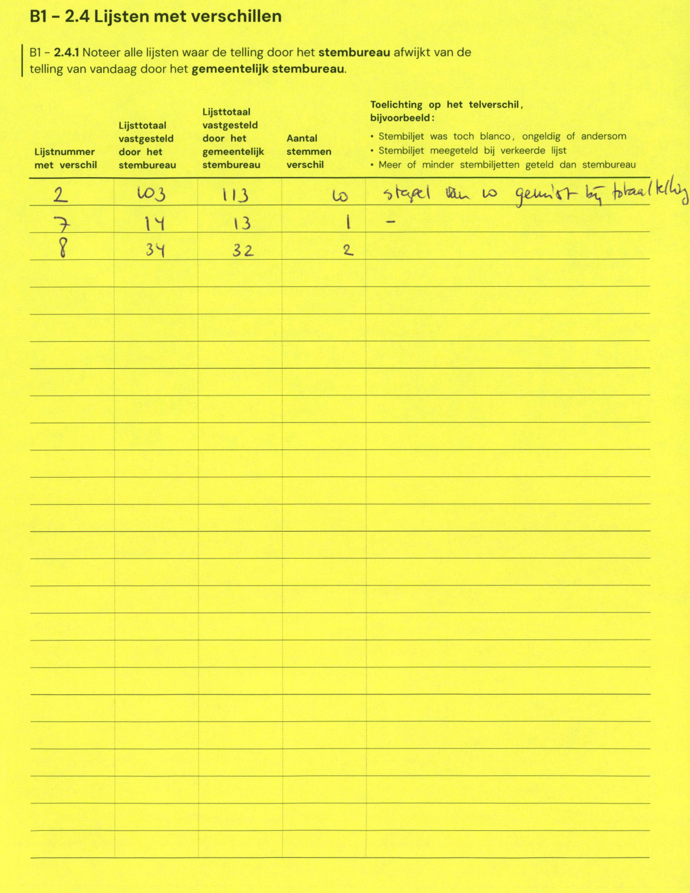

# Station 31 - Prinses Beatrixlaan 2

- Status: `correction inconsistent`
- Markdown: `2026-GR/0344/results/Utrecht_31_Het_Vorstelijk_Complex_GR26_eerste_telling.md`
- Correction OCR: `2026-GR/0344/results/corrections/Utrecht_31_Het_Vorstelijk_Complex_GR26.md`

## Correction Inconsistency

The correction table does not line up with the first-count Markdown. Inspect the correction crop before treating this as a plain official-result mismatch.


## Details

- could not apply corrections: E.7 second=13, official=14

## Candidate Votes

- Status: `incomplete`
- Compared candidate cells: 0/508
- Candidate OCR files: 0
- candidate OCR not available
- known list/correction issues are shown

Legend: yellow/red = official CSV mismatch; blue = internal consistency issue. The right margin shows OCR and official values for official mismatches.



## Corrections

```markdown
| ID | First | Second | Difference | Note |
|---|---:|---:|---:|---|
| E.2 | 103 | 113 | 10 | stapel van 10 gemist bij totaal |
| E.7 | 14 | 13 | -1 | - |
| E.8 | 34 | 32 | -2 | |
```


