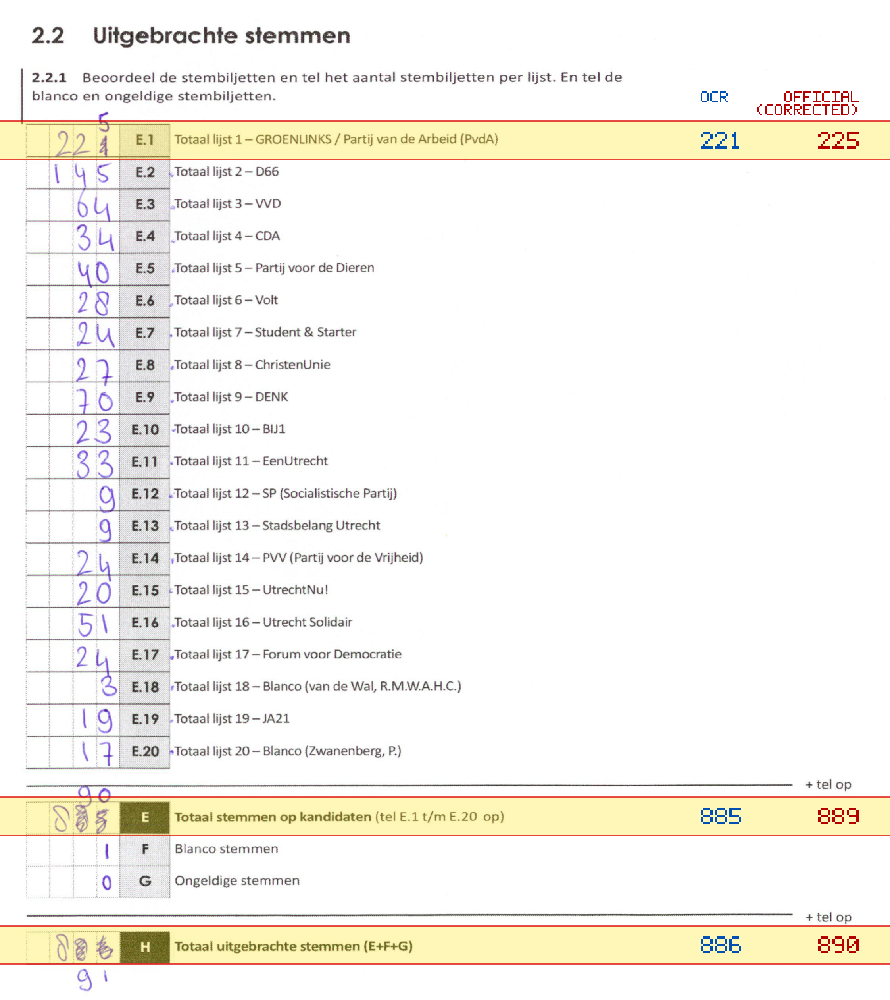
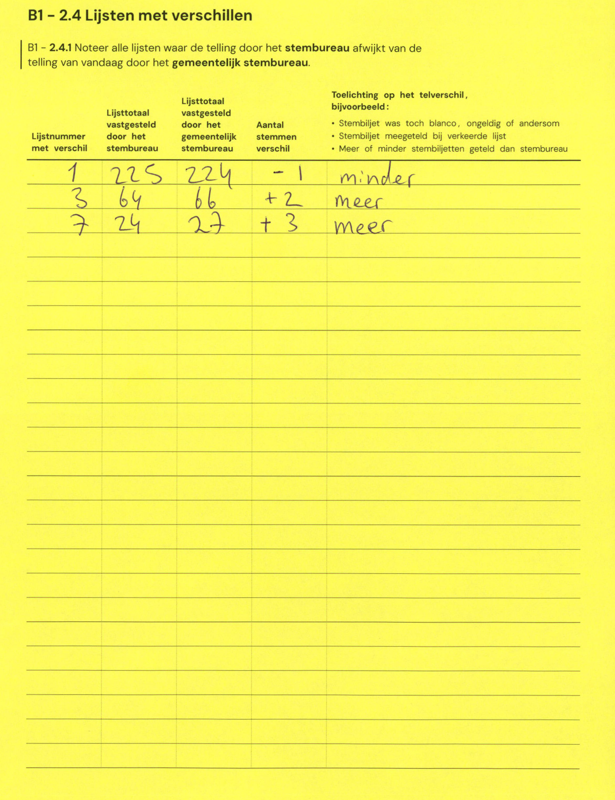

# Station 36 - Van Hoornekade 6

- Status: `mismatch`
- Markdown: `2026-GR/0344/results/Utrecht_36_Ludgerschool_Van_Hoornekade_GR26_eerste_telling.md`
- Correction OCR: `2026-GR/0344/results/corrections/Utrecht_36_Ludgerschool_Van_Hoornekade_GR26.md`

## Details

- E.1: md=221, official=225
- E: md=885, official=889
- H: md=886, official=890

## Candidate Votes

- Status: `incomplete`
- Compared candidate cells: 0/508
- Candidate OCR files: 0
- candidate OCR not available
- known list/correction issues are shown

Legend: yellow/red = official CSV mismatch; blue = internal consistency issue. The right margin shows OCR and official values for official mismatches.



## Corrections

```markdown
| ID | First | Second | Difference | Note |
|---|---:|---:|---:|---|
| E.1 | 225 | 224 | -1 | minder |
| E.3 | 64 | 66 | 2 | meer |
| E.7 | 24 | 27 | 3 | meer |
```


