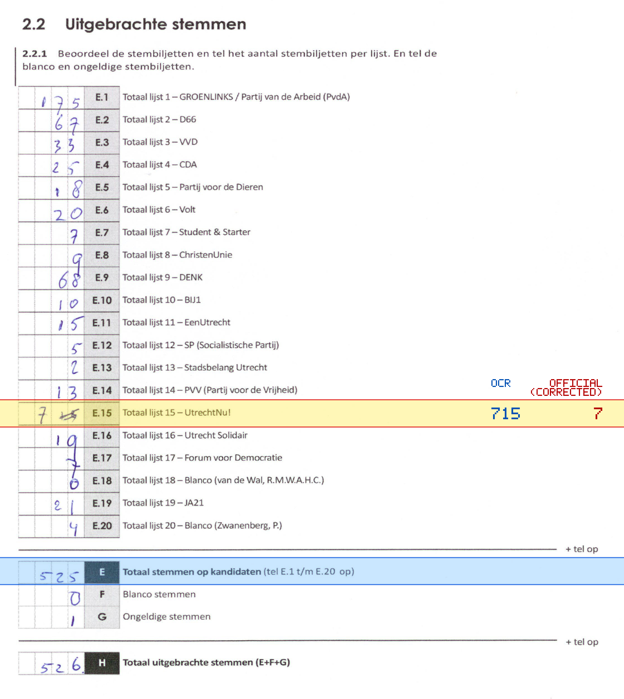
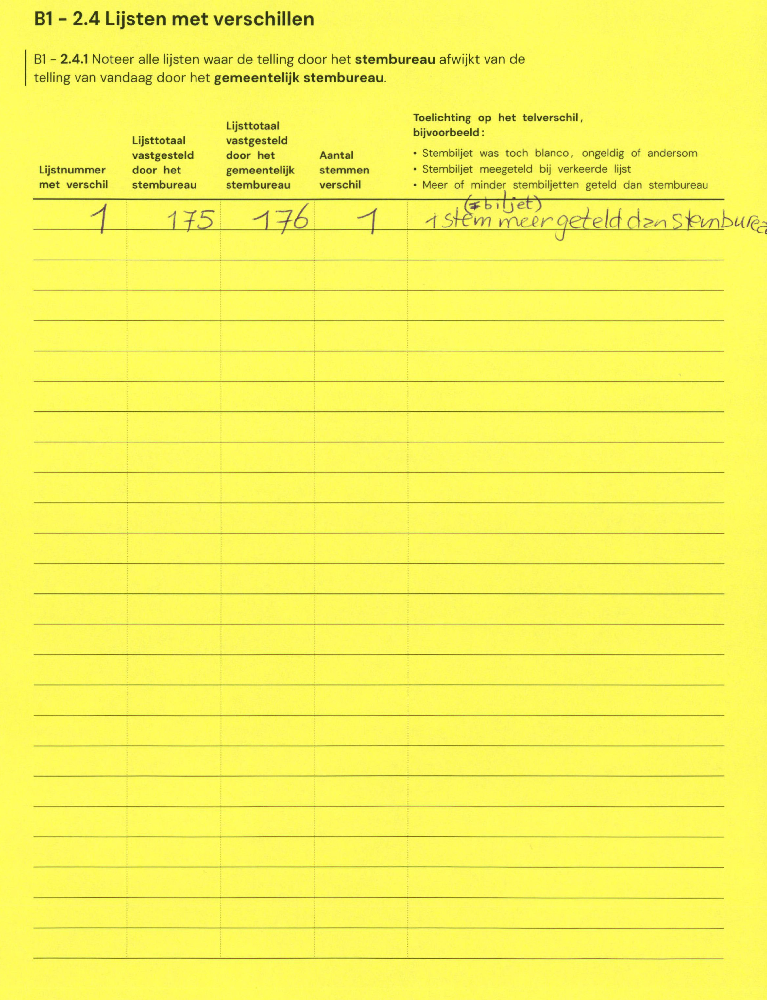

# Station 37 - Jan van Ransdorpstraat 32

- Status: `internally inconsistent`
- Markdown: `2026-GR/0344/results/Utrecht_37_KBS_Wijzer_aan_de_Vecht_GR26_eerste_telling.md`
- Correction OCR: `2026-GR/0344/results/corrections/Utrecht_37_KBS_Wijzer_aan_de_Vecht_GR26.md`

## Details

- E.1 through E.20 sum to 1233, but E is 525
- E.15: md=715, official=7

Legend: yellow/red = official CSV mismatch; blue = internal consistency issue. The right margin shows OCR and official values for official mismatches.



## Corrections

```markdown
| ID | First | Second | Difference | Note |
|---|---:|---:|---:|---|
| E.1 | 175 | 176 | 1 | 1 stem meer geteld dan stembure |
```


