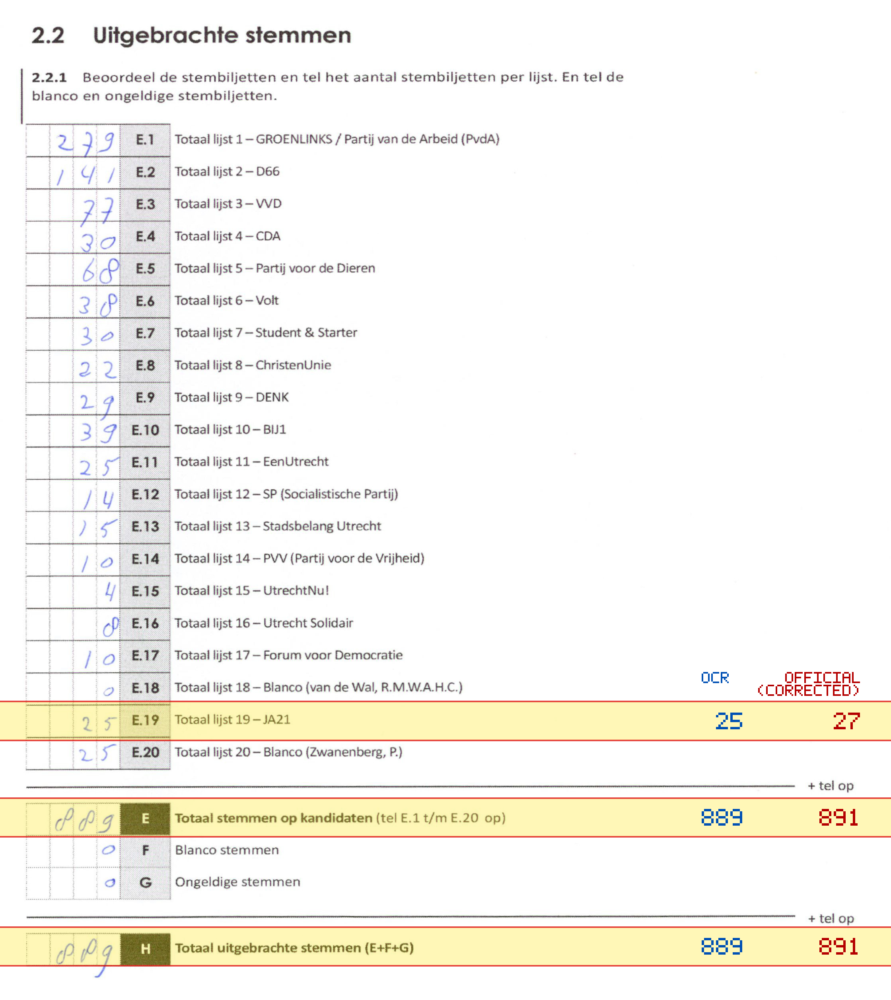
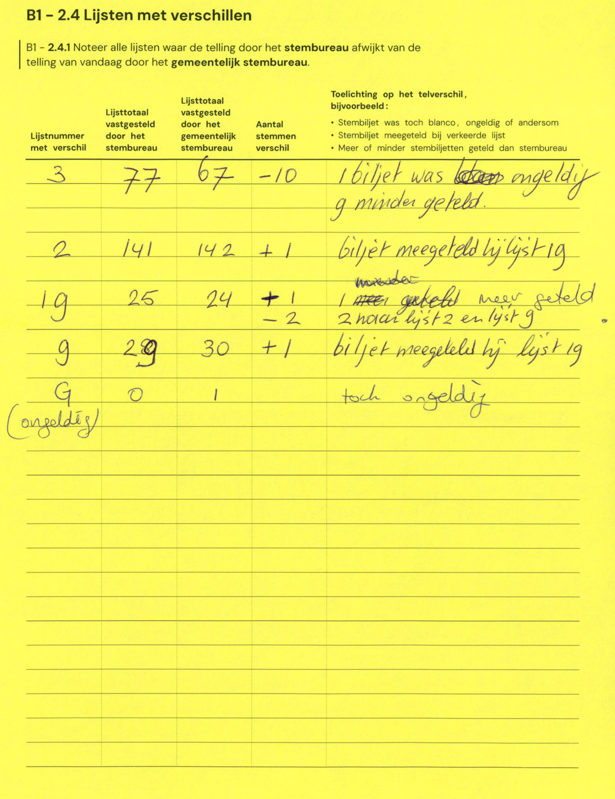

# Station 40 - Lagenoord 28A

- Status: `mismatch`
- Markdown: `2026-GR/0344/results/Utrecht_40_Speeltuin_Noordsepark_GR26_eerste_telling.md`
- Correction OCR: `2026-GR/0344/results/corrections/Utrecht_40_Speeltuin_Noordsepark_GR26.md`

## Details

- E.19: md=25, official=27
- E: md=889, official=891
- H: md=889, official=891

## Candidate Votes

- Status: `incomplete`
- Compared candidate cells: 0/508
- Candidate OCR files: 0
- candidate OCR not available
- known list/correction issues are shown

Legend: yellow/red = official CSV mismatch; blue = internal consistency issue. The right margin shows OCR and official values for official mismatches.



## Corrections

```markdown
| ID | First | Second | Difference | Note |
|---|---:|---:|---:|---|
| E.3 | 77 | 67 | -10 | 1 biljet was later ongeldig 9 minder geteld |
| E.2 | 141 | 142 | 1 | biljet meegeteld bij lijst 19 |
| E.19 | 25 | 24 | -1 | 1 meer geteld |
| E.19 | | | -2 | meer geteld 2 naar lijst 2 en lijst 9 |
| E.9 | 29 | 30 | 1 | biljet meegeteld bij lijst 19 |
| G | 0 | 1 | 1 | toch ongeldig |
```


