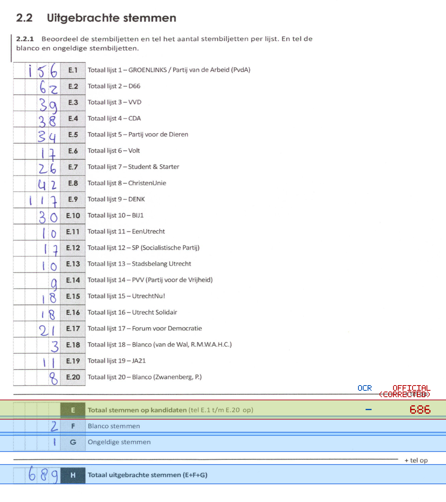
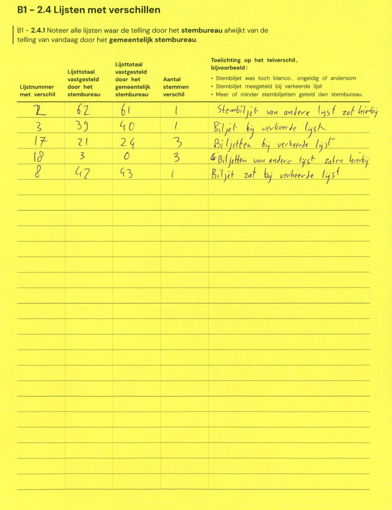

# Station 49 - Rhônedreef 40

- Status: `internally inconsistent`
- Markdown: `2026-GR/0344/results/Utrecht_49_Impulzz_GR26_eerste_telling.md`
- Correction OCR: `2026-GR/0344/results/corrections/Utrecht_49_Impulzz_GR26.md`

## Details

- expected 26 non-empty table lines, found 25
- row 23 expected ID E, found F
- row 24 expected ID F, found G
- row 25 expected ID G, found H
- missing row 26 for H
- E: md=missing, official=686

## Candidate Votes

- Status: `incomplete`
- Compared candidate cells: 0/508
- Candidate OCR files: 0
- candidate OCR not available
- known list/correction issues are shown

Legend: yellow/red = official CSV mismatch; blue = internal consistency issue. The right margin shows OCR and official values for official mismatches.



## Corrections

```markdown
| ID | First | Second | Difference | Note |
|---|---:|---:|---:|---|
| E.2 | 62 | 61 | -1 | Stembiljet van andere lijst zat hierbij |
| E.3 | 39 | 40 | 1 | Biljet bij verkeerde lijst |
| E.17 | 21 | 24 | 3 | Biljetten bij verkeerde lijst |
| E.18 | 3 | 0 | -3 | Biljetten van andere lijst zaten hierbij |
| E.8 | 42 | 43 | 1 | Biljet zat bij verkeerde lijst |
```


