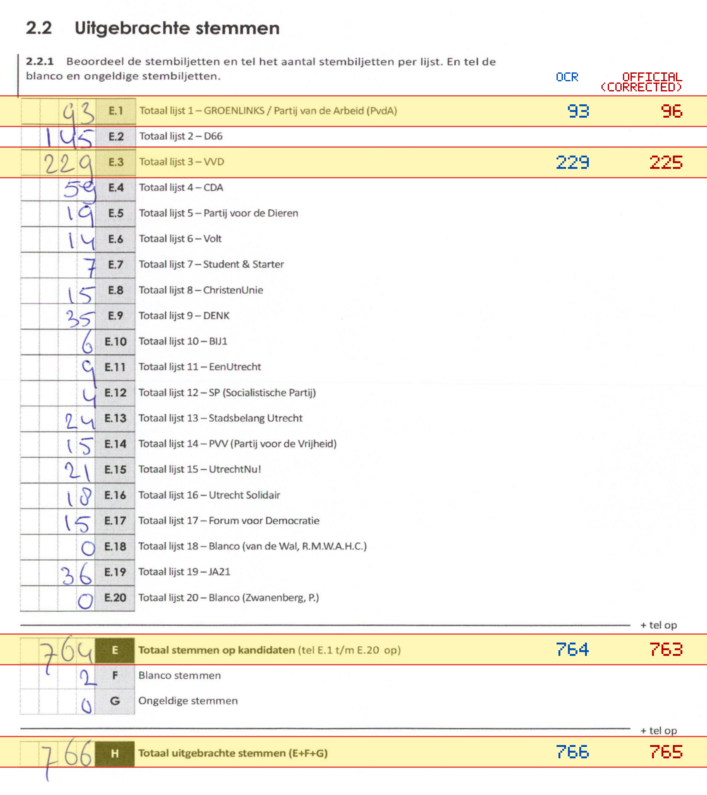
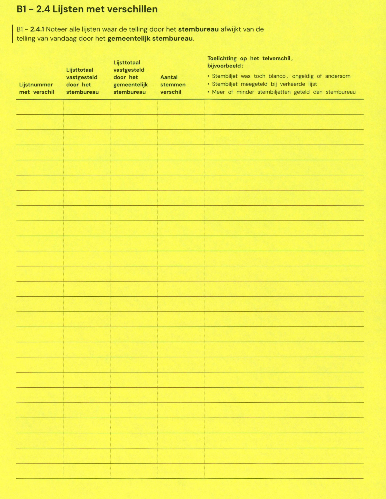

# Station 501 - Haarzichtsingel 15 ingang via achterkant

- Status: `mismatch`
- Markdown: `2026-GR/0344/results/Utrecht_501_Kindcentrum_Haarzicht_GR26_eerste_telling.md`
- Correction OCR: `2026-GR/0344/results/corrections/Utrecht_501_Kindcentrum_Haarzicht_GR26.md`

## Details

- E.1: md=93, official=96
- E.3: md=229, official=225
- E: md=764, official=763
- H: md=766, official=765

Legend: yellow/red = official CSV mismatch; blue = internal consistency issue. The right margin shows OCR and official values for official mismatches.



## Corrections

```markdown
| ID | First | Second | Difference | Note |
|---|---:|---:|---:|---|
```


