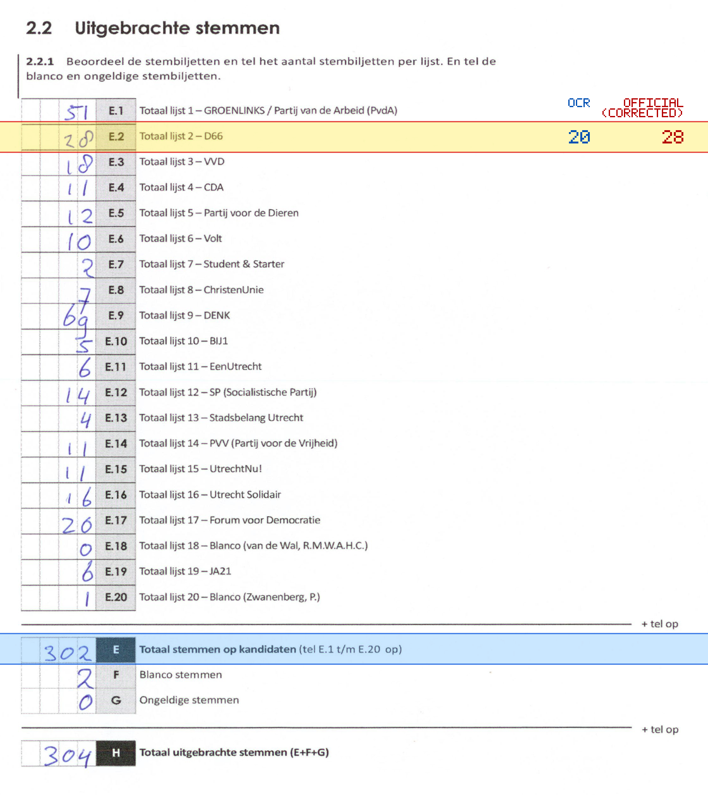
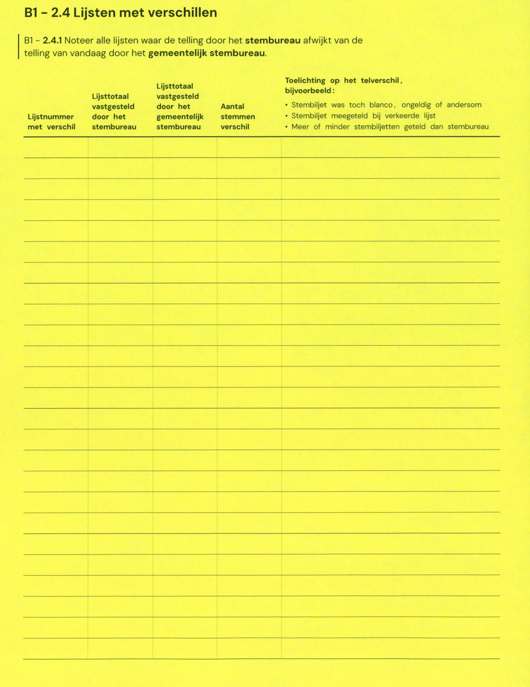

# Station 509 - Pagodedreef 4

- Status: `internally inconsistent`
- Markdown: `2026-GR/0344/results/Utrecht_509_Gymzaal_Pagodedreef_GR26_eerste_telling.md`
- Correction OCR: `2026-GR/0344/results/corrections/Utrecht_509_Gymzaal_Pagodedreef_GR26.md`

## Details

- E.1 through E.20 sum to 294, but E is 302
- E.2: md=20, official=28

## Candidate Votes

- Status: `incomplete`
- Compared candidate cells: 0/508
- Candidate OCR files: 0
- candidate OCR not available
- known list/correction issues are shown

Legend: yellow/red = official CSV mismatch; blue = internal consistency issue. The right margin shows OCR and official values for official mismatches.



## Corrections

```markdown
| ID | First | Second | Difference | Note |
|---|---:|---:|---:|---|
```


