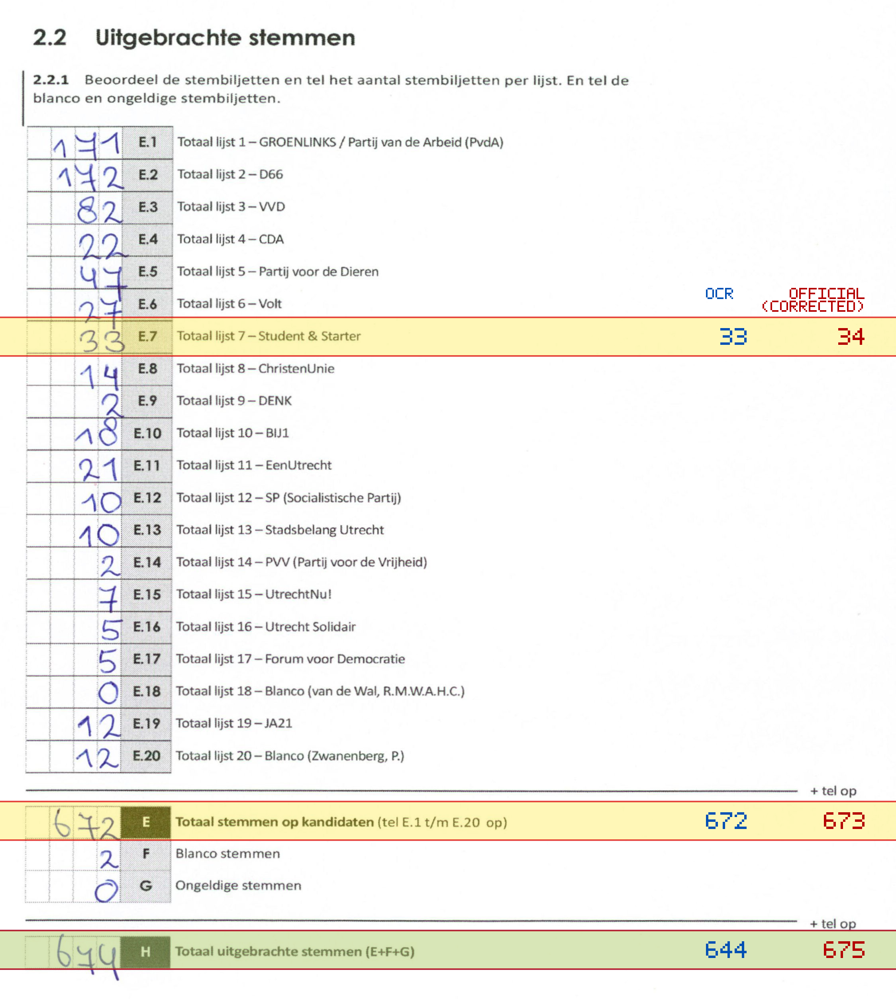
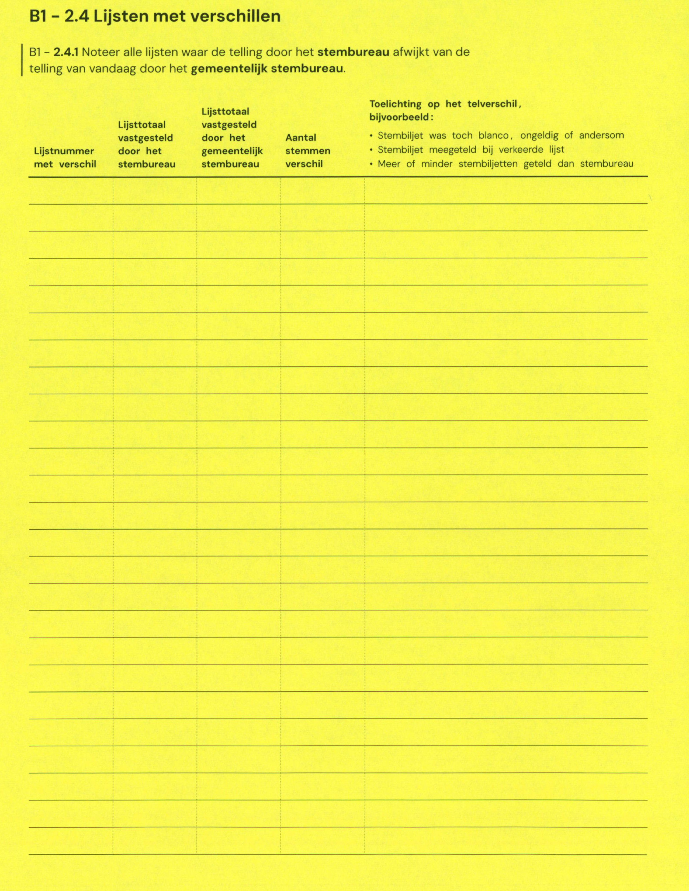

# Station 518 - Deken Roesstraat 2G

- Status: `internally inconsistent`
- Markdown: `2026-GR/0344/results/Utrecht_518_Gymzaal_Deken_Roesstraat_GR26_eerste_telling.md`
- Correction OCR: `2026-GR/0344/results/corrections/Utrecht_518_Gymzaal_Deken_Roesstraat_GR26.md`

## Details

- E + F + G is 674, but H is 644
- E.7: md=33, official=34
- E: md=672, official=673
- H: md=644, official=675

Legend: yellow/red = official CSV mismatch; blue = internal consistency issue. The right margin shows OCR and official values for official mismatches.



## Corrections

```markdown
| ID | First | Second | Difference | Note |
|---|---:|---:|---:|---|
```


