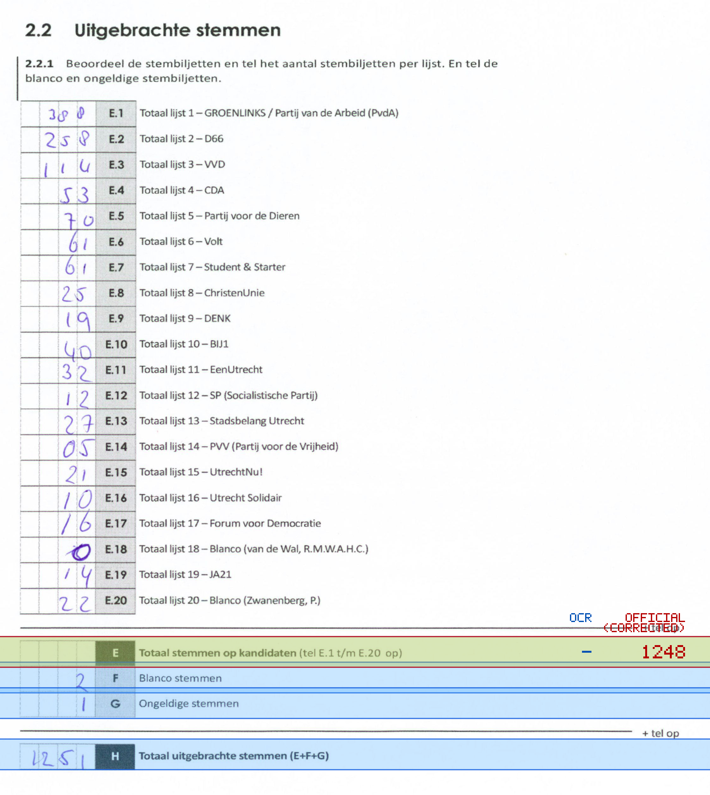
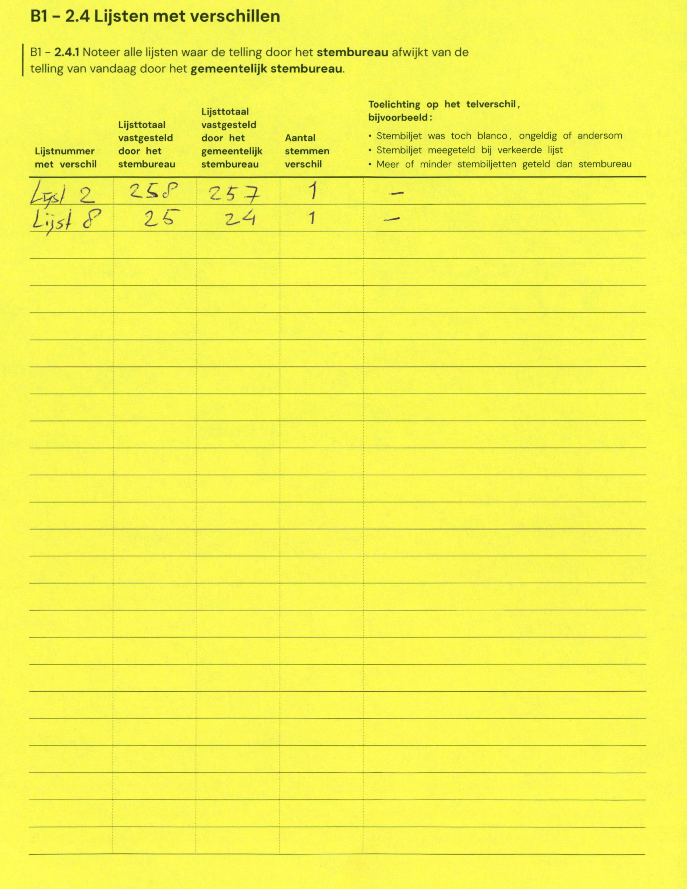

# Station 519 - Weerdsingel W.Z. 22

- Status: `internally inconsistent`
- Markdown: `2026-GR/0344/results/Utrecht_519_Gymzaal_Weerdsingel_GR26_eerste_telling.md`
- Correction OCR: `2026-GR/0344/results/corrections/Utrecht_519_Gymzaal_Weerdsingel_GR26.md`

## Details

- expected 26 non-empty table lines, found 25
- row 23 expected ID E, found F
- row 24 expected ID F, found G
- row 25 expected ID G, found H
- missing row 26 for H
- E: md=missing, official=1248

## Candidate Votes

- Status: `incomplete`
- Compared candidate cells: 0/508
- Candidate OCR files: 0
- candidate OCR not available
- known list/correction issues are shown

Legend: yellow/red = official CSV mismatch; blue = internal consistency issue. The right margin shows OCR and official values for official mismatches.



## Corrections

```markdown
| ID | First | Second | Difference | Note |
|---|---:|---:|---:|---|
| E.2 | 258 | 257 | -1 |  |
| E.8 | 25 | 24 | -1 | - |
```


